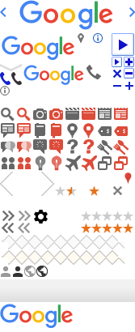

## CSS Interview Questions

1. Please Explain The Difference Between Visibility : Hidden And Display : None?

> - Visibility : hidden; 
> –> It doesn't show up but takes space in the layout flow. (It **DOESN'T** cause DOM reflow)
 

> - Display : none; 
> –> It doesn't show up and removes the element from the layout flow, it allows other elements to fill in. (It **CAUSES** DOM reflow)
   

1.1 Aditional : Please Explain The Difference Between Visibility : Hidden And Opacity : 0?

> - Opacity : 0; 
> -> It doesn't show up but also takes space in the layout flow. 
> -> The difference is you can click on the elements behind it but you **CAN'T** click on the elements which style is visibility : hidden.

Example : https://jsfiddle.net/yschen25/289xv1ba/1/
 
 

2. When Should You Use Visibility and When Should You Use Display?

> - When you want the element to hold its space even when it’s not seen. => Visibility : hidden; 
> - When you don't want the element to take space in the layout or You want to allowe the other elements on your page to collapse around it. => Display : none;
      
Related Reference : [Visibility vs Display in CSS](http://vanseodesign.com/css/visibility-vs-display/)
 
 

3. Please Explain The Difference Between Inline, Block, Inline-Block?

> - Inline 
> -> It has no line break before or after it, allow other elements to sit to their left and right. 
> -> Height and width properties have no effect. 
> -> It can have left & right margin and padding, but not top and bottom. 
> -> To make the element horizontally center is add text-align : center on it's parent element. 
> -> I.g., \<a>, \, \  
 

> - Block 
> -> It starts on a new line. 
> -> Height, width, margin, padding properties have effect. 
> -> To make this element horizongally center is add margin : auto 
> -> I.g., \
, \
, \<h1>, \<ol>, \<ul>, \<li>
 

> - Inline-Block 
> -> It has no line break before or after it, allow other elements to sit to their left and right. 
> -> Height, width, margin, padding properties have effect.
> -> To make this element horizongally center is add margin : auto 
 

4. Please Explain What Is Sprite? When Would You Use It?

> (1) sprite is a collection of images put into a single image. To display the image you can set height, width and background position. 

> (2) Using image sprites will reduce the number of server requests when you have multiple images/icons.

 

5. What Is CSS Reset? What Is The Difference Between CSS Reset And CSS Normalize?

> (1) Every browser has its own default 'user agent' stylesheet, CSS Reset is use to make it look consistent across browsers.
 

> (2) CSS Reset removes all built-in browser styling, after assigning the values of margin padding and other attributes to 0. CSS Normalize keeps useful defaults rather than unstyling everything and corrects some common bugs that are out of scope for             reset.css.
 

6. What Is Box Model?
 

7. What Is Float?

> Float is a CSS positioning property, an element can be declared to be outside the normal flow of elements. 
> There are float : left, right, none(is default), inherit(ie not suppoerted). 
> I.g., By setting the 'float' property of an image to 'left', the image is moved to the left until the margin, padding or border of another block-level element is reached. The normal flow will wrap around on the right side. 
 

8. How To Clear Float?

> Clear is the properity to clear the float. 
> There are clear : left, right, both. 
> I.g., (1)empty https://jsfiddle.net/yschen25/yc1aqhbw/6/ (2)overflow (3)after https://jsfiddle.net/yschen25/ug9m514r/2/  
Related Reference : [All About Floats](https://css-tricks.com/all-about-floats/)
