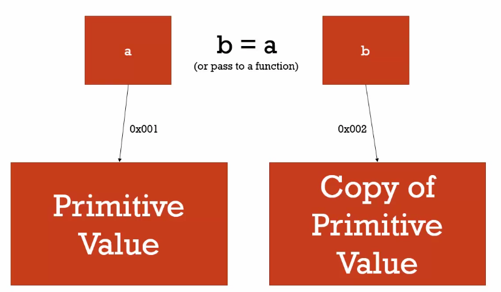

## JavaScript Questions
<br/>

1. Explain What Is Closure?

> - If we use the global variables in the wrong way, may cause some problems like [Without Use Closure](https://jsfiddle.net/yschen25/aofkj153/14/), `closure uses outer function returns the inner function (which we really want to execute) to let us have private variable without affected by environment`, see the [Use Closure](https://jsfiddle.net/yschen25/pvqbxjr7). <br/>
> - Improve code [Use Anonymous And Arrow Function](https://jsfiddle.net/yschen25/rjefc2sg/). <br/>
> - Even use the same outer function, variables don't disturb each other cause the excute environment is different, see the  [Use The Same Function](https://jsfiddle.net/yschen25/q5ohxarL/). <br/>
> - Sometimes use the new feature ```Let``` in ES6 can solve the problem.

> - Related Reference : [深入淺出瞭解 JavaScript 閉包（closure）](https://pjchender.blogspot.com/2017/05/javascript-closure.html)
<br/><br/>

2. Explain What Is Promise? (ref:3)
<p align="center">

</p>

> - `Promise is guarantee to do specfic things after resolved or rejected`, one of the ways we can deal with asynchronous operations, prevent callback hell. It takes two parameters, one for success (resolve) and one for fail (reject) :

```
const myPromise = new Promise((resolve, reject) => {  
    // condition
});
```

> - A promise starts in the `pending state which indicates that the promise hasn’t completed`, it ends with either success (resolve) or fail (reject) state, and the value won't be change when the states of promise parse to resolve or reject : <br/>
(1) **Resolved** : The state of a promise representing a successful operation. <br/>
(2) **Rejected** : The state of a promise representing a failed operation. <br/>
(3) **Pending** : Initial state, before the promise succeeds or fails. <br/>

```
const myPromise = new Promise((resolve, reject) => {  
    let condition;  
    
    if(condition is met) {    
        resolve('Promise is resolved successfully.');  
    } else {    
        reject('Promise is rejected');  
    }
});
```

> - How to deal with states :  <br/>
(1) **then( )**  : If the promise gets `resolved`, the then( ) method is called, then we can decide what to do with the resolved promise. then( ) accepts two function arguments, the first handler supplied to it will be called if the promise is resolved, The second one will be called if the promise is rejected. <br/>
(2) **catch( )**  : If the promise gets `rejected`, it will jump to the catch( ) method. <br/>
(3) **finally()** : Execute the `same piece of code whether the promise is resolved or rejected`. <br/>
(4) **all()** : Creates a new promise that will be resolved when all of promises are resolved. If any of the promises are rejected, the returned promise will be rejected immediately and will provide the value of the promise that was rejected.  <br/>
(5) Keep waiting : During pending.  

```
myPromise.then((message) => { 
    console.log(message);
}).catch((message) => { 
    console.log(message);
});
```

> - Related Reference : [Promise (1)](https://ithelp.ithome.com.tw/articles/10197427), [Promise (2)](https://ithelp.ithome.com.tw/articles/10197529), [JavaScript Promise Tutorial: Resolve, Reject, and Chaining in JS and ES6](https://www.freecodecamp.org/news/javascript-es6-promises-for-beginners-resolve-reject-and-chaining-explained/), [The Definitive Guide to the JavaScript Promises](https://www.javascripttutorial.net/es6/javascript-promises/), [Promises](https://www.codecademy.com/learn/introduction-to-javascript/modules/javascript-promises/cheatsheet)
<br/><br/>

3. Explain What Is Async/Await? (ref:2)
> - Async and Await is `syntax sugar for promises` in javaScript.
> - Await ensures executing next step `after specific operations`. 
> - An Await operand can `only be used inside an Async function`.
> - The Async functions return a promise.

```
async function fetchData(){
  await a();
  .....       // Execute after a
  await b();
  .....       // Execute after b
}

fetchData();
fetchData().then(() => {
  .....       // Execute after fetchData
});
```

> - Related Reference : [簡單理解 JavaScript Async 和 Await](https://www.oxxostudio.tw/articles/201908/js-async-await.html), [Async-Await](https://www.codecademy.com/learn/introduction-to-javascript/modules/asynch-js/cheatsheet), [認識同步與非同步 — Callback + Promise + Async/Await
](https://medium.com/%E9%BA%A5%E5%85%8B%E7%9A%84%E5%8D%8A%E8%B7%AF%E5%87%BA%E5%AE%B6%E7%AD%86%E8%A8%98/%E5%BF%83%E5%BE%97-%E8%AA%8D%E8%AD%98%E5%90%8C%E6%AD%A5%E8%88%87%E9%9D%9E%E5%90%8C%E6%AD%A5-callback-promise-async-await-640ea491ea64)
<br/><br/>

4. Explain What Is The New Feature In ES6?
> - Arrow Function, Class, Promise, Block-Scoped Constructs Let and Const, Template Literals.
<br/><br/>

4.1 Explain What Is The New Feature In ES7?
> - Async, Await.
<br/><br/>

:small_red_triangle: 5. Explain What Is The Difference Between push(), pop(), unshift(), shift()?

| Methods | push() | pop() | unshift() | shift() | 
|---|---|---|---|---|
|  | **ADD** the element in the **END** of array | **DELETE** the element in the **END** of array | **ADD** the element in the **BEGINNING** of array | **DELETE** the element in the **BEGINNING** of array |
| Return | New length | The removed item | New length | The removed item |

Example : https://jsfiddle.net/yschen25/bcuto13q/
<br/><br/>

:small_red_triangle: 6. Explain What Is The Difference Between slice(), splice()?

| Methods |  slice(start index, end index) | splice(index, howmany, item1, ....., itemX) 
|---|---|---|
|  | (optional, optional) | (required, optional, optional)|
|  | (If use negative numbers it will select from the end of an array, it acts like "0" if omitted ; Whole array will be selected if omitted, use negative numbers will select from the end of an array) | (Specifies at what position to add/remove items, use negative values to specify the position from the end of the array ; The number of items to be removed; The new item(s) to be added to the array) |
| | Starting at the given start argument, and ends at, but does not include | The end doesn't include |
| | **NOT** changes the original array | **CHANGES** the original array |

Example : https://jsfiddle.net/yschen25/vxmp7z3t/
<br/><br/>

:small_red_triangle: 7. Explain What Is The Difference Between map(), forEach()?

| Methods | map() | foEach() |
|---|---|---|
| Return | Returns a new array | **DOES NOT** return a new array, returns undefined |
| | **DOES NOT** change the original array | |
| |The function is not executed for array elements without values.| The function is not executed for array elements without values. |

<br/>

:white_check_mark: 8. Explain What Is Callbacks?

> - `Take a function as another function's parameter, called by another function`.
> - Control the sequence of function execute.
```
window.setTimeout( function(){ ... }, 1000);
```
> - Related Reference : [重新認識 JavaScript: Day 18 Callback Function 與 IIFE](https://ithelp.ithome.com.tw/articles/10192739)
<br/><br/>

9. Explain What Is Hoisting? (ref:10)

> - Hoisting is JavaScript's default behavior of `moving declarations to the top`. <br/>
```
console.log(a); // Uncaught ReferenceError: a is not defined
```
```
console.log(a); // undefined
var a; 
```
```
var v = 5;
var v;
console.log(v); // 5
```
```
function test(v) {
  console.log(v) // 10
  var v = 3
}
test(10)
```
> - Only hoists declarations, not initializations. <br/>
```
console.log(a); // undefined
var a = 5;
```
> - Not only `hoists variable, also hoists function`, and the function's priority is higher than variable.
```
console.log(a) // function a(){}
var a
function a(){}
```
> - JavaScript in `strict mode(use strict)` does `not allow variables to be used if they are not declared`. <br/>
> - You can use `let/const instead of var to avoid hoisting`, actually let/const has hoisting, but they have ```TDZ(Temporal Dead Zone)```.

> - Related Reference : [我知道你懂 hoisting，可是你了解到多深？](https://blog.techbridge.cc/2018/11/10/javascript-hoisting/)
<br/><br/>

10. What Is Let And Const? (ref:11)

> - `Let and Const is block scope`, `Var is function scope`. <br/>
```
function varFunction () {
  var ming = 'May';
  if (true) {
    var ming = 'Joe';  
  }
  console.log(ming);  // Joe
}

function letFunction () {
  let ming = 'May';
  if (true) {
    let ming = 'Joe';  
  }
  console.log(ming);  // May
}

varFunction(); 
letFunction();
```
> - Compare var and let in loop https://jsfiddle.net/yschen25/7qwp480z/1/. (ref:[ES6 開始的新生活 let, const](https://wcc723.github.io/javascript/2017/12/20/javascript-es6-let-const/))
> - `Let is for declare variables`. <br/>
> - `Const is for declare const variables`, need initialize in declaration, `can't reassignment`. <br/>
```
const a = 10
a = 20  // TypeError: Assignment to constant variable.
```

> - Related Reference :  [let與const](https://ithelp.ithome.com.tw/articles/10185142), [ES6 開始的新生活 let, const](https://wcc723.github.io/javascript/2017/12/20/javascript-es6-let-const/)
<br/><br/>

11. Explain What Is TDZ (Temporal Dead Zone)? (ref:10)

> - TDZ is short of `Temporal Dead Zone`. You will get error notification if you try to access a variable `after hoisting and before initialization` which declared with let or const.
```
function test() {
    var a = 1; // Start varable c's TDZ
    var b = 2;
    console.log(c) // Uncaught ReferenceError: Cannot access 'c' before initialization
    if (a > 1) {
      console.log(a)
    }
    let c = 10 // End varable c's TDZ
}
test()
```
> - Related Reference : [我知道你懂 hoisting，可是你了解到多深？](https://blog.techbridge.cc/2018/11/10/javascript-hoisting/)
<br/>

12. Explain What Is "this"?
> - The this keyword evaluates to the value of the ThisBinding of the current execution context, the `value of this is determined by how a function is called`.
<br/>

**Default Binding** 
> - In a JavaScript `function(default)`, the owner of the function is the `global object`, so this refers to the `global object`.
```
var a = 123;

function foo() {
  console.log(this.a);
}

foo(); // 123
```
<br/>

> - In a JavaScript `function(strict)`, strict mode `does not allow default binding`, So in strict mode is undefined.
```
"use strict";

var a = 123;
function foo() {
  console.log(this.a);
}

foo(); // undefined
```
<br/>

**Implicit Binding** 
> - In an `object method`, this refers to the `owner` of the method.
```
function func() {
  console.log( this.a );
}

var obj = {
  a: 2,
  foo: func
};

func();       // undefined
obj.foo();    // 2
```
<br/>

> - In HTML `event handlers`, this refers to the HTML element that received the event.
```
<button onclick="this.style.display='none'">Click to Remove Me!</button>
// The button will disappear when click the button
```
<br/>


**Explicit Binding**
> - Use `another variable` to temp save this.
```
let el = document.getElementById('app');

el.addEventListener("click", function(event) {
  var that = this;
  console.log(this.textContent); // show the textcontent

  innerFunc();

  function innerFunc() {
    console.log(this.textContent); // undefined
    console.log(that.textContent); // show the textcontent
  };

}, false);
```
<br/>

> - Use `call(), apply()` to execute the function.
```
var person = {
  name: "Kuro",
  hello: function(thing, whom) {
    console.log(this.name + " says " + thing + " to " + whom);
  }
}

var person2 = {
  name: "Jack"
};

person.hello("love you", "Amy");                 // Kuro says love you to Amy
person.hello.call(person, 'love you', 'Amy')     // Kuro says love you to Amy
person.hello.apply(person, ["love you", "Amy"]); // Kuro says love you to Amy

person.hello.call(person2, "miss you", "Amy");    // Jack says miss you to Amy
person.hello.apply(person2, ["miss you", "Amy"]); // Jack says miss you to Amy
```
<br/>

> - Use `bind()` to creates a new function that will force the this inside the function to be the parameter passed to bind().
```
var obj = {
  x: 123
};

var func = function () {
  console.log(this.x);
};

func();            // undefined
func.bind(obj)();  // 123
```
<br/>

**New Binding**
```
function foo(a) {
  this.a = a;
}

var obj = new foo(123);
console.log( obj.a ); // 123
```

> - Related Reference : [JavaScript 的 this 到底是誰？](https://wcc723.github.io/javascript/2017/12/12/javascript-this/), [What's THIS in JavaScript ? [上]](https://kuro.tw/posts/2017/10/12/What-is-THIS-in-JavaScript-%E4%B8%8A/), [What's THIS in JavaScript ? [中]](https://kuro.tw/posts/2017/10/17/What-s-THIS-in-JavaScript-%E4%B8%AD/), [What's THIS in JavaScript ? [下]](https://kuro.tw/posts/2017/10/20/What-is-THIS-in-JavaScript-%E4%B8%8B/)
<br/><br/>

13. List The Primitive And Non-Primitive(Objects) Types In Javascript.
<p align="center">

</p>

> - Primitive Types : string, number, boolean, undefined, null, symbol. (ref:15)
> - Non-Primitive Types : array, object, function, date, regx.
<br/><br/>

14. Explan What Is Call By Value, Call By Reference And Call By Sharing? (ref:13, 14.1)

> - **Call By Value** : 

<p align="center">

</p>

> - When you declare a `primitive type (string, number, boolean, null, undefined, symbol) variable` a and b, it will has own memory location and store it's own value in it, then assign b equal to a, b also `has own memory location` and store a's value in it. b's value `will not change` when a's value changes, a and b's memory location is isolate, they won't interrupt each other. 

> - Example : https://jsfiddle.net/yschen25/9v0t2fx6/
<br/><br/>

> - **Call By Reference** : 

<p align="center">

</p>

> - When you declare a `non-primitive(objects) type(array, object, function, date, regx) variable` a and b, it will has own memory location and store it's own value in it, then assign b equal to a, b `doesn't have own memory` location, a and b will has same memory location, b's value `will change` when a's value changes.  (Ref : Shallow copy)

> - Example : https://jsfiddle.net/yschen25/ov3rq5me
<br/><br/>

> - **Call By Sharing** : When you declare non-primitive(objects) type(array, object, function, date, regx) variable a and b, assign b equal to a, but use `Array Literals or Object Literals(see example or reference)` to reassign a's value, b's value `will not change` when a's value changes. 

> - Example : https://jsfiddle.net/yschen25/7djyawve

> - Related Reference : [談談 JavaScript 中 by reference 和 by value 的重要觀念](https://pjchender.blogspot.com/2016/03/javascriptby-referenceby-value.html), 
[你不可不知的 JavaScript 二三事](https://ithelp.ithome.com.tw/articles/10209104)
<br/><br/>

14.1 Explan What Is Shallow Copy And Deep Copy?
 
<p align="center">


</p>

> - **Shallow Copy** : `Duplicates as little as possible`. If b is a shallow copy of a, b points to a's location in memory, b `will change` it's value when changes a. 
> - Method => spread operator, object.assign

> - **Deep Copy** : `Duplicates everything`. If b is a deep copy of a, a and b has it's own memory location, b `will not change` it's value when changes a. 
> - Method => javaScript : JSON.parse(JSON.stringify(object)) (not for function), jQuery : $.extend, lodash : _.cloneDeep

> - Related Reference : [關於 JS 中的淺拷貝和深拷貝](https://larry850806.github.io/2016/09/20/shallow-vs-deep-copy/),  [JS-淺拷貝(Shallow Copy) VS 深拷貝(Deep Copy)](https://kanboo.github.io/2018/01/27/JS-ShallowCopy-DeepCopy/)
<br/><br/>

15. Explain What Is Not Defined, Undefined And Null?

**Not Defined**
> - Not defined means the varable doesn't exist.

**Undefined**
> - Primitive type
> - Undefined means a variable has been declared but has not yet been assigned a value. <br/>
> - Boolean(undefined) = false <br/>
> - Type of undefined = undefined <br/>
let a;<br/>
console.log(a);         // undefined<br/>
console.log(typeof a);  // undefined<br/>

**Null**
> - Primitive type
> - Null is an assignment value. It can be assigned to a variable as a representation of no value. <br/>
> - Boolean(null) = false <br/>
> - Type of null = object <br/>
let a = null; <br/>
console.log(a);         // null<br/>
console.log(typeof a);  // object<br/>

> - null == undefined   // true<br/>
null === undefined  // false

> - Related Reference : [Javascript中undefined和null的差異](https://medium.com/harry-xies-blog/javascript%E4%B8%ADundefined%E5%92%8Cnull%E7%9A%84%E5%B7%AE%E5%88%A5-1f48e9be5e02), [JavaScript中undefined和null的區別是什麼](https://m.html.cn/qa/javascript/10504.html)
<br/><br/>

16. What Is Event Bubbling And How To Stop I?

> - (1)The event first triggers on the innermost target element, and then triggers on the ancestors (parents) of the target element in the same nesting hierarchy till it reaches the outermost DOM element or document object.<br/>
> - (2)Using event.stopPropagation()

> - Related Reference : [重新認識 JavaScript: Day 14 事件機制的原理](https://ithelp.ithome.com.tw/articles/10191970), [DOM 的事件傳遞機制：捕獲與冒泡](https://blog.techbridge.cc/2017/07/15/javascript-event-propagation/)
<br/><br/>

17. What Is Function Statements(Declaration) And Function Expressions?
> - **Function Statement** : <br/>

(1) A function created with a name. 
```
function statement(item) {
    console.log('Function statement example'+ item);
  }
```
<br/>

(2) Function declarations are hoisted.
```
callTest(); // 123

function callTest(){
	console.log(123);
}

callTest(); // 123
```
<br/>

> - **Function Expression** :  <br/>

(1) The name may be omitted in function expressions, making that function anonymous. <br/>
```
var expression = function(item) {
    console.log('Function expression example'+ item);
  }
```
<br/>

(2) Function declarations are `not` hoisted.
```
callTest(); // callTest is not a function

var callTest = function(){
	console.log(123);
}

callTest(); // 123
```
<br/>

> - [[筆記] 進一步談JavaScript中函式的建立─function statements and function expressions](https://pjchender.blogspot.com/2016/03/javascriptfunction-statements-and.html)
<br/><br/>

18. What Is IIFE(Immediately Invoked Function Expression)? (ref:21)
> -  (pronounced 'iffy') Is a function `defined as an expression and executed immediately after creation`.
> - By wrapping our function in parenthesis, we tell the parser to parse our JavaScript as a function expression; the enclosing parenthesis at the end of IIFE are used to invoke functions. 
```
(function(){
    //...
})();
```
<br/>

> - See the example : We can’t access the variable superSecret outside of the IIFE. All of the code within our IIFE stays within the private scope of our function. Is a good way at protecting the scope of your function and the variables within it, ensures that code inside IIFE does not interfere with other code or be interfered by another code and so code is safe.
```
(function(){
  var superSecret = 195;
})()
console.log(superSecret);
//  Uncaught ReferenceError: superSecret is not defined
```
<br/>

18.1 Why Would You Just Create A Named Function And Invoke It? That Would Create The Same Result?
> - Yes, but with consequences : Creating a named function pollutes the global name space. It also means the named function is hanging around also readily available, `it could accidentally be invoked again`. `IIFE isn’t named and therefor can’t accidentally be called later — avoiding any potential security implications`.

> - Related Reference : [重新認識 JavaScript: Day 18 Callback Function 與 IIFE](https://ithelp.ithome.com.tw/articles/10192739), [JavaScript: What the heck is an Immediately-Invoked Function Expression?](https://codeburst.io/javascript-what-the-heck-is-an-immediately-invoked-function-expression-a0ed32b66c18)
<br/><br/>

19. What Is First Class Function?
> - First Class Function means that `you can do the things to the functions same as to other types(objects, string, boolean, numbers)`. <br/>
(1) Functions are objects. <br/>
(2) Can pass as an argument to other functions. <br/>
(3) Can be assigned as a parameter. <br/>
(4) Can be returned by another function. <br/>
(5) Function have properties.

> - Related Reference : [[筆記] JavaScript 中函式就是一種物件 ─ 談談 first class function（一等公民函式）](https://pjchender.blogspot.com/2016/03/javascriptfunctionobjects.html)
<br/><br/>

20. In Javascript What Can Cause A Script To Run Indefinitely And How Can You Mitigate This Situation?
> - Recursion
> - Set the condition to stop it
<br/><br/>

21. What Is Prototype?
> - All JavaScript objects inherit properties and methods from a prototype.
> - Prototype property allows you to `add new properties` to object constructors.
```
function Person(first, last, age, eyecolor) {
  this.firstName = first;
  this.lastName = last;
  this.age = age;
  this.eyeColor = eyecolor;
}

Person.prototype.nationality = "English";
```

> - Prototype property allows you to `add new methods` to object constructors.
```
function Person(first, last, age, eyecolor) {
  this.firstName = first;
  this.lastName = last;
  this.age = age;
  this.eyeColor = eyecolor;
}

Person.prototype.name = function() {
  return this.firstName + " " + this.lastName;
};
```
> - prototype is a property of a Function object. It is the prototype of objects constructed by that function.
> - __proto__ (pronounced as dunder proto or double underscore proto) is internal property of an object, pointing to its prototype. Current standards provide an equivalent Object.getPrototypeOf(O) method.
> - Related Reference : [該來理解 JavaScript 的原型鍊了](https://blog.techbridge.cc/2017/04/22/javascript-prototype/)
<br/><br/>

21.1 What Is Prototype Chain?
> - If you try to call a property on an object, JavaScript will go to the prototype object and look for it, until it finds it. If it doesn't find the specific property that you're looking for, it'll return undefined for you.
> - Related Reference : [JavaScript Fundamentals: Prototype Chains](https://www.telerik.com/blogs/javascript-fundamentals-prototype-chains)
<br/><br/>

❗ 22. What Is Pure Function?
<br/><br/>

❗ 23. What Is High Order Function?
<br/><br/>

❗ 24. What Is Functional Programming?
> - Related Reference : [Functional Programming - What Is It and Why Does It Matter?](https://www.keycdn.com/blog/functional-programming), [What is Functional Programming?](https://www.dummies.com/programming/what-is-functional-programming/), [Functional Programming Paradigm
](https://www.geeksforgeeks.org/functional-programming-paradigm/), [Functional Programming 基本觀念](https://ithelp.ithome.com.tw/articles/10186465), [談談 JavaScript 那些常見的 Functional Programming 的概念帶來了怎樣的好處](https://tinyurl.com/ybrplrvz), [JavaScript: Functional Programming 函式編程概念](https://tinyurl.com/ycoo6yfe), [Functional Programming 一文到底全紀錄](https://tinyurl.com/y8wjozqy)
<br/><br/>

❗ 25. What Is An Event Loop?
> - Related Reference : [What is an event loop in JavaScript?](https://www.educative.io/edpresso/what-is-an-event-loop-in-javascript)
<br/><br/>

❗ 26. What Is Delegate?
<br/><br/>

## Customized javaScript Questions

1. Where Do You Use Async, Await and Promise?
> - To do somthing after receive the data from API calls.
<br/><br/>

