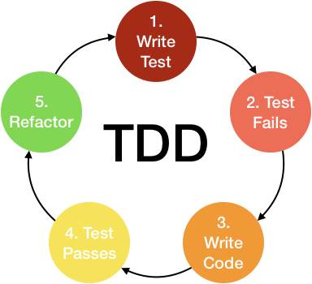

# Coding Style / Principles / Strategy Questions

### **Explain What Is TDD (Test Driven Development)?** 

 

> - TDD (Test Driven Development) is an approach to automated software testing that involves `writing a failing test before writing the production code to make it pass`.
> - Repeat the process below :   
(1) **Add the tests**: Our first step is to create an end-to-end test describing the feature we want users to be able to do.   
(2) **Run all tests**: The tests will fail (be "red") at first because we haven't yet implemented the functionality.  
(3) **Write the simplest code that passes the new tests**: To write only enough production code to fix the current error or test failure.  
(4) **All tests should now pass**  
(5) **Refactor as needed.**: Using tests after each refactor to ensure that functionality is preserved.  

 

### **What Are The Advantages Of TDD**
> - **Improved design of the system**: TDD forces you to think about exactly what you expect from scenario to scenario, which makes you more likely to cover all the bases.
> - **Lower development costs and improved quality of code**: As you are specifically writing code to pass the tests in place, and refactoring at the end of each test; you ensure your code is clean and optimised without any extra pieces of code that you won't need.
> - **Prevents bugs early on in the development process**: As you are adding to the functionality of your code as you go along, you ensure that each stage of the code is working as you progress. 
> - **Very high test-coverage**
> - Related Reference : [The Benefits of Test-Driven Development (TDD)]([https://www.simplilearn.com/what-is-react-article](https://northcoders.com/company/blog/the-benefits-of-test-driven-development-tdd))

 

### **Why Writing Tests Are Important?**
 > - To test every function and procedure.
 > - To find early bugs and fix in the development cycle and to save costs.
 > - To help the developers to understand the code base and enable them to make changes quickly.
 > - To help for code reuse.

 

### **Explain What Are Functional, Unit, Integration, E2E (End-To-End) Testing?**

> - **Functional testing**: Testing the functions. 
> - **Unit testing**: Testing an independent unit of behavior, such as a method (function) in a class.
> - **Integration testing**: Combines mutiple components testings.
> - **End-to-End testing**: Mainly testing the whole working flow,  from the end user’s experience by simulating the real user scenario and validating the system under test and its components for integration and data integrity.

 

### **Explain What Is DDD (Domain Driven Design)?** 
> - Focus on the core domain and domain logic. Base complex designs on models of the domain. Constantly collaborate with domain experts, in order to improve the application model and resolve any emerging domain-related issues.

 

### **What Are The DRY And DIE Principles?**

> - **DRY principle (Don't Repeat Yourself)**: Duplicated code can cause maintenance problems as multiple changes must be made. 
> - **DIE (Duplication Is Evil)**: Similar to the DRY principle, goes one step further and states that even small amounts of duplication should be avoided.

 

### **What Is The Difference Between An Acceptance Test And A Functional Test?**
> - **Acceptance testing**: This is a `validation activity`. Often developers are faced with questions, they built the right thing and or will it satisfy the needs of the client. With an acceptance test, you can determine if a product solves the problems for which it was designed. This can best be done by the user, for instance, performing their tasks that the software assists with.

> - **Functional testing**: This is a `verification activity`. Developers also often have questions about whether they have built the product correctly and meet their business requirements. The functional test helps to answer these questions. It can be used to determine if the product works the way the developers think it does not.

 

# Customized React Questions

### **Why Choose ESLint?**
> - Compared to JSLint, JSHint, ESLint is easy to extend and allow users to customize rules, easy to know where the error is.

 

### **What Are The Important Things You Think About During The Code Review?**
> - **Functional programming**: Focus on high order function and pure function, prevent side effect and mutable data. 
> - **Single responsibility**: One function only responsible for one functionality. 
> - **Open-close**: Open to extension, close to modification. 
> - **DRY principle**: Don’t repeat yourself.

 

### **What Does The Clean Code Mean To You?** 
> - Testable, Readable, Maintainable.

