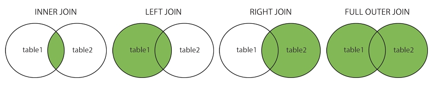
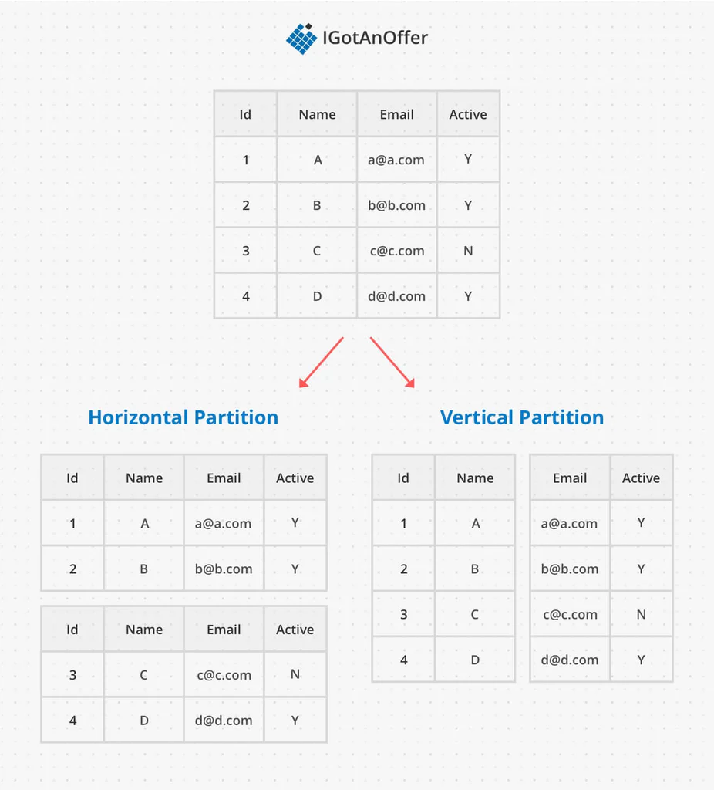

# Database / SQL Questions

### **What Is a Database Join Used For?**
> - Make users easy to query data by joining the tables.

 

### **What Is Inner, Outer, Left And Right Joins**

> - **Inner join**: Returns records that have matching values in both tables.
> - **Outer join**: Returns all records when there is a match in either left or right table.
> - **Left join**: Returns all records from the left table, and the matched records from the right table.
> - **Right join**: Returns all records from the right table, and the matched records from the left table.
> - Related Reference : [SQL Joins](https://www.w3schools.com/sql/sql_join.asp)
> 
 

### **What Is Relational And Non-Relational Databases?**
> - **Relational databases**  
> (1) Relational databases are also called a `relational database management system (RDBMS) or SQL database`.   
> (2) The most popular ones are MySQL, Oracle database, PostgreSQL, etc.   
> (3) Relational databases represent and store data in tables and rows. You can perform join operations using SQL across different database tables.

> - **Non-Relational databases**  
> (1) Non-Relational databases are also called `NoSQL databases`.  
> (2) Popular ones are CouchDB, Neo4j, Cassandra, HBase, Amazon DynamoDB, etc.  
> (3) Join operations are generally not supported in non-relational databases.

 

### **When Use Non-Relational Databases?**
> - Your application requires super-low latency.
> - Your data are unstructured, or you do not have any relational data.
> - You only need to serialize and deserialize data (JSON, XML, YAML, etc.).
> - You need to store a massive amount of data.

 

### **What Is Vertical And Horizontal Scaling?**
> - **Vertical scaling**  
> (1) Referred to as `scale up`.   
> (2) Can add more power (CPU, RAM etc.) to the existing servers, but there are hardware limits.  
> (3) Greater risk of  `single point of failures (SPOF) `.  
> (4) The overall cost is high.

> - **Horizontal scaling**  
> (1) Referred to as `scale out`, also known as `sharding`.   
> (2) It allows you to scale by adding more servers into your pool of resources.   
 
 

### **What Is Database Sharding?**

> - **Horizontal partition (Sharding)**: Meaning the database table is split up by drawing a horizontal line between rows.
> - **Vertical partition**: Where partitions are made between columns.
> - Related Reference : [Sharding](https://igotanoffer.com/blogs/tech/sharding-system-design-interview)

 

### **What Is Single Point Of Failures (SPOF)?**
> - If a system fails which will stop entire system from working.

 

### **What Is A Database Index And How Is It Useful?**
> - Index is created by using a few database columns.
> - An index is used to speed up searching for a specific column in the database.

 

