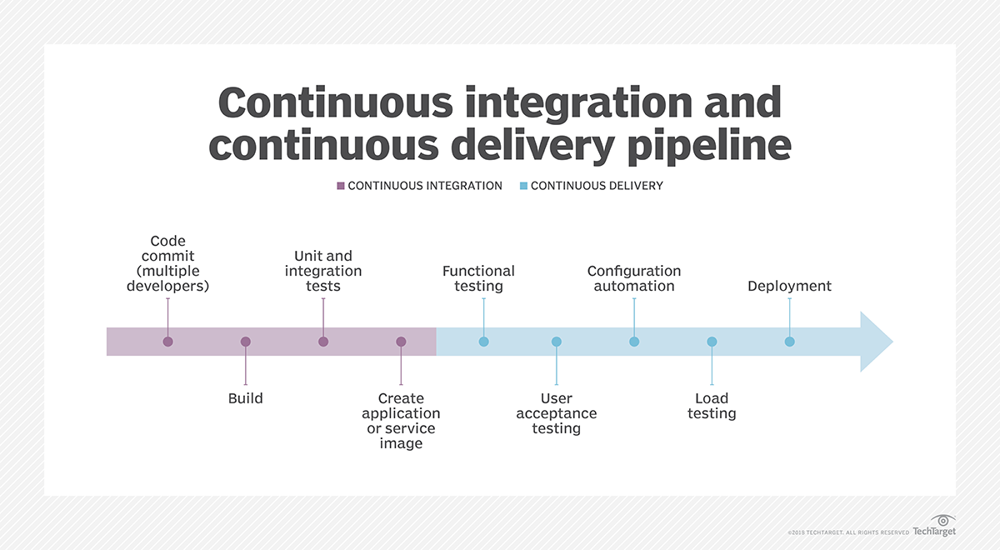

# Deployment Questions

### **What Is CI (Continuous Integration)?**
> - CI is a way to merge all developers' copies of code into a code base frequently. Isolated changes are tested and integrated quickly with unit and integration tests. Continuous integration gives a development team specific feedback on changes or additions to the code base. If a bug is introduced, the code tests in CI should reveal it before the code moves closer to release. CI and continuous delivery enable an organization to have automated testing and staging processes, which then further enable developers to decide when and how often to deploy their code into production.

 

### **What Is CD (Continuous Delivery)?**
> - CD is an approach for software delivery in which development teams produce and test code in short but continuous cycles, usually with high degrees of automation, to improve software quality. 

 

### **What Is CI/CD?**

    

> - The following are general stages in a CI/CD process:  
> (1) **Source**: The first step in the pipeline is where developers write and commit the smallest distributable units of code. The code gets tested by reviews, unit tests and static analysis.  
> (2) **Build**: The source code is collected from the repository, linked to libraries, modules and dependencies, and compiled into an executable file. Tools log the process and denote errors to fix. Some builds may employ scripts to translate the executable file into a packaged or deployable execution environment, such as a VM or a Docker container.  
> (3) **Test**: At this point, the code should be executable. It is tested at the subsystem level, including functional, performance and security tests. These ensure that the developed code meets the quality standards of an end user and the specifications of the project.   
> (4) **Deploy**: Finally, the software should be ready to be deployed into the production environment, but first, the code is manually checked one last time.  
> - Related Reference: [continuous delivery (CD)](https://www.techtarget.com/searchitoperations/definition/continuous-delivery-CD)

 

### **What Is Cloud Computing?**
> - The cloud(internet) computing is a way of `managing IT resources that replaces local machines and private data centers with virtual infrastructure`, including servers, storage, databases, networking, software, analytics. Users access virtual compute, network, and storage resources made available online by a remote provider. 
> - These resources can be provisioned instantly, which is particularly useful for companies that need to scale their infrastructure up or down quickly in response to fluctuating demand.
> - Related Reference: [徹底了解 Cloud Computing](https://www.ithome.com.tw/article/93006)

 

### **How Do You Deploy Your Code To The Production?**
> - (1) Scan code quality by ESLint and SonarLint.
> - (2) Test by product manager.
> - (3) Push to github then test by pipeline.
> - (4) Code review by boss or colleagues.
> - (5) Repeat 2 - 5 until to the production.

 

### **What Is The Semantic Version?**

| 3 | 2 | 6 | 
|---|---|---|
| Major | Minor | Patch  |

> - The semantic version is `consist of Major, Minor and Patch`.
> - **Add Major** : it means add new function and it **IS NOT** downward compatibility, mahor number add one, minor and patch number change to 0.
> - **Add Minor** : it means add new function and it **IS** downward compatibility, minor number add one, patch number change to 0.
> - **Add Patch** : it means fixs the simple bugs, patch number add one.
> - Related Reference : [SemVer - 語意化版本規範](https://www.eebreakdown.com/2016/09/semver.html)

 

