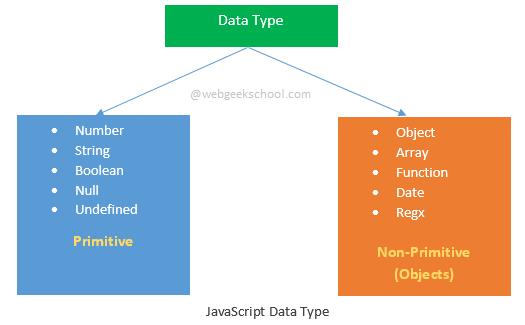
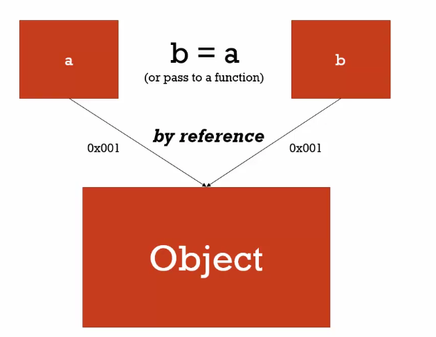
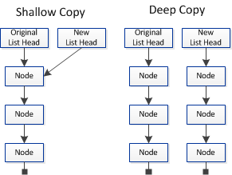
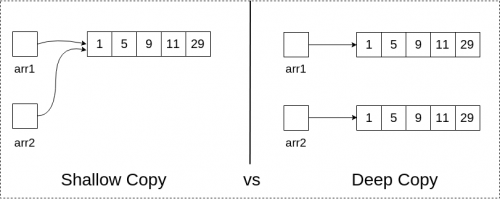
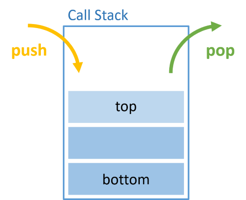
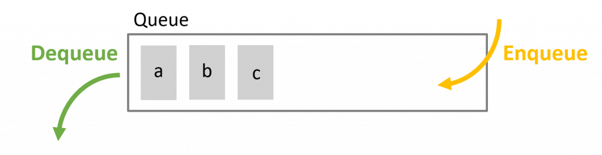

# JavaScript Questions

### **List Down The Primitive And Non-Primitive(Object) Types.**

<p align="center">

</p>

> - Primitive Types : string, number, boolean, undefined, null, symbol.
> - Non-Primitive(Object) Types : array, object, function, date, regx.

<br/>

### **What Is JSON (JavaScript Object Notation)?**
> - JSON is basically an object represented in the form of a string.

```
// Parse JSON to object by JSON.parse()
let obj = '{"gretting": "hello"}';
let plainObj = JSON.parse(obj);
console.log(plainObj); // {gretting: 'hello'}

// Parse object to JSON by JSON.stringfy()
let data = {"name": "Erika"};
let jsonData = JSON.stringfy(data);
console.log(jsonData); // '{"name": "Erika"}'

```

<br/>

### **Explain What Is Not Defined, Undefined, Empty and Null?**

**Not Defined**

> - Not defined means the variable doesn't exist.

<br/>

**Undefined**

> - Undefined means a variable has been declared but has not yet been assigned a value.
> - Type of undefined = undefined

```
let a;
console.log(a);           // undefined
console.log(typeof a);    // undefined
```

<br/>


**Empty**

> - Empty is used to refer to a unique string with zero length.

```
let a = "";
console.log(a);        // ''
console.log(a.length); // 0

let b = " ";
console.log(b);         // ' '
console.log(b.length);  // 1
```

<br/>

**Null**

> - Null is used to refer to nothing.
> - Type of null = object

```
let a = null;
console.log(a);           // null
console.log(typeof a);    // object

console.log(null == undefined);  // true
console.log(null === undefined); // false
```

> - Related Reference : [Javascript 中 undefined 和 null 的差異](https://medium.com/harry-xies-blog/javascript%E4%B8%ADundefined%E5%92%8Cnull%E7%9A%84%E5%B7%AE%E5%88%A5-1f48e9be5e02), [JavaScript 中 undefined 和 null 的區別是什麼](https://m.html.cn/qa/javascript/10504.html)

<br/>

### **Explain What Is Call By Value, Call By Reference And Call By Sharing?**

**Call By Value**

<p align="center">

</p>

> - When you declare a `primitive type (string, number, boolean, null, undefined, symbol) variable` a and b, it will has own memory location and store it's own value in it, then assign b equal to a, b also `has own memory location` and store a's value in it. b's value `will not change` when a's value changes, a and b's memory location is isolate, they won't interrupt each other.

```
var a = 2;
var b = a;
a = 3;

// a = 3, b = 2
```

<br/>

**Call By Reference**

<p align="center">

</p>

> - When you declare a `non-primitive(objects) type(array, object, function, date, regx) variable` a and b, it will has own memory location and store it's own value in it, then assign b equal to a, b `doesn't have own memory` location, a and b will has same memory location, b's value `will change` when a's value changes. (Ref : Shallow copy)
```
var a = {greeting:'Hello'};
var b = a;

a.greeting = 'Hola';

console.log(a.greeting) // Hola 
console.log(b.greeting) // Hola  

var c = [1, 2, 3];
var d = c;

c[0] = 5;

console.log(c) // [5, 2, 3] 
console.log(d) // [5, 2, 3]

```

<br/>


**Call By Sharing**

> - When you declare non-primitive(objects) type(array, object, function, date, regx) variable a and b, assign b equal to a, but use `Array Literals or Object Literals` to reassign a's value, b's value `will not change` when a's value changes.
> - Related Reference : [談談 JavaScript 中 by reference 和 by value 的重要觀念](https://pjchender.blogspot.com/2016/03/javascriptby-referenceby-value.html),
>   [你不可不知的 JavaScript 二三事](https://ithelp.ithome.com.tw/articles/10209104)

<br/>


### **Explan What Is Shallow Copy And Deep Copy?**

<p align="center">


</p>

**Shallow Copy**

> - `Duplicates as little as possible`. If b is a shallow copy of a, b points to a's location in memory, b `will change` it's value when changes a.
> - Method => spread operator (The spread operator makes deep copies of data if the data is not nested.), object.assign

**Deep Copy**

> - `Duplicates everything`. If b is a deep copy of a, a and b has it's own memory location, b `will not change` it's value when changes a.
> - Method => javaScript : JSON.parse(JSON.stringify(object)) (not for function), jQuery : $.extend, lodash : \_.cloneDeep
> - Related Reference : [關於 JS 中的淺拷貝和深拷貝](https://larry850806.github.io/2016/09/20/shallow-vs-deep-copy/), [JS-淺拷貝(Shallow Copy) VS 深拷貝(Deep Copy)](https://kanboo.github.io/2018/01/27/JS-ShallowCopy-DeepCopy/), [The Spread Operator: Deep and Shallow Copies](https://medium.com/@kevinlai76/the-spread-operator-deep-and-shallow-copies-d193ac9b58bf), [How to Deep Clone an Array in JavaScript](https://dev.to/samanthaming/how-to-deep-clone-an-array-in-javascript-3cig)

<br/>

### **What Is Spread Operator?**

> - It consists of three dots (...). The spread operator allows you to spread out elements of an iterable object such as an array, map, or set.

```
let number = [1, 2, 3, 4, 5];
console.log(Math.max(number));  
// NaN. 
The Math.max() method doesn't allow you to pass in an array,
if at least one of the arguments cannot be converted to a number, the result is NaN.

// Using spread operator
let number = [1, 2, 3, 4, 5];
console.log(Math.max(...number)); // 5

```

<br/>

### **What Is Rest Operator?**

> - It consists of three dots (...) which collects all remaining elements into an array.

```
Example1:

const getLength = (...num) => {
     console.log(num.length) // 5
}

getLength(1, 2, 3, 4, 5);


Example2:
let avg = function(arr) {
  let sum = 0;
  for(let i = 0; i < arr.length; i++) {
    sum += arr[i];
  }
  return sum / arr.length;
}

console.log(avg(1, 3, 5, 7, 9));  // NaN

// Using rest operator
let avg = function(...arr) {
  let sum = 0;
  for(let i = 0; i < arr.length; i++) {
    sum += arr[i];
  }
  return sum / arr.length;
}

console.log(avg(1, 3, 5, 7, 9));  // 5

```

> - Related Reference : [[筆記] JavaScript ES6 中的展開運算子（spread operator）和其餘運算子（rest operator）](https://pjchender.blogspot.com/2017/01/es6-spread-operatorrest-operator.html)
>   <br/>

<br/>

### **What Is Destructuring Assignment?**

> - The destructuring assignment syntax is a JavaScript expression that makes it possible to unpack values from arrays, or properties from objects, into distinct variables.
> - Destructuring array or object preventing from changing original values.

```
const [a, b] = [1, 2]; // a = 1, b = 2

const [a, , b] = [1, 2, 3];  // a = 1, b = 3

const [a, ...b] = [1, 2, 3]; // a = 1, b = [2, 3]

const [a, b, ...c] = [1, 2, 3, 4, 5]; // a = 1, b = 2, c = [3, 4, 5]
```

> - Related Reference : [解構賦值](https://eyesofkids.gitbooks.io/javascript-start-from-es6/content/part4/destructuring.html)
>   <br/>

<br/>

### **Explain What Is The Difference Between push(), pop(), unshift(), shift()?**

| Methods | push()                                      | pop()                                          | unshift()                                         | shift()                                              |
| ------- | ------------------------------------------- | ---------------------------------------------- | ------------------------------------------------- | ---------------------------------------------------- |
|         | **ADD** the element in the **END** of array | **DELETE** the element in the **END** of array | **ADD** the element in the **BEGINNING** of array | **DELETE** the element in the **BEGINNING** of array |
| Return  | New length                                  | The removed item                               | New length                                        | The removed item                                     |

```
let arr = [1, 2, 3, 4, 5];
console.log(arr);

// Push
console.log(arr.push(6));
console.log(arr);

// Pop
console.log(arr.pop());
console.log(arr);

// Unshift
console.log(arr.unshift());
console.log(arr);

// Shift
console.log(arr.shift());
console.log(arr);
```

<br/>

### **Explain What Is The Difference Between slice(), splice() and split()?**

| Methods | slice (start index, end index)                                           | splice (index, howmany, item1, ....., itemX)                                               | split (separator, howmany)           |
| ------- | ------------------------------------------------------------------------ | ------------------------------------------------------------------------------------------ | ------------------------------------ |
|         | Array, string                                                            | Array                                                                                      | String                               |
|         | Return a new array object selected from begin to end (end not included). | Changes the contents of an array by removing existing elements and/or adding new elements. | Splits a string object into an array |
|         | Starting at the given start argument, and ends at, but does not include  | The end doesn't include                                                                    |                                  |
|         | **NOT** changes the original array                                       | **CHANGES** the original array                                                             | **NOT** changes the original array   |

```
let arr = [1, 2, 3, 4, 5];

// Slice
console.log(arr.slice(0)) // [1, 2 ,3 , 4, 5]
console.log(arr.slice(2, 4)) // [3, 4]
console.log(arr.slice(-2)) // [4, 5]

// Splice
let arr3 = [1, 2, 3, 4, 5];
arr3.splice(0, 3);
console.log(arr3); [4, 5]

let arr4 = [1, 2, 3, 4, 5];
arr4.splice(2, 0, 55, 66);
console.log(arr4); // [1, 2, 55, 66, 3, 4, 5] 

let arr5 = [1, 2, 3, 4, 5];
arr5.splice(-2);
console.log(arr5) // [1, 2, 3]
```


> - Related Reference : [JavaScript slice()、splice()、split() 傻傻分不清](https://medium.com/@bebebobohaha/slice-splice-split-%E5%82%BB%E5%82%BB%E5%88%86%E4%B8%8D%E6%B8%85-46d9c8992729), [Slice、Splice、Split 的區別](https://chupai.github.io/posts/2007/js_slice_splice_split/)

<br/>

### **Explain What Is Hoisting?**

> - Hoisting is JavaScript's default behavior of `moving declarations to the top`. <br/>

```
console.log(a); // Uncaught ReferenceError: a is not defined
```

```
console.log(a); // undefined
var a;
```

```
var v = 5;
var v;
console.log(v); // 5
```

```
function test(v) {
  console.log(v) // 10
  var v = 3
}
test(10)
```

> - Only hoists declarations, not initializations. <br/>

```
console.log(a); // undefined
var a = 5;
```

> - Not only `hoists variable, also hoists function`, and the function's priority is higher than variable.

```
console.log(a) // function a(){}
var a
function a(){}
```

> - JavaScript in `strict mode(use strict)` does `not allow variables to be used if they are not declared`. <br/>
> - You can use `let/const instead of var to avoid hoisting`, actually let/const has hoisting, but they have `TDZ(Temporal Dead Zone)`.

<br/>

### **What Is "Use strict"?**

> - This strict context `prevents certain actions from being taken and throws more exceptions`.
> - Using strict mode, don’t allow to use a variable without declaring it, Duplicating a parameter name is not allowed, etc.

> - Related Reference : [我知道你懂 hoisting，可是你了解到多深？](https://blog.techbridge.cc/2018/11/10/javascript-hoisting/)

<br/>

### **What Is Let And Const?**

> - `Let and Const is block scope`, `Var is function scope`. <br/>

```
function varFunction () {
  var ming = 'May';
  if (true) {
    var ming = 'Joe';
  }
  console.log(ming);  // Joe
}

function letFunction () {
  let ming = 'May';
  if (true) {
    let ming = 'Joe';
  }
  console.log(ming);  // May
}

varFunction();
letFunction();
```

> - Compare var and let in loop  

```
for (var i = 0; i < 10; i++) {
  setTimeout(function () {
    console.log('execute ' + i + ' times '); 
  }, 10);
}

// execute 10 times execute 10 times execute 10 times execute 10 times execute 10 times execute 10 times execute 10 times execute 10 times execute 10 times execute 10 times

for (let i = 0; i < 10; i++) {
  setTimeout(function () {
    console.log('execute ' + i + ' times ');
  }, 10);
}

// execute 0 times execute 1 times execute 2 times execute 3 times execute 4 times execute 5 times execute 6 times execute 7 times execute 8 times execute 9 times
```

> - `Let is for declare variables`. <br/>
> - `Const is for declare const variables`, need initialize in declaration, `can't reassignment`. <br/>

```
const a = 10
a = 20  // TypeError: Assignment to constant variable.
```

> - Related Reference : [ES6 開始的新生活 let, const](https://wcc723.github.io/javascript/2017/12/20/javascript-es6-let-const/)
<br/>


### **What Is Block Scope And Function Scope?**

> - Block scope is everything inside a set of braces `{a block scope here}`
> - A block scope is sometimes the same as a function scope.

```
function test(x) {
   // this is both a block scope and a function scope
   let y = 5;
   if (x) {
       // this is a smaller block scope that is not the same as the function scope
       let z = 1;
   }
}
```

```
function foo() {
    if (true) {
        var a = 1;
        let b = 2;
        const c = 3;
    }
    console.log(a); // 1
    console.log(b); // b is not defined
    console.log(c); // c is not defined
}

```

> - Related Reference : [let 與 const](https://ithelp.ithome.com.tw/articles/10185142), [ES6 開始的新生活 let, const](https://wcc723.github.io/javascript/2017/12/20/javascript-es6-let-const/)

<br/>


### **What Is Local Scope And Global Scope?**

**Local Scope**

> - Variables `declared within a JavaScript function`, become `local` to the function.
> - Local variables have Function scope: They can only be accessed from within the function.

```
// code here can NOT use carName

function myFunction() {
  var carName = "Volvo";

  // code here CAN use carName

}
```

**Global Scope**

> - A variable `declared outside a function`, becomes `global`.
> - A global variable has global scope: All scripts and functions on a web page can access it.

```
var carName = "Volvo";

// code here can use carName

function myFunction() {

  // code here can also use carName

}
```

> - If you `assign a value to a variable that has not been declared`, it will automatically become a `global` variable.
> - This code example will declare a global variable carName, even if the value is assigned inside a function.

```
myFunction();

// code here can use carName

function myFunction() {
  carName = "Volvo";
}
```

<br/>

### **Explain What Is TDZ (Temporal Dead Zone)?**

> - TDZ is short of `Temporal Dead Zone`. You will get error notification if you try to access a variable `after hoisting and before initialization` which declared with let or const.

```
function test() {
    var a = 1; // Start varable c's TDZ
    var b = 2;
    console.log(c) // Uncaught ReferenceError: Cannot access 'c' before initialization
    if (a > 1) {
      console.log(a)
    }
    let c = 10 // End varable c's TDZ
}
test()
```

> - Related Reference : [我知道你懂 hoisting，可是你了解到多深？](https://blog.techbridge.cc/2018/11/10/javascript-hoisting/)

<br/>

### **Explain What Is "this"?**

> - The this keyword refers to an object, the `value of this is determined by how a function is called`.

<br/>

**Default Binding**

> - In a JavaScript `function(default)`, the owner of the function is the `global object`, so this refers to the `global object`.

```
var a = 123;

function foo() {
  console.log(this.a);
}

foo(); // 123
```

<br/>

> - In a JavaScript `function(strict)`, strict mode `does not allow default binding`, So in strict mode is undefined.

```
"use strict";

var a = 123;
function foo() {
  console.log(this.a);
}

foo(); // undefined
```

<br/>

**Implicit Binding**

> - In an `object method`, this refers to the `owner` of the method.

```
function func() {
  console.log( this.a );
}

var obj = {
  a: 2,
  foo: func
};

func();       // undefined
obj.foo();    // 2
```

<br/>

> - In HTML `event handlers`, this refers to the HTML element that received the event.

```
<button onclick="this.style.display='none'">Click to Remove Me!</button>
// The button will disappear when click the button
```

<br/>

**Explicit Binding**

> - Use `another variable` to temp save this.

```
let el = document.getElementById('app');

el.addEventListener("click", function(event) {
  var that = this;
  console.log(this.textContent); // show the textcontent

  innerFunc();

  function innerFunc() {
    console.log(this.textContent); // undefined
    console.log(that.textContent); // show the textcontent
  };

}, false);
```

<br/>

> - Use `call(), apply()` to execute the function.

```
var person = {
  name: "Kuro",
  hello: function(thing, whom) {
    console.log(this.name + " says " + thing + " to " + whom);
  }
}

var person2 = {
  name: "Jack"
};

person.hello("love you", "Amy");                 // Kuro says love you to Amy
person.hello.call(person, 'love you', 'Amy')     // Kuro says love you to Amy
person.hello.apply(person, ["love you", "Amy"]); // Kuro says love you to Amy

person.hello.call(person2, "miss you", "Amy");    // Jack says miss you to Amy
person.hello.apply(person2, ["miss you", "Amy"]); // Jack says miss you to Amy
```

<br/>

> - Use `bind()` to creates a new function that will force the this inside the function to be the parameter passed to bind().

```
var obj = {
  x: 123
};

var func = function () {
  console.log(this.x);
};

func();            // undefined
func.bind(obj)();  // 123
```

<br/>

**New Binding**

```
function foo(a) {
  this.a = a;
}

var obj = new foo(123);
console.log( obj.a ); // 123
```

> - Related Reference : [JavaScript 的 this 到底是誰？](https://wcc723.github.io/javascript/2017/12/12/javascript-this/), [What's THIS in JavaScript ? [上]](https://kuro.tw/posts/2017/10/12/What-is-THIS-in-JavaScript-%E4%B8%8A/), [What's THIS in JavaScript ? [中]](https://kuro.tw/posts/2017/10/17/What-s-THIS-in-JavaScript-%E4%B8%AD/), [What's THIS in JavaScript ? [下]](https://kuro.tw/posts/2017/10/20/What-is-THIS-in-JavaScript-%E4%B8%8B/)

<br/>

### **What Is Difference Between Bind(), Call() And Apply()?**

> - Bind() is when you want that function to later be called with a certain context, useful in events. Use call() or apply() when you want to invoke the function immediately, and modify the context.
>   Fundamental difference is that call() accepts an argument list, while apply() accepts a single array of arguments. The difference is that call() takes the function arguments separately, and apply() takes the function arguments in an array.

<br/>

### **Explain What Is Callbacks?**

> - `Take a function as another function's parameter, called by another function`.
> - Control the sequence of function execute.

```
window.setTimeout(function(){ ... }, 1000);
```

<br/>

### **Why Do We Use Callback?**

> - Callback functions allow us to do something with data at a later time. But too much callback will cause callback hell, we can use promise to replace it.

> - Related Reference : [重新認識 JavaScript: Day 18 Callback Function 與 IIFE](https://ithelp.ithome.com.tw/articles/10192739)

<br/>

### **What Is Expressions And Statement?**

> - Expression : Any unit of code that can be evaluated to a value is an expression.

```
1;
1 + 2;
"Hello";
10 > 9;
```

> - Statements : A statement is an instruction to perform a specific action. Such actions include creating a variable or a function, looping through an array of elements, evaluating code based on a specific condition etc. JavaScript programs are actually a sequence of statements.

```
if (expression)
    statement 1
else
    statement 2
```

<br/>

### **What A Function Statements(Declaration) And Function Expressions?**

> - **Function Statement** : <br/>

(1) A function created with a name.

```
function statement(item) {
    console.log('Function statement example'+ item);
}
```

<br/>

(2) Function declarations are hoisted.

```
callTest(); // 123

function callTest(){
	console.log(123);
}

callTest(); // 123
```

<br/>

> - **Function Expression** : <br/>

(1) The name may be omitted in function expressions, making that function anonymous. <br/>

```
var expression = function(item) {
    console.log('Function expression example'+ item);
  }
```

<br/>

(2) Function declarations are `not` hoisted.

```
callTest(); // callTest is not a function

var callTest = function(){
	console.log(123);
}

callTest(); // 123
```

<br/>

> - [[筆記] 進一步談 JavaScript 中函式的建立 ─function statements and function expressions](https://pjchender.blogspot.com/2016/03/javascriptfunction-statements-and.html)

<br/>

### **What Is IIFE(Immediately Invoked Function Expression)?**

> - (pronounced 'iffy') Is a function `defined as an expression and executed immediately after creation`.
> - By wrapping our function in parenthesis, we tell the parser to parse our JavaScript as a function expression; the enclosing parenthesis at the end of IIFE are used to invoke functions.

```
(function(){
    //...
})();
```

<br/>

> - See the example : We can’t access the variable superSecret outside of the IIFE. All of the code within our IIFE stays within the private scope of our function. Is a good way at protecting the scope of your function and the variables within it, ensures that code inside IIFE does not interfere with other code or be interfered by another code and so code is safe.

```
(function(){
  var superSecret = 195;
})()
console.log(superSecret);
//  Uncaught ReferenceError: superSecret is not defined
```

<br/>


### **Why Would You Just Create A Named Function And Invoke It? That Would Create The Same Result?**

> - Yes, but with consequences : Creating a named function pollutes the global name space. It also means the named function is hanging around also readily available, `it could accidentally be invoked again`. `IIFE isn’t named and therefor can’t accidentally be called later — avoiding any potential security implications`.

> - Related Reference : [重新認識 JavaScript: Day 18 Callback Function 與 IIFE](https://ithelp.ithome.com.tw/articles/10192739), [JavaScript: What the heck is an Immediately-Invoked Function Expression?](https://codeburst.io/javascript-what-the-heck-is-an-immediately-invoked-function-expression-a0ed32b66c18)

<br/>

### **What Is First Class Function?**

> - First Class Function means that `you can do the things to the functions same as to other types(objects, string, boolean, numbers)`. <br/>
>   (1) Functions are objects. <br/>
>   (2) Can be passed as an argument to other functions. <br/>
>   (3) Can be assigned as a parameter. <br/>
>   (4) Can be returned by another function. <br/>
>   (5) Function have properties.

> - Related Reference : [[筆記] JavaScript 中函式就是一種物件 ─ 談談 first class function（一等公民函式）](https://pjchender.blogspot.com/2016/03/javascriptfunctionobjects.html)

<br/>

### **What Is Higher Order Function (HOF)?**

> - To match one of the criteria as below

(1) Takes one or more functions as arguments.

```
/** Higher Order Function **/
function higherOrderFunction (callback) {
  console.log("higherOrderFunction...");
  callback();
}

function callbackFunction () {
  console.log("callbackFunction...");
}

/** Callback Function */
higherOrderFunction(callbackFunction);
```

<br/>

(2) Returns a function as its result.

```
/** Higher Order Function **/
function higherOrderFunction () {
  console.log("higherOrderFunction...");
  return function(arg1) {
    console.log(arg1 + "...");
  };
}

/** Returned Function **/
var returnedFunction = higherOrderFunction();
returnedFunction("returnedFunction");
```

<br/>

> - forEach(), map(), reduce(), filter(), etc. are HOFs. <br/>
> - Related Reference : [JavaScript 什麼是 Higher Order Function？](https://matthung0807.blogspot.com/2019/05/javascript-higher-order-function.html)

<br/>

### **Explain What And When Use The map(), forEach(), filter(), find(), reduce()?**

> - **map()**: returns new array with transformed elements, leaving back original array unchanged.
> - **forEach()**: like a for loop, but is more readable and intuitive. Use it when we want to perform a specific action for each element of an array.
> - **filter()**: return an array which that match the criteria.
> - **find()**: returns the first element in an array that satisfies a provided function.
> - **reduce()**: return a value by running the reducer across all elements of the array, leaving back original array unchanged.

```
let people = [
  {
    name: 'Casper',
    like: 'Noodles',
    age: 18
  },
  {
    name: 'Wang',
    like: 'Rice',
    age: 24
  },
  {
    name: 'Bobo',
    like: 'Steak',
    age: 1
  },
  {
    name: 'Andy',
    like: 'Fish',
    age: 3
  }
];

// Map
let map = people.map((item) => item.age);
console.log(map); // [18, 24, 1, 3]

// Foreach
people.forEach((item) => console.log (item.name + " likes " + item.like))
// Casper likes Noodles
// Wang likes Rice
// Bobo likes Steak
// Andy likes Fish

// Filter
let filter = people.filter((item) => item.age <= 3)
console.log(filter) // [{name: 'Bobo', like: 'Steak', age: 1}, {name: 'Andy', like: 'Fish', age: 3}]

// Find
let find = people.find((item) => item.age <= 3)
console.log(find) // {name: 'Bobo', like: 'Steak', age: 1}

// Reduce
const agesArr = people.map((item) => item.age);
const reduce = agesArr.reduce((accumulator, current) => accumulator + current
);

console.log(reduce); // 46

```

<br/>

### **Explain What Is The Difference Between map(), forEach()?**

| Methods | map()                                  | foEach()                                           |
| ------- | -------------------------------------- | -------------------------------------------------- |
| Return  | Returns a new array                    | **DOES NOT** return a new array, returns undefined |
|         | **DOES NOT** change the original array |                                                    |
|         | Ability to chain other methods         | Can't chain other methods                          |

> - Related Reference : [The Differences Between forEach() and map() that Every Developer Should Know](https://www.freecodecamp.org/news/4-main-differences-between-foreach-and-map/)

<br/>

### **Write The Map By Yourself.**

```
const arr = [1, 2, 3];

const myMap1 = (arr, func) => {
  let newArr = [];
  for(let i = 0; i < arr.length; i++) {
    let result = func(arr[i])
    newArr.push(result);
  }
  return newArr;
}

console.log(myMap1(arr, num => num + 1)); // [2, 3, 4]

// Without using for loop
const myMap2 = (oldArr, func, newArr = []) => {
  if (oldArr.length === 0) {
    return newArr;
  } else {
    let [val, ...rest] = oldArr;
    let updateArr = [...newArr, func(val)];
    return myMap2(rest, func, updateArr);
  }
}

console.log(myMap2(arr, num => num + 1)); // [2, 3, 4]

```

> - Related Reference : [Javascript - Writing Map as a Recursive Function](https://dev.to/alexmercedcoder/javascript-writing-map-as-a-recursive-function-2854)

<br>

### **Write The Map By Yourself With TypeScript**

```
type MyFnType<Type> = (arg1: Type) => Type;

const myMap1 = <Type>(arr: Type[], fn: MyFnType<Type>): Type[] => {
  let newArr = [];
  for (let i = 0; i < arr.length; i++) {
    newArr.push(fn(arr[i]));
  }
  return newArr;
};

console.log(myMap1(arr, (x: number) => x + 1));

// Without using for loop
const myMap2 = <Type>(
  oldArr: Type[],
  fn: MyFnType<Type>,
  newArr: Type[] = []
): Type[] => {
  if (oldArr.length <= 0) {
    return newArr;
  } else {
    const [val, ...rest] = oldArr;
    newArr.push(fn(val));
    return myMap2(rest, fn, newArr);
  }
};

console.log(myMap2(arr, (x: number) => x + 1));
```


<br/>

### **What Is Set?**

> - The set object lets you store unique values of any type, whether primitive values or object references.
> - One of the set's method can check if a value is in a set object.

```

let arr = [1, 2, 2, 3];

// Check if a value is in a set object
const mySet = new Set(arr)
console.log(mySet(1)) // true

// Delete the duplicate value
let arr2 = [...new Set(arr)];
console.log(arr2) // [1, 2, 3]

```

<br/>

### **What Is Curry?**

> - Currying is transforming a function with multiple arguments into a sequence of nesting functions. It returns a new function that expects the next argument inline.

```
// Before curring
function minusFunc(x, y) {
  return x + y;
}

console.log(1, 2) // 3


// After curring
// Syntax 1
function minusFunc(x) {
  return function(y) {
    return x + y;
  }
}

const returnFunc = minusFunc(1);
console.log(returnFunc); // Function
console.log(returnFunc(2)); // 3
console.log(minusFunc(1)(2)); // 3

// Syntax 2
const minusFunc = (x) => (y) => x - y;

const retuernFunc = minusFunc(1);
console.log(returnFunc); // Function
console.log(retuernFunc(5)) // 3
console.log(minusFunc(1)(5)) // 3
```

<br/>

### **Explain What Is Closure?**

> - If we use the global variables in the wrong way, may cause some problems like :

```
var count = 0; 

function hamster() {
  count += 1;
  console.log(count + ' hamster(s)');
}

var count = 0;

function cat() {
  count += 1;
  console.log(count + ' cat(s)');
}

hamster(); // 1 hamster(s)
hamster(); // 2 hamster(s)

cat(); // 3 cat(s), Expect 1
cat(); // 4 cat(s), Expect 2
cat(); // 5 cat(s), Expect 3

hamster(); // 6 hamster(s),  Expect 3
```

> - `Closure uses outer function returns the inner function (which we really want to execute) to let us have private variable without affected by environment`.


```
function hamster() {
	var count = 0; 
	function countHamster() {
    count += 1;
    console.log(count + ' hamster(s)');
  }
  return countHamster;
}

function cat() {
	var count = 0; 
	function countCat() {
    count += 1;
    console.log(count + ' cat(s)');
  }
  return countCat;
}

const countHamster = hamster();
const countCat = cat();

countHamster(); // 1 hamster(s)
countHamster(); // 2 hamster(s)

countCat(); // 1 cat(s)
countCat(); // 2 cat(s)
countCat(); // 3 cat(s)

countHamster(); // 3 hamster(s)

```

> - Improve code by using Anonymous And Arrow Function.

```
function hamster() {
  var count = 0; 
  return () => {
    count += 1;
    console.log(count + ' hamster(s)');
  }
}

function cat() {
  var count = 0; 
  return () => {
    count += 1;
    console.log(count + ' cat(s)');
  }
}

const countHamster = hamster();
const countCat = cat();

countHamster(); // 1 hamster(s)
countHamster(); // 2 hamster(s)

countCat(); // 1 cat(s)
countCat(); // 2 cat(s)
countCat(); // 3 cat(s)

countHamster(); // 3 hamster(s);
```


> - Even use the same outer function, variables don't disturb each other cause the excute environment is different. 

```
function hamster(name) {
	var count = 0; 
  return () => {
    count += 1;
    console.log(count + ' ' + name)
  }
}

const syrianHamster = hamster('Syrian Hamster(s)');
const goldenHamster = hamster('Golden Hamster(s)');
const whiteHamster = hamster('Dwarf Winter White Russian Hamster(s)');

syrianHamster(); // 1 Syrian Hamster(s)
goldenHamster(); // 1 Golden Hamster(s)
goldenHamster(); // 2 Golden Hamster(s)
whiteHamster();  // 1 Dwarf Winter White Russian Hamster(s)
syrianHamster(); // 2 Syrian Hamster(s)
whiteHamster();  // 2 Dwarf Winter White Russian Hamster(s)
whiteHamster();  // 3 Dwarf Winter White Russian Hamster(s)

```

> - Sometimes use the new feature `Let` in ES6 can solve the problem.
> - Related Reference : [深入淺出瞭解 JavaScript 閉包（closure）](https://pjchender.blogspot.com/2017/05/javascript-closure.html)

<br/>


### **What Is Funcution composition?**

> - Function composition is the process of combining two or more functions to produce a new function.

```
const double = (x) => x * 2;
const square = (y) => y * y;
const minus = (z) => z - 10;

// Before implementing the funcution composition
// Method 1
let a = double(1);
let b = square(a);

console.log('Method 1', b) // 4

// Method 2
console.log('Method 2', square(double(1))) // 4

// After implementing the funcution composition
// For only 2 functions
const composeForTwo = (fun1, fun2) => x => fun1(fun2(1));
console.log('Function composition for 2 functons', composeForTwo(square, double)(1)); // 4

// For mutiple functions
const compose = (...fcs) => x => fcs.reduceRight((val, fc) => fc(val), x);
console.log('Function composition for mutiple functions', compose(minus, square, double)(1)); // -6
```

> - Related Reference : [Function composition in JavaScript](https://www.educative.io/edpresso/function-composition-in-javascript), [Master the JavaScript Interview: What is Function Composition?](https://medium.com/javascript-scene/master-the-javascript-interview-what-is-function-composition-20dfb109a1a0), [Write better JavaScript, function composition with pipe and compose](https://itnext.io/write-better-javascript-function-composition-with-pipe-and-compose-93cc39ab16ee)

<br/>

### **Explain What Is Promise?**

<p align="center">

</p>

> - `Promise is guarantee to do specfic things after an asynchronous action is resolved or rejected`, one of the ways we can deal with asynchronous operations, prevent callback hell. It takes two parameters, one for success (resolve) and one for fail (reject) :

```
const myPromise = new Promise((resolve, reject) => {
    // condition
});
```

> - A promise starts in the `pending state which indicates that the promise hasn’t completed`, it ends with either success (resolve) or fail (reject) state, and the value won't be change when the states of promise parse to resolve or reject : <br/>
>   (1) **Resolved** : The state of a promise representing a successful operation. <br/>
>   (2) **Rejected** : The state of a promise representing a failed operation. <br/>
>   (3) **Pending** : Initial state, before the promise succeeds or fails. <br/>

```
const myPromise = new Promise((resolve, reject) => {
    let condition;

    if(condition is met) {
        resolve('Promise is resolved successfully.');
    } else {
        reject('Promise is rejected');
    }
});
```

> - How to deal with states : <br/>
>   (1) **then()** : If the promise gets `resolved`, the then() method is called, then we can decide what to do with the resolved promise. then() accepts two function arguments, the first handler supplied to it will be called if the promise is resolved, The second one will be called if the promise is rejected. <br/>
>   (2) **catch()** : If the promise gets `rejected`, it will jump to the catch() method. <br/>
>   (3) **finally()** : Execute the `same piece of code whether the promise is resolved or rejected`. <br/>
>   (4) **all()** : Creates a new promise that will be resolved when all of promises are resolved. If any of the promises are rejected, the returned promise will be rejected immediately and will provide the value of the promise that was rejected. <br/>
>   (5) Keep waiting : During pending.

```
myPromise.then((message) => {
    console.log(message);
}).catch((message) => {
    console.log(message);
});
```

> - Related Reference : [Promise (1)](https://ithelp.ithome.com.tw/articles/10197427), [Promise (2)](https://ithelp.ithome.com.tw/articles/10197529), [JavaScript Promise Tutorial: Resolve, Reject, and Chaining in JS and ES6](https://www.freecodecamp.org/news/javascript-es6-promises-for-beginners-resolve-reject-and-chaining-explained/), [The Definitive Guide to the JavaScript Promises](https://www.javascripttutorial.net/es6/javascript-promises/), [Promises](https://www.codecademy.com/learn/introduction-to-javascript/modules/javascript-promises/cheatsheet)

<br/>

### **Explain What Is Async/Await?**

> - Async and Await is `syntax sugar for promises` in javaScript.
> - Await ensures executing next step `after specific operations`.
> - An Await operand can `only be used inside an Async function`.
> - The Async functions return a promise.

```
async function fetchData(){
  await a();
  .....       // Execute after a
  await b();
  .....       // Execute after b
}

fetchData();
fetchData().then(() => {
  .....       // Execute after fetchData
});
```

### **Explain What Is Asynchronous And Synchronous?**

> - You execute something synchronously, you need to wait for it to finish before moving on to another task. When you execute something asynchronously, you can move on to another task before it finishes.
> - Related Reference : [簡單理解 JavaScript Async 和 Await](https://www.oxxostudio.tw/articles/201908/js-async-await.html), [Async-Await](https://www.codecademy.com/learn/introduction-to-javascript/modules/asynch-js/cheatsheet), [認識同步與非同步 — Callback + Promise + Async/Await
>   ](https://medium.com/%E9%BA%A5%E5%85%8B%E7%9A%84%E5%8D%8A%E8%B7%AF%E5%87%BA%E5%AE%B6%E7%AD%86%E8%A8%98/%E5%BF%83%E5%BE%97-%E8%AA%8D%E8%AD%98%E5%90%8C%E6%AD%A5%E8%88%87%E9%9D%9E%E5%90%8C%E6%AD%A5-callback-promise-async-await-640ea491ea64)

<br/>

### **What Is Functional Programming (FP)?**

> - Functional programming empazies on pure, higher order functions, take function as first class, voiding mutating data and side effect.
> - Related Reference : [What is Functional Programming?](https://www.guru99.com/functional-programming-tutorial.html#1)

<br/>

### **What Are The Strengths Of Functional Programming?**

> - Allows you to avoid confusing problems and errors in the code
> - Easier to test and execute Unit testing and debug FP Code.
> - Parallel processing and concurrency
> - Hot code deployment and fault tolerance
> - Offers better modularity with a shorter code
> - Increased productivity of the developer
> - Supports Nested Functions
> - Functional Constructs like Lazy Map & Lists, etc.
> - Allows effective use of Lambda Calculus

<br/>

### **What Is Pure Function And What Is Impure Function?**

> - Pure Functions = Consistent Results
> - The first example returns a value based on the given parameters, regardless of where/when you call it. <br/>
>   (1) Its return value is the same for the same arguments. <br/>
>   (2) Its evaluation has no side effects.

```
// Pure Function
const add = (x, y) => x + y;

console.log(add(2, 4)); // 6

```

> - Impure Functions = Inconsistent Results
> - The second example returns nothing. It relies on shared state to do its job by incrementing a variable outside of its own scope. In the example : The first time results in 6, next time is 10 and so on.

```
// Impure Function
let x = 2;

const add = (y) =>  x += y;

console.log(add(4)); // 6
console.log(add(4)); // 10
```

> - Related Reference : [What Is a Pure Function in JavaScript?](https://www.freecodecamp.org/news/what-is-a-pure-function-in-javascript-acb887375dfe/)

<br/>

### **What Is Event Bubbling And How To Stop It?**

> - (1)The event first triggers on the innermost target element, and then triggers on the ancestors (parents) of the target element in the same nesting hierarchy till it reaches the outermost DOM element or document object.<br/>
> - (2)Using event.stopPropagation()
> - Related Reference : [重新認識 JavaScript: Day 14 事件機制的原理](https://ithelp.ithome.com.tw/articles/10191970), [DOM 的事件傳遞機制：捕獲與冒泡](https://blog.techbridge.cc/2017/07/15/javascript-event-propagation/)

<br/>

### **What Is Event Capturing?**

> - The event is first captured by the outermost element and propagated to the inner elements.
> - If you click on < p >, then the sequence is: <br/>
>   (1) HTML → BODY → FORM → DIV (capturing phase, the first listener): <br/>
>   (2) P (target phase, triggers two times, as we’ve set two listeners: capturing and bubbling) <br/>
>   (3) DIV → FORM → BODY → HTML (bubbling phase, the second listener).

```
<form onclick="alert('form')">FORM
  <div onclick="alert('div')">DIV
    <p onclick="alert('p')">P
    </p>
  </div>
</form>
```

> - Related Reference : [Event Capturing and Bubbling](https://pjchender.github.io/2017/10/03/js-event-capturing-and-bubbling/), [瀏覽器事件：Event Bubbling, Event Capturing 及 Event Delegation](https://shubo.io/event-bubbling-event-capturing-event-delegation/)

<br/>

### **What Is Prototype?**

> - All JavaScript objects inherit properties and methods from a prototype.
> - Prototype property allows you to `add new properties` to object constructors.

```
function Person(first, last, age, eyecolor) {
  this.firstName = first;
  this.lastName = last;
  this.age = age;
  this.eyeColor = eyecolor;
}

Person.prototype.nationality = "English";
```

> - Prototype property allows you to `add new methods` to object constructors.

```
function Person(first, last, age, eyecolor) {
  this.firstName = first;
  this.lastName = last;
  this.age = age;
  this.eyeColor = eyecolor;
}

Person.prototype.name = function() {
  return this.firstName + " " + this.lastName;
};
```

> - `prototype is a property of a Function object`. It is the prototype of objects constructed by that function.
> - `__ proto __ (pronounced as dunder proto or double underscore proto) is internal property of an object, pointing to its prototype`. Current standards provide an equivalent Object.getPrototypeOf(O) method.

```
function Person(name, age) {
  this.name = name;
  this.age = age;
}

Person.prototype.log = function () {
  console.log(this.name + ', age:' + this.age);
}

var nick = new Person('nick', 18);

console.log(nick.__proto__ === Person.prototype) // true
console.log(nick.prototype === undefined) // true
```

> - Related Reference : [** proto ** VS. prototype in JavaScript
>   ](https://stackoverflow.com/questions/9959727/proto-vs-prototype-in-javascript), [該來理解 JavaScript 的原型鍊了](https://blog.techbridge.cc/2017/04/22/javascript-prototype/)

<br/>

### **What Is A Prototype Chain?**

> - If you try to call a property on an object, JavaScript will go to the prototype object and look for it, until it finds it. If it doesn't find the specific property that you're looking for, it'll return undefined for you.
> - Related Reference : [JavaScript Fundamentals: Prototype Chains](https://www.telerik.com/blogs/javascript-fundamentals-prototype-chains)

<br/>

### **What Is Stack?**

<p align="center">

</p>

> - Stack is a linear data structure which follows a order LIFO(Last In First Out) in which the operations are performed.
> - Related Reference : [解釋 Event Loop ( 上 ) --- Call Stack](https://ithelp.ithome.com.tw/articles/10260433)

<br/>

### **What Is Queue?**

<p align="center">

</p>

> - A Queue is a linear structure which follows a order FIFO(First In First Out) in which the operations are performed. 
> - Related Reference : [解釋 Event Loop ( 下 ) --- Task Queue ( Callback Queue )](https://ithelp.ithome.com.tw/articles/10261593)

<br/>


### **What Is Call Stack?**

> - The call stack is what a program uses to keep track of method calls. The call stack is made up of stack frames

```
function a() {

    function b() {

        function c() {
            console.log('This is c()');
        }

        c();
        console.log('This is b()');
    }

    b();
    console.log('This is a()');
} 
a();

// This is c();
// This is b();
// This is a();
```

<br/>


### **What Is Stack Overflow?**

> - A stack overflow is a runtime error that happens when a program runs out of memory in the call stack.

<br/>


### **What Is Callback/Event/Task Queue?**

> -  This is where the `asynchronous code` gets pushed to, and waits for the execution.
> - Deep down the task queue. The tasks are broken down further into `Marcotasks：setTimeout, setInterval, I/O, UI Rendering` and `Mircotasks：Promises, MutationObserver`. The `priority Mircotasks is higher than Marcotasks`.

<br/>

### **What Is Job Queue?**

> - Apart from Callback Queue, reserved only for new Promise() functionality.

<br/>


### **What Is An Event Loop?**

<p align="center">

</p>

#### You should know before reading about event loop
> - **Process** : A process can have anywhere from just one thread to many threads.
> - **Threaded** : A thread is the unit of execution within a process.
``single thread means it can only do one thing at the same time``.
> - **Runtime** : Where your program will be executed. It determines what global objects your program can access and it can also impact how it runs. This article covers the two JavaScript runtime environments: <br/>
(1) The runtime environment of a browser (like Chrome, or Firefox). <br/>
(2) The Node runtime environment.
> - **Web APIs** : The Web APIs are provided by the web browser that gives additional functionality to the V8 engine, like the DOM, AJAX, setTimeout and much more.
> - **Heap** : It's not a data structure here, this is where all the memory allocation happens for your variables, that you have defined in your program.

> - JavaScript is a `single-threaded` programming language which can run at various `runtime`, once your browser starts processing too many tasks in the call stack, it may stop being responsive for a long time, even block the UI thread, and the user can't click around, scroll the page, and so on. 
> - In order to run the make sure `every process isolated and avoid a web page with infinite loops or heavy processing to block your entire browser when using web APIs`, the `event loop` continuous monitoing the `call stack and the callback queue`. If the call stack is empty, it will take the first event from the queue and will push it to the call stack, which effectively runs it.


```
console.log('start')

setTimeout(() => {
  console.log('setTimeout1')
})
Promise.resolve()
  .then(()=> {
    console.log('Promise1')
  })
  .then(()=> {
    console.log('Promise2')
  })
setTimeout(() => {
  console.log('setTimeout2')
})
console.log('end')

// Result
'start'
'end'
'Promise1'
'Promise2'
'setTimeout1'
'setTimeout2'

```

> - Related Reference : [How JavaScript works: an overview of the engine, the runtime, and the call stack](https://blog.sessionstack.com/how-does-javascript-actually-work-part-1-b0bacc073cf), [How JavaScript works: Event loop and the rise of Async programming + 5 ways to better coding with async/await](https://blog.sessionstack.com/how-javascript-works-event-loop-and-the-rise-of-async-programming-5-ways-to-better-coding-with-2f077c4438b5),[Understanding Event Loop, Call Stack, Event & Job Queue in Javascript](https://medium.com/@Rahulx1/understanding-event-loop-call-stack-event-job-queue-in-javascript-63dcd2c71ecd),[JS底層學習筆記 - EventLoop](https://front-chef.coderbridge.io/2021/05/08/js-eventloop/), [JavaScript 深入淺出 Microtasks & Marcotask](https://shawnlin0201.github.io/JavaScript/JavaScript-Microtasks-Marcotask/)

<br/>

### **What Is Recursion?**

> - Recursion is a process of calling itself. A function that calls itself is called a recursive function. A recursive function must have a condition to stop calling itself. Otherwise, the function is called indefinitely.

```
function recu(i) {
  if(i < 10) {
    i++;
    return recu(i);
  }
    return i;
}

console.log(recu(1)) // 10

```

<br/>

### **What Is Delegate?**

> - Event delegation allows you to `avoid adding event listeners to specific nodes, instead, the event listener is added to one parent.` That event listener analyzes bubbled events to find a match on child elements.
> - Related Reference : [[教學] 瀏覽器事件：Event Bubbling, Event Capturing 及 Event Delegation](https://shubo.io/event-bubbling-event-capturing-event-delegation/), [What is DOM Event delegation?](https://stackoverflow.com/questions/1687296/what-is-dom-event-delegation)

<br/>

### **How To Convert Binary String To Number And Vice Versa?**
> - parseInt(): convert binary string to number
> - toString(): convert number to binary string

```
// Convert binary string to number
let binaryStr = "1011";
let num = parseInt(binaryStr, 2);
console.log(num) // 11

// Convert number to binary string
let num = 34;
let binaryStr = num.toString(2);
console.log(binaryStr) // "100010"

```

<br/>


# Customized javaScript Questions

### **Where Do You Use Async, Await and Promise?**

> - To do somthing after receive the data from API calls.

<br/>

### **What Do You Think About JavaScript?**

> - With JavaScript we can build websites, mobile apps, web apps, and writing back-end code, It works on many platforms and environments. Many new features in ES6 and ES7 such as spread operator, promise, async, and await can greatly increase our ease of development. JavaScript is also a foundation of frameworks such as React, Vue, etc. We can use the frameworks to solve many real-world problems and extend the language.

> - JavaScript is very relaxed about the difference between strings and numbers.
>   such as using string + number will be string, and using string will be number. It might cause the error code, but we can us TypeScript to prevent this simple error occurs.

<br/>
