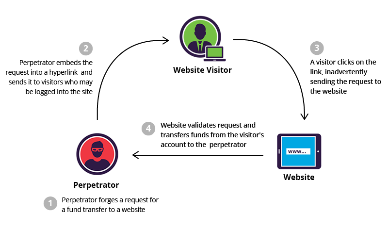

# Security

### **List The Security Vulnerabilities.**
> - SQL Injection.
> - Cross-Site Scripting (XSS).
> - Cross-Site Request Forgery (CSRF).
> - Unvalidated Redirects and Forwards.
> - Failure to restrict URL Access.
> - Broken Authentication and Session Management.
> - Insecure Direct Object References.
> - Security Misconfiguration.
> - Insecure Cryptographic Storage.
> - Insufficient Transport Layer Protection.

<br/>

### **What Is SQL Injection?**
> - A SQL injection is a technique that attackers use to gain unauthorized access to a web application database by `adding a string of malicious code to a database query`.
> - For example, a database may store information about user information. Instead of searching for a specific user ID, an attacker may insert "UserId = 105 OR 1=1" into the input field. Since the statement "1=1" is always true, the SQL query would return all available data. 

```
SELECT UserId, Name, Password FROM Users WHERE UserId = 105 OR 1=1;
```

<br/>

### **How To Prevent SQL Injection?**
> - **Input validation & sanitation**: Detect and filter out malicious code from user inputs.
> - **Use of prepared statements**: The use of prepared statements with variable binding (also known as parameterized queries) should be the first line of defense for mitigating SQL injections.
> - **Enforcing least privilege**: To ensure the security of data environments, administrators must minimize the privileges assigned to each database account. 
> - **Use Allowlists, Not Blocklists**: Don’t filter user input based on blocklists. If possible, verify and filter user input using strict allowlists only. Allowlists are an ideal way to prevent a serious SQL injection.
> - **Use constructed stored procedures**: Stored procedures can also be set up to accept user input, reducing the burden of validating user input within the application.
> - **Continuous Scanning and Penetration Testing**: Continuous web application scanning involves regularly running automated vulnerability scanning tools to identify and assess any potential vulnerabilities in a system.

<br/>

### **What Is XSS?**
> - Cross site scripting (XSS) is an attack which `injects malicious executable scripts into the code of a trusted application or website`.
> - There are three types of XSS: <br/>
(1) **Reflected XSS**: where the malicious script comes `from the current HTTP request`. <br/>
(2) **Stored XSS**: where the malicious script comes from the `website's database`, such as someone enter the script on message board. <br/>
(3) **DOM-based XSS**: where the vulnerability exists in client-side code rather than server-side code,. usually by `writing the data back to the DOM`.

<br/>

### **How To Prevent XSS?**
> - Filter input on arrival.
> - Encode data on output.
> - Use appropriate response headers.
> - Follow the content security policy.
> - Related Reference: [常見攻擊：XSS、SQL Injection
SQL Injection](https://yakimhsu.com/project/project_w12_Info_Security-XSS_SQL.html), [Cross Site Scripting (XSS)](https://www.synopsys.com/glossary/what-is-cross-site-scripting.html), [Cross-site scripting](https://portswigger.net/web-security/cross-site-scripting)

<br/>

### **What Is CSRF?**
<p align="center">
  
</p>

> - Cross-Site Request Forgery (CSRF) is an attack that `forces an end user to execute unwanted actions` on a web application in which they’re currently authenticated.
> - If you login website A then visit a dangerous website B, and click the btn on website B, send a request to website A however website A's session or cookie doesn't expired, website A will accept the request from user then execute it.
> - Related Reference: [讓我們來談談 CSRF](https://blog.techbridge.cc/2017/02/25/csrf-introduction/), [常見攻擊：CSRF](https://yakimhsu.com/project/project_w12_Info_Security-CSRF.html)

<br/>

### **What Is CORS?**

> - `A request from the origin domain is different from the target domain` which violate the same-origin policy, for the security, usually fobidden cross domain access to prevent CSRF.
> - `Cross Origin Resource Sharing` is a mechanism that `allows get data from other domain outside our own domain`. To be requested from another domain outside our own domain. 
> - There are three way to implement: Form Submit, JSONP and W3C - CORS.
> - By building on top of the XMLHttpRequest object, CORS allows developers to work with the same idioms as same-domain requests.
```
<? php
 
// Cross-Origin Resource Sharing Header
header('Access-Control-Allow-Origin: *');
header('Access-Control-Allow-Methods: GET, POST, PUT, DELETE, OPTIONS');
header('Access-Control-Allow-Headers: Origin, X-Requested-With, Content-Type, Accept');
 
?>
```
> - Related Reference: [什麼是CORS？](https://sibevin.github.io/posts/2017-06-05-101518-note-cors), [什麼是CORS](https://ithelp.ithome.com.tw/articles/10204004)
<br/>

### **How To Store The Password?**
> - Recommended: `hashed and salted`. Salting is simply the addition of a unique, random string of characters known only to the site to each password before it is hashed.
> - Not recommended: MD5, SHA1, SHA256.
> - Related Reference: [Passwords and hacking: the jargon of hashing, salting and SHA-2 explained](https://www.theguardian.com/technology/2016/dec/15/passwords-hacking-hashing-salting-sha-2)

<br/>


### **What Is CQRS?**
> - CQRS (Command-Query Responsibility Segregation): The update command should separate from query command

<br/>


### **What Is Locking?**
> - Use locking when multiple users are accessing data at the same time to protected resources such as tables, data rows, etc. For the concurrency and  isolation purpose.

<br/>
