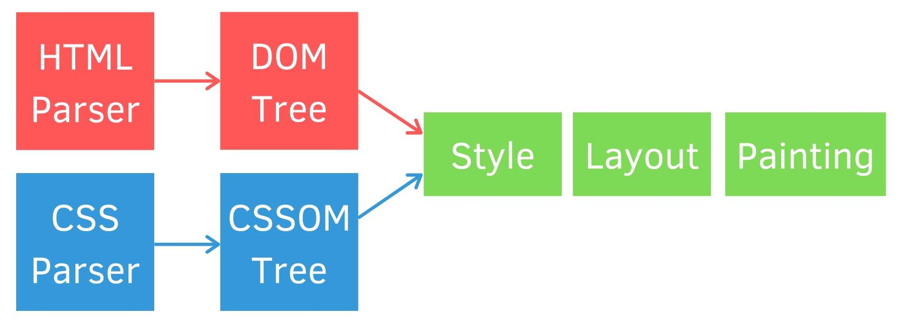
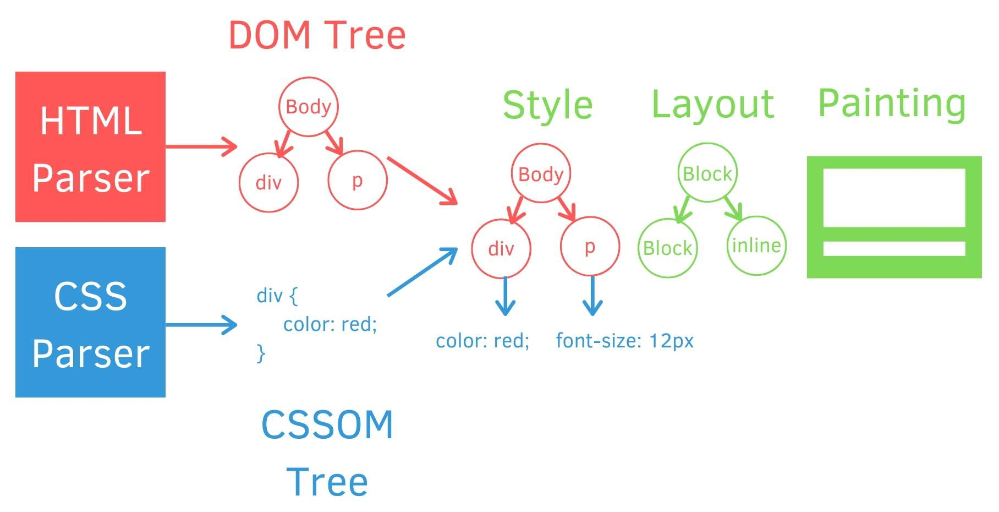

# Website Questions

### **What Are The Difference Between Session, Cookie, Sessionstorage And Localstorage?**

<table>
    <tr>
        <th>Type</th>
        <th>session</th>
        <th>cookie</th>
        <th>sessionStorage</th>
        <th>localStorage</th>
    </tr>
    <tr>
        <td>Storage location</td>
        <td>Server-side</td>
        <td>Client-side</td>
        <td>Client-side</td>
        <td>Client-side</td>
    </tr>
    <tr>
        <td>Maximum data size</td>
        <td>1024KB</td>
        <td>4K for one cookie, max 20 cookies for a website</td>
        <td>5M</td>
        <td>5M</td>
    </tr>
    <tr>
        <td>Expired Time</td>
        <td>If the user doesn’t active for a long time which over expires time, the server-side will delete the session to
            save the space
        </td>
        <td><li>Users can set the expiration time for each cookie.</li> <li>It will expire after closing the browser if it set on client-side
        </li></td>
        <td>The data clear automatically when the browser is closed</td>
        <td>The data <b>WILL NOT</b> be deleted when the browser is closed until the user clear through JavaScript, browser cache /
            locally stored data
        </td>
    </tr>
    <tr>
        <td>Scope</td>
        <td>No</td>
        <td>Changes made are saved and available for all same-origin page</td>
        <td>Changes made are saved and available for the current page</td>
        <td>Changes made are saved and available for all same-origin page</td>
    </tr>
    <tr>
        <td>Security</td>
        <td>High</td>
        <td>Low</td>
        <td>Low</td>
        <td>Low</td>
    </tr>
    <tr>
        <td>Usability</td>
        <td>Easy to use</td>
        <td>The API is difficult to use</td>
        <td colspan="2">Has method setItem, getItem, removeItem, clear that easy to use</td>
    </tr>
    <tr>
        <td>HTTP Request</td>
        <td></td>
        <td>The data is sent back to the server for every HTTP request which causes performance problems</td>
        <td colspan="2">The data is <b>NOT</b> sent back to the server for every HTTP request</td>
    </tr>
    <tr>
        <td>Application</td>
        <td>Login</td>
        <td>Login, shopping cart, game scores</td>
        <td>Form</td>
        <td>Shopping cart</td>
    </tr>
</table>

<br/>

### **How To Speed Up The Website?**

> **Analysis tools**:  <br/>
**(1) Performance Analyzers**: Lighthouse, PageSpeed, GTMatrix, etc. <br/>
**(2) Webpack**: Webpack Bundle Analyzer.  <br/>

<br/>

> **Methods**: <br/>
> - **Web Application:** SPA. Prevent user interact with the website causes render the whole page every time. First page use Server side render, Other pages use Client side render.
> - **Technology:** React  <br/>
**(1) Router**: React-router + React.lazy. <br/>
**(2) Virtual DOM**: dependency array of useEffect, key in the list. <br/>
**(3) Proper components**: Pure component or shouldComponentUpdate.

<br/>

> **For Huge Data:** <br/>
**(1) Virtualize long lists**: React-window or vue-virtual-scroll-list. This technique only renders the list in your viewport, preventing creating unnecessary nodes.  <br/>
**(2) Use webStorage**: Store such as user id, search key and result, user setting such as layout and lang on client side. <br/>
**(3) Use Promise to make multiple calls**.  <br/>
**(4) Service worker**: It will irst immediately return a cached response if it exists, and then in parallel query the network. Upon receiving the response from the network, the cached entry will be updated and the user interface will be updated automatically.

<br/>

> **For Files:** <br/>
**(1) Code splitting**: To solve the problem that js bundle size is too large, to divide to smaller chunks.  <br/>
**(1.1) Dynamic Import**: React-router + React.lazy to load the specific resources when we change to that page, prevent some resources that we don’t need to download in the beginning. Big files: To load the files according to the timing or logic. <br/>
**(1.2) Bundle third party files to one file**: CommonsChunkPlugin, By separating common modules from bundles, the resulting chunked file can be loaded once initially, and stored in cache for later use. <br/>
**(1.3) Preload, prefetch, prepender, async...files**: Use async, defer, prefetch, preload, preconnect, dns-preconnect, prerender tags.<br/>
**(2) Contents**: Offer the different website content depends on user’s internet speed. <br/>
**(3) Delete unused code**: Remove spaces, commas, and other unnecessary characters.<br/>
**(4) Minify CSS, JS, images**: Use gzip for file compression, to reduce the size of your CSS, HTML, and JavaScript files. <br/>
**(5) Images**: Proper image size and format, use jpg instead of png,  use webp  instead of jpg. <br/>
**(6) Lazy load**: Like JS, CSS, images, 3rd party scripts such as Google Tag Manager, facebook pixel code. <br/>
**(7) Eliminate render-blocking resources**: Not waiting website load the js, css resources then render the page.

 <br/>
 
> **Others:**
> - Reduce the HTTP requests: use sprite images, combine files...etc.
> - Use CDN.
> - Use Cache, for static resources use longer cache expiration.
> - Reduce redirects.
> - Stable server.
> - Optimize render web page.
> - Related Reference: [20 Ways to Speed Up Your Website](https://www.crazyegg.com/blog/speed-up-your-website/), [讓你的網頁加載時間降低到1s 內](https://www.jianshu.com/p/d857c3ff78d6)

<br/>

### **Explain The Meaning Of HTTP Status Code 200, 400, 403, 404, 500, 502.** 

> - 200: Request success. <br/>
> - 400: Syntax error -> The reason usually is programming error. <br/>
> - 403: Not allow to visit. <br/>
> - 404: Page not found. <br/>
> - 500: Server error -> There are lots of possibilities: .htaccess document setting error, database setting error...etc <br/>
> - 502: Bad gateway -> Wait and reload or find mis.

<br/>

### **What Is NPM?**

> - NPM is short for Node Package Manager, it is an online library for `download manage open-source javaScript projects`.

<br/>


### **Why Use NPM?**
> - For example if we want to use jQuery, we used to download jQuery or include jQuery CDN url, but how about we need to use a lots of packages? NPM is a tool to solve this time-consuming things.
> - Related Reference: [從零開始: 使用NPM套件](https://medium.com/html-test/從零開始-使用npm套件-317beefdf182)

<br/>


### **What Is Webpack?**

> - There are lots of preprocessors and frameworks, We may need to compile ES6, SCSS, webpack can help us compile preprocessors to the code which browser can understand then bundle it, we can also use webpack to minify or optimize code...etc., which makes work efficiently.
> - Related Reference: [什麼是Webpack?](https://medium.com/i-am-mike/什麼是webpack-你需要webpack嗎-2d8f9658241d), [關於 Webpack](https://neighborhood999.github.io/webpack-tutorial-gitbook/Part1/), [Webpack 初學者教學課程](https://neighborhood999.github.io/webpack-tutorial-gitbook/Part1/)

<br/>

### **How To Reduce Webpack Building Time?**

> - Use the latest webpack version.
> - Minimize the search scope.
> - Since webpack only use single thread so we can use tool such as happypack, thread-loader, etc., by runnung multiple threads to save building time.
> - Set cacheDirectory to babel-loader
> - Related Reference: [使用 happypack 提升 Webpack 项目构建速度](https://juejin.im/post/5c6e0c3a518825621f2a6f45), [提升構建速度的方法](https://zhuanlan.zhihu.com/p/59328293), [使用webpack4提升180%編譯速度](http://louiszhai.github.io/2019/01/04/webpack4/), [webpack-bundle-analyzer插件快速入門](https://juejin.im/post/5cb70649f265da03452bd2d9)

<br/>


### **What Is SPA?**

> - SPA is short for `Single Page Application`. 
> - One SPA is one web application, it will `load all you need (HTML, CSS, JS) at first time`.
> - It will `not reload whole` website when user manipulate the pages, `only reload the different part`, let user has better user experiences.
> - Related Reference: [跟著小明一起搞懂技術名詞：MVC、SPA 與 SSR](https://medium.com/@hulitw/introduction-mvc-spa-and-ssr-545c941669e9)

<br/>


### **What Are SPA's Pros And Cons?**

> **Pros**: 
> - (1) SPA is fast, as most resources (HTML+CSS+Scripts) are only loaded once throughout the lifespan of the application. Only data is transmitted back and forth.
> - (2) SPA can cache any local storage effectively. An application sends only one request, store all data, then it can use this data and works even offline.
> - (3) Using fewer servers for the same amount of traffic.
> - (4) Improve user experiences'
> - It’s easier to make a mobile application because the developer can reuse the same backend code for web application and native mobile application.

> **Cons**: 
> - (1) Bad at SEO, but can be improved by SSR.
> - (2) Additional problems with JavaScript arise because you have to make sure there are no memory leaks. Since the app can run for a long time 
> - (3) It is slow to download because heavy client frameworks are required to be loaded to the client.
> - (4) Compared to the “traditional” application, SPA is less secure. Due to Cross-Site Scripting (XSS), it enables attackers to inject client-side scripts into web application by other users. → WHY?
> - (5) One more disadvantage of JavaScript is that users simply can have it disabled on their devices, and then you need to think of additional ways of how they can access the information on your website or your app without JavaScript. 

<br/>


### **How To Improve The Bad SEO Of SPA?**

> - SSR, Server Side Rendering, `render the fist page with server side, the others with client side`.
> - Related Reference: [淺談SPA、SEO與SSR](https://juejin.im/entry/5bbbf852f265da0aea699497)

<br/>

### **What Is SSR (Server-Side Rendering) And CSR (Client-Side Rendering)?**

|   | SSR (Server-side rendering) | CSR (Client-side rendering) |
|---|---|---|
| Rendering |It can basically be defined as doing the browser's work on the server. In connection requests to the server side, the server `returns the entire page content as a readable HTML response`. A readable content appears even when the `JavaScript codes are not executed`, but the page does not have the dynamics that the JavaScript codes provide. |Websites send very `little HTML response to connection requests`. This HTML response contains JavaScript codes that make up the content of the page. `Unless these JavaScript codes are executed, the website is a blank page`.|
| SEO | `Good`, due to the `faster initial load time`, the HTML is available for the first time itself. | `Bad`, negative impact on SEO if there are any delays in API responses and rendering doesn’t happen correctly. CSR requires a `two-wave process for JS rendering and indexing` in a browser. |
| Speed | Initial loading time is fast, browsing from page to page is often much slower. | Initial loading time is slow, but website is rendered faster after the initial load. |
| Loading | Mainly on `server`. | Mainly on `browser`. |
| Application | Main page which needs SEO. | Other pages which don't need SEO or update frequently. |

> - Related Reference: [現代前端渲染機制: SSR vs. CSR](https://growingdna.com/ssr-versus-csr/), [Pros and Cons of Client-Side Rendering](https://www.pluralsight.com/guides/pros-and-cons-of-client-side-rendering), [Javascript SEO: What is SSR/CSR? Advantages and Disadvantages](https://zeo.org/blog/javascript-seo-what-is-ssr-csr-advantages-and-disadvantages/)

<br/>


### **What Is MPA?**
> - MPA is short of `Multi-page Web Applications`.
> - Multi-page application (a traditional app that loads new pages when you click a link).

<br/>


### **What Is PWA?**

> - PWA is short of `Progressive Web Application`,
> - A website that is built using JavaScript or its frameworks and can act like an app, i.e., you can, for example, add it to your mobile phone homepage as an app)
> - PWA is webAPP.
> - Related Reference: [PWA 初體驗](https://hsiangfeng.github.io/pwa/20191017/2186080947/)

<br/>


### **What Is Webview?**

> - Webview is hybrid(Native + Web) app or in-app browser, open a website in native app.
> - Related Reference: [Native, Hybrid, Web App, Cross App](https://medium.com/@milkmidi/native-hybrid-web-app-cross-app%E5%93%AA%E4%B8%80%E5%80%8B%E6%98%AF%E9%96%8B%E7%99%BCapp%E6%9C%80%E4%BD%B3%E6%96%B9%E6%A1%88%E5%91%A2-381e5529e47), [用 Line、FB 手機 APP 開啟網頁對前端工程師的困擾﹍JS 辨識內建瀏覽器(webview)的方法](https://www.wfublog.com/2018/06/mobile-detect-webview-fb-line-in-app.html)

<br/>


### **What Is WebAPP?**
> - A website app which doesn't need to download, you can open it with browser.
> - Related Reference: [Native, Hybrid, Web App, Cross App](https://medium.com/@milkmidi/native-hybrid-web-app-cross-app%E5%93%AA%E4%B8%80%E5%80%8B%E6%98%AF%E9%96%8B%E7%99%BCapp%E6%9C%80%E4%BD%B3%E6%96%B9%E6%A1%88%E5%91%A2-381e5529e47)

<br/>


### **What Is Gateway, API And API Gateway?**

> - Gateway: An interface to receive and handle the request.
> - API: A `Application Programming Interface` to let user manipulate to achieve what they want.
> - API Gateway: A service that makes it easy for developers to publish, maintain, monitor, secure, and operate APIs. 
> - Related Reference: [Amazon API Gateway](https://aws.amazon.com/tw/api-gateway/features/), [什麼是 Amazon API Gateway？](https://docs.aws.amazon.com/zh_tw/apigateway/latest/developerguide/welcome.html)

<br/>


### **What Is Rest API (Restful API)?** 

> - Rest API also calls `Restful API`, the purpose is make api easily to maintain and develop. 

```
https://localhost:8080/myweb/getDogs --> GET /rest/api/dogs get dogs 
https://localhost:8080/myweb/addDogs --> POST /rest/api/dogs add dog
https://localhost:8080/myweb/updateDogs/:dog_id --> PUT /rest/api/dogs/:dog_id modify a dog
https://localhost:8080/myweb/deleteDogs/:dog_id --> DELETE /rest/api/dogs/:dog_id delete a dog
```
> - Related Reference: [REST與RESTful](https://www.twblogs.net/a/5d404cf0bd9eee517423039c), [休息(REST)式架構](https://progressbar.tw/posts/53), [API 是什麼? RESTful API 又是什麼?](https://medium.com/itsems-frontend/api-%E6%98%AF%E4%BB%80%E9%BA%BC-restful-api-%E5%8F%88%E6%98%AF%E4%BB%80%E9%BA%BC-a001a85ab638), [RESTful Web API 設計指南](https://www.footmark.info/programming-language/design/restful-webapi-design-guide/), [簡明RESTful API設計要點](https://tw.twincl.com/programming/*641y)

<br/>


### **What Are Prons And Cons Of Rest API?**

> - Strength: Simple and uniform Interface, cachable
> - Weakness: Need to create multiple requests to get complex data 

<br/>


### **How To Solve The Cons Of Rest API?**

> - `GraphQL allow using one entry point to get all data`, doesn’t like restful api which needs to call multiple times to get enough data. And what your get is what you search, it also can reduce the requests.

```
Search：

{
    user(uid:1) {
        uid
        name
    }
}
```

```
Get：

{
  "data": {
    "user": {
      "uid": "1",
      "name": "xxx"
    }
  }
}
```
> - Related Reference: [GraphQL和RESTful的比較](https://segmentfault.com/a/1190000012878342)

<br/>


### **What Is Token?**

> - Token likes a passport, after user enter the id and password, server-side will generate a token for this user,
then the user will has permission to view or manipulate corresponding informations by the token. There are a lots of way to generate token, such use Mac, sessionId, etc.
> - Related Reference: [Token令牌入門學習](https://codertw.com/%E7%A8%8B%E5%BC%8F%E8%AA%9E%E8%A8%80/35304/#outline__1_0_1), [簡單理解token機制](http://www.woshipm.com/pd/877760.html)

<br/>


### **What Is Web Accessibility?**

> - To ensure everyone includes disables can use the website's function working normally.
> - The ways: <br/>
    (1) Semantic tags. <br/>
    (2) Offer alt descriptions for button, images, audio and video. <br/>
    (3) Set up proper title for website.  <br/>
    (4) Use rem, em, etc. for text instead of using px.  <br/>
    (5) Add noscript when user disable javaScript.  <br/>
    (6) Add access key.  <br/>
            - User able useing tap to browse whole website.  <br/>
            - User able useing specfic key to jump to main area.  <br/>

> - Related Reference: [我們都應該了解的無障礙網頁概念](https://designtongue.me/website-accessibility/)

<br/>


### **How The Browser Renders A Web Page?**

<p align="center">


</p>

> - (1) Start parsing HTML to DOM(Document Object Model) Tree and parsing CSS to CSSOM(CSS Object Model) Tree
> - (2) Combine DOM and CSSOM to calculate html and style then generate render tree
> - (3) Determine every element's layout (Reflow)
> - (4) Paint the result on the screen (Repaint)
> - Related Reference: [瀏覽器渲染過程與性能優化](https://sylvanassun.github.io/2017/10/03/2017-10-03-BrowserCriticalRenderingPath/), [從輸入網址列到渲染畫面，過程經歷了什麼事？](https://w3c.hexschool.com/blog/8d691e4f), [html網頁渲染的基本過程](https://www.itread01.com/content/1546714651.html)

<br/>


### **What Happens When A User Click A Link On a Page?**
> - Browser gathers the information about the link and sends the request to a naming server. 
> - The naming server translates the link text into an IP address, the IP address will be used to identify a particular computer.
If the address is found, the IP address is sent to my browser. 
The browser then contacts the web server that has the web page I requested. 
The page is then sent to your browser.

<br/>

### **What Is The Async And Defer In Script Tag?**
> - **Async**: `Continue loading other documents when loading script`, recommended use in single independent scripts such as ga, advertisement, etc. (It can't ensurance loading sequence, because when fininsh loading script, it will start to execute script and stop parsing html)
> - **Defer**: `Load script after finishing loading other documents`, recommended use in every scripts.
> - **Async + Defer**: load script asynchronous after loading other documents.
> - Related Reference: [script tag 加上 async & defer 的功能及差異？](https://ithelp.ithome.com.tw/articles/10216858), [script 的新增屬性 defer, async](http://n.sfs.tw/content/index/10323)

<br/>


### **What Is HTTP Cache?**
> - HTTP caching is a `process of temporarily storing web content and on a CDN server`.
> - The first time a browser loads a web page, it stores the page resources in the HTTP Cache. The next time the browser hits that page, it can look in the cache for resources that were previously fetched and retrieve them from disk, often faster than it can download them from the network.
> - Two main types of cache headers, `cache-control and expires`, define the caching characteristics for your resources.
> - Related Reference: [HTTP Caching](https://developers.google.com/web/fundamentals/performance/get-started/httpcaching-6)

<br/>


### **What Is The Purpose Of A CDN And What Benefits Does It Bring?**
> - The primary purpose of CDN is to improve a website’s loading speed.
> - This helps users around the world view the same high-quality content and also improve their site performance without slow loading times.

<br/>


### **What Is Reflow And Repaint?**
> - **Reflow**: It will reflow when `manipulate DOM (add, change, delete, etc.)`, `change CSS(width, position, etc.)`, `change size of browser`, etc. Change width → Reflow → Repaint.
> - **Repaint**: It will repaint when `change style of element`. Change color → Repaint.
> - Related Reference: [Reflow 及 Repaint 是什麼？](https://ithelp.ithome.com.tw/articles/10217427), [html網頁渲染的基本過程](https://www.itread01.com/content/1546714651.html)

<br/>


### **How To Optimize Render Web Page?**
> - Combine multiple operations to one time.
> - `Modify element's style by change class name` instead of changeing the style by css-in-js.
> - Set the position to absolute or fixed to the element needs to reflow multiple times, the element will escape from document flow to prevent affect other elements. 

<br/>


### **What Is Graceful Degradation And Progressive Enhancement?**

> - **Graceful Degradation**: Building the website so it provides a good level of user experience in `modern browsers first`, then fix the problem for other browsers. 
> - **Progressive Enhancement**: Building the website to keep all functions work properly for `all the browsers`, then optimize the website to support the newer browser, let the basic functionality will work on older systems.
> - Use progressive enhancement will cost more time and manpower in the beginning, but easily to maintain. Use graceful degradation can make website online quickly. Choose which to use it depends on the requirements.
> - Related Reference: [認識優雅降級與漸進增強](http://augus-blog.logdown.com/posts/143403-graceful-degradation-and-progressive-enhancement)

<br/>
