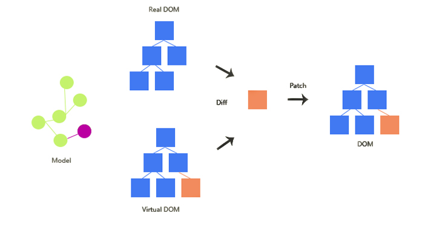
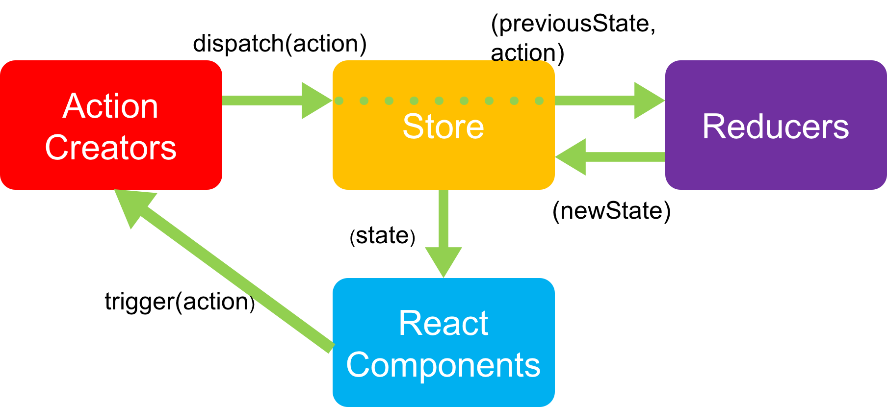

## React Questions
<br/>

:white_check_mark: 1. What Is And When Use React.js ?
> - React is a front-end JavaScript library for building user interfaces which developed by Facebook, now Instagram, Netflix, Whatsapp, Uber, Dropbox, IMDB and Reddit, etc. also use React.js 
> - Build a huge website which includes complicated events and status change instead of buliding a simple web.<br /><br/>
> - Related Reference : [What is React?](https://www.simplilearn.com/what-is-react-article)
<br/>

:white_check_mark: 1.2 What Is Features Of React.js ?
> - Only the View of MVC.
> - JSX.
> - Virtual DOM.
> - Uni-directional data flow.
> - Components based.
<br/>

:white_check_mark: 1.3 What Is Strength And Weakness Of React.js ?
> - **Strength** :  <br/>
(1) Ensures faster rendering with virtual DOM, which compares the components’ previous states and updates only the items in the Real DOM that were changed, instead of updating all of the components again.   <br/>
(2) It follows the component based approach which helps in building reusable UI components.  <br/>
(3) Uni-directional data flow make it becomes easier to debug errors and know where a problem occurs in an application at the moment in question. And even small changes made to the child structures will not affect their parents, that makes code stable.  <br/>
(4) SEO friendly, React can run on the server, rendering and returning the virtual DOM to the browser as a regular webpage.  <br/>
(5) Can be used for the development of both web and mobile apps.   <br/>
(6) Server-side rendering accelerates loads of starting page because users do not need to wait for JavaScript loadings before viewing web sites.  <br/>
(7) Useful developer toolset.  <br/>
(8) Strong community support.
<br/>

> - **Weakness** : <br/>
(1) React focus on view, lacking of route, ajax, async promise, etc. <br/>
(2) Coding gets complex as it uses inline templating and JSX.

<br/>

:white_check_mark: 2. What Is The Differences Between Vue.js, Angular.js and React.js ?

| TOPIC | React | Vue | Angular |
|---|---|---|---|
| Syntax | ES6 | ES5, ES6 | TypeScript |
| Architecture | Only the View of MVC | MVVM | Complete MVC |
| Rendering | Server-side rendering | Client-side rendering | Client-side rendering |
| DOM | Virtual DOM | Virtual DOM | Real DOM |
| Data Binding | One-way data binding | Two-way data binding | Two-way data binding |
| Author | Facebook | Former google employee | Google |
| When Use | • Your project can accept reusable components.  <br/> • Your project’s front-end is not too complex.  <br/> • The performance and scalability are critical.  <br/> • You have tight deadlines.  <br/> | • Your project scope is on the small side.  <br/> • You need high performance.  <br/> • You have no skilled front-end developers but have team members with JavaScript knowledge.  <br/> • You do not have much time to learn a new technology.  <br/> | • You are about to develop a very large and complex project. <br/> • You need easy and reliable scalability. <br/> • You have Angular developers on your team. <br/>   • You can afford some time for learning TypeScript before the project starts |

> - Related Reference : [Angular vs React vs Vue: Which Framework to Choose in 2020](https://www.codeinwp.com/blog/angular-vs-vue-vs-react/), [Angular vs React vs Vue](https://levelup.gitconnected.com/angular-vs-react-vs-vue-which-is-the-best-choice-for-2020-81f577697c7e), [Angular vs. React vs. Vue.js – choosing a JavaScript framework for your project](https://relevant.software/blog/angular-vs-react-vs-vue-js-choosing-a-javascript-framework-for-your-project/)

<br/>

:white_check_mark: 3. What Is JSX ?
> - JSX stands for JavaScript XML.
> - JSX is not JavaScript nor HTML, is an XML/HTML like extension to JavaScript.
> - JSX as a syntax sugar for calling React.createElement().
> - Instead of putting JavaScript into HTML, JSX allows us to put HTML into JavaScript, then Babel will transform these expressions into actual JavaScript code. 
> - Examples : <br/>
 (1) Return one element https://jsfiddle.net/yschen25/29xrnmtw/ <br/>
 (2) Self-closing tags https://jsfiddle.net/yschen25/8g0w7thy/ <br/>
 (3) Comments https://jsfiddle.net/yschen25/c9uwgox1/ <br/>
 (4) Js in JSX https://jsfiddle.net/yschen25/knrg7ydm/ <br/>
 (5) Ternary operator https://jsfiddle.net/yschen25/L9o6ymcg/ <br/>
 (6) CamelCase https://jsfiddle.net/yschen25/x2n3oc8y/11/ <br/>
<br/><br/>

:white_check_mark: 3.1 Why Can’t Browsers Read JSX?
> - Browsers can only read JavaScript objects but JSX in not a regular JavaScript object. Thus to enable a browser to read JSX, first, we need to transform JSX file into a JavaScript object using JSX transformers like Babel and then pass it to the browser.
<br/><br/>

:white_check_mark: 4. What Is Virtual DOM ?

<p align="center">


</p>

> - If a developer uses JSX to manipulate and update its DOM, React.js creates Virtual DOM which is a copy of the site’s DOM, and React.js uses this copy to see what parts of the actual DOM need to change when an event happens.

> - If you’re not using React.js (and JSX), your website will use HTML to update its DOM. This works fine for simple, static websites, but for dynamic websites that involve heavy user interaction it can become a problem, since the entire DOM needs to reload every time the user clicks a feature calling for a page refresh.

<br/>

:white_check_mark: 5. What Is Functional Components(Stateless Component) And Class Components (Stateful Components) ? (ref:17)

> - **Functional Components** : <br/>
(1) These components have no state of their own and only contain a render method, so they are also called stateless components. They may derive data from other components as props (properties). <br/>
(2) Example : https://jsfiddle.net/yschen25/dmacrpjq/
<br/>

> - **Class Components** : <br/>
(1) These components can hold and manage their state and have a separate render method for returning JSX on the screen. They are also called stateful components, as they can have a state. <br/>
(2) Constructor is optional, add the constructor when you need to use state or bind function. (If use functional + hook or arrow function then don't need bind function) In this example, this.props works fine even without constructor, Example : https://jsfiddle.net/yschen25/2jcgbom0/ <br/>
(3)  Related Reference : [有無加上constructor的差異](https://github.com/kdchang/reactjs101/issues/28)
<br/><br/>


:white_check_mark: 5.1 What Is The Difference Between Functional Components And Class Components ?

|  Functional Components | Class Components |
|---|---|
| Calculates the internal state of the components | Stores info about component’s state change in memory |
| Do not have the authority to change state | Have authority to change state |
| Contains no knowledge of past, current and possible future state changes | Contains the knowledge of past, current and possible future changes in state |
| They receive the props from the Stateful components and treat them as callback functions | Stateless components notify them about the requirement of the state change, then they send down the props to them |

<br/>

:white_check_mark: 5.2 When Use Functional Components And Class Components ?

> - **Functional Components** :  <br/>
(1) Don't need to use lifecycle  <br/>
(2) Don't need to use state  <br/>
(3) Create reusable components  <br/>
(4) Only render UI
<br/>

> - **Class Components** :  <br/>
(1) Need to use lifecycle  <br/>
(2) Need to use state  <br/>
(3) Have to receive data form user  <br/>
(4) Create interactive objects  <br/>
(5) Render after change state

<br/>

:white_check_mark: 6. What Is Props ?
> - Props is the shorthand for Properties. props data is read-only, which means that data coming from the parent should not be changed by child components.
> - They are always passed down from the parent to the child components in a uni-directional flow, a child component can never send a prop back to the parent component.
> - Props form the parent to the child components will cause child components re-render.
> - When your applications have a massive quantity of nested components it will may causes props hell (wrapper hell).
> - Examples : <br/>
    (1) Pass props via Functional Component (notice : use props.data) https://jsfiddle.net/yschen25/0e5udb1x/ <br/>
    (2) Pass props via Class Component (notice : use this.props.data) https://jsfiddle.net/yschen25/3vhqL8bn/
<br/><br/>

:white_check_mark: 6.1 When Use Props ?
> - To pass data & event handlers down to your child components.
> - If you don't have to use state or bind function then you don't need to write constructor.
> - Related Reference : [有無加上constructor的差異](https://github.com/kdchang/reactjs101/issues/28)
<br/><br/>

:white_check_mark: 6.2 What Is PropTypes And DefaultProps ?
> - PropTypes : A typechecking tool to make sure the data is valid, propTypes is only checked in development mode, Example : https://jsfiddle.net/yschen25/oahjbq81/.
> - DefaultProps : You can define default values for props by assigning defaultProps, Example : https://jsfiddle.net/yschen25/763g8Lqv/.
<br/><br/>

:white_check_mark: 6.3 How To Solve Props Hell (Wrapper Hell) ?
> - Redux.
> - Functional components + hook. 

<br/>

:white_check_mark:7. What Is State ?
> - The state is a data structure that starts with a default value when a Component mounts.
> - A component’s state can change over time; whenever it changes, the component re-renders. The change in state can happen as a response to user action or system-generated events, and these changes determine the behavior of the component and how it will render.  
> - Example : https://jsfiddle.net/yschen25/wc1qapz2/14/
<br/>

:white_check_mark:7.1 When Use State ?
> - To store the data your current page needs in your controller-view.
<br/><br/>

:white_check_mark:7.2 How To Change State ?
> - State of a component can be updated using this.setState(), functional + hook useState().
> - setState is asynchronous.
> - Example : https://jsfiddle.net/yschen25/a2cmdb04/
<br/><br/>

:white_check_mark: 7.3 What Is The Difference Between Props And Status ?

|  Conditions | State | Props |
|---|---|---|
| | Internal | External |
| | Mutable | Immutable |
| | Can be modified using setState() method | Can't not be modified |
| | Starts with a default value which is generally updated by event handlers | Passed as attributes from parent component to child component |
| (ref:8)| Can only be used with Class Components | Can be used with both Class as well as Functional Components |

<br/>

:white_check_mark: 8. Why Should We Bind The Function ?

> - When you define a component using an ES6 class, a common pattern is for an event handler to be a method on the class. In JavaScript, class methods are not bound by default. If you forget to bind this.someEventHandler and pass it to onChange, this will be undefined when the function is actually called.
> - This is a way of saving the current value of this, which is in scope during the call to the constructor, so that it can be used later when the function is called.
> - Bind creates a new function that will force the this inside the function to be the parameter passed to bind().
> - When you need to access props, state or other members on the class, then you would need to bind it.
> - Related Reference : [why do you need to bind a function in a constructor
](https://stackoverflow.com/questions/38334062/why-do-you-need-to-bind-a-function-in-a-constructor), [Why and when do we need to bind functions and eventHandlers in React?](https://stackoverflow.com/questions/41113798/why-and-when-do-we-need-to-bind-functions-and-eventhandlers-in-react), [What is the use of the JavaScript 'bind' method?](https://stackoverflow.com/questions/2236747/what-is-the-use-of-the-javascript-bind-method), [進入Component的事件處理篇](https://ithelp.ithome.com.tw/articles/10200941), [React Binding Patterns: 5 Approaches for Handling `this`](https://www.freecodecamp.org/news/react-binding-patterns-5-approaches-for-handling-this-92c651b5af56/?source=post_page---------------------------)
<br/><br/>

:white_check_mark: 8.1 How To Bind The Function ?
> - Class component : Bind in constructor : https://jsfiddle.net/yschen25/n8umkzx6/5/

```
constructor(props) {
        super(props);
        this.state = {count: 0};
        this.addCount = this.addCount.bind(this);
    }

    addCount() {
        this.setState({
            count: this.state.count + 1
        });
    }
    
    render() {
    		return (
		    <div>
			<button onClick={this.addCount}>Click Me!</button>
			<h1>{this.state.count}</h1>
		    </div>
        )
    }
```
<br/>

> -  Class component : Bind in render : https://jsfiddle.net/yschen25/otd36q24/
```
addCount() {
        this.setState({
            count: this.state.count + 1
        });
    };

    render() {
        return (
            <div>
                <button onClick={this.addCount.bind(this)}>Click Me!</button>
                <h1>{this.state.count}</h1>
            </div>
        )
    }
```
<br/>

> -  Class component : use arrow function : https://jsfiddle.net/yschen25/z6ckng0w/
```
addCount = () => {
    this.setState({ 
        count: this.state.count + 1 
    });
```
<br/>
> - Functional component + hook

<br/><br/><br/>

:white_check_mark: 8.2 Why We Don't Need Bind Arrow Function ?
> - A benefit of using arrow functions is that this is already bound to that function so we don’t need to specify that anywhere else.
> - Related Reference : [Why we don't need to bind the arrow function in React?](https://stackoverflow.com/questions/52979915/why-we-dont-need-to-bind-the-arrow-function-in-react)
<br/><br/>

9. Explain The Life Cycle Of React.js ? <br/>
> - Each component in React has a lifecycle which you can monitor and manipulate during its three main phases. <br/>
 (1) Mounting : Means putting elements into the DOM. <br/>
 (2) Updating : A component is updated whenever there is a change in the component's state or props. <br/>
 (3) Unmounting : When a component is removed from the DOM. <br/>
 (4) (Error Handling) : Occors javaScript errors. <br/>
<br/>

**Mounting** : <br/>
(1) constructor() : The constructor is the first method executed and is called before mounting. This method is typically used for two reasons, binding member functions and setting the initial state. Each can only be used in class components. If you do make use of a constructor, make sure to call super() with the props as an argument, otherwise ‘props’ will be undefined in the component. <br/>
Since we need to initialize state, this is the only place where we can directly define state without using setState(). You should also not use setState() in the constructor anyway, to avoid unexpected behavior. If you’re using arrow functions in your component, then you don’t need to bind ‘this’ to the functions as it is already implicitly passed.
```
constructor(props){
        super(props);
        this.state = {
            name: "ReactJS"
        }
        this.updateName = this.updateName.bind(this);
    }
```
<br/>

(2) getDerivedStateFromProps() : Called right before rendering the elements in the DOM, and is executed every time the component updates, including the initial render. It is usually used to set the initial state depending on the props passed to the component.
```
 static getDerivedStateFromProps(props, state){
        return {
            name: props.name
        }
    }
```
<br/>

(3) render() : The only required method in a component. It is responsible for rendering the JSX into the DOM. If using conditional rendering, some simple logic can be applied inside this method, such as a ternary operator or pure functions. Don't make API request, put any action that needs to occur only once in the lifetime of the component here and set the state here (Your app will be thrown into an infinite loop of rendering as this.setState will change the state and then call the render function which in turn will again set the state and so on).
```
render() {
    return <div>My Component</div>;
  }
```
<br/>

(4) componentDidMount() : When your component is loaded in the DOM, this method is executed. Therefore, it makes this an ideal place to perform any API calls or make changes to the DOM. After executing once, it is not triggered again for the duration of the component’s life. <br/>
You can use setState() here to modify the state, which is commonly done when data is fetched from a network request. However, if you need to set the state immediately and you don’t need to access the DOM, it is always a better idea to do that in the constructor. <br/>

**Updating** : <br/>
The modification phase can be triggered using three methods :  <br/>
(1) Receiving new props  <br/>
(2) Calling setState() and updating the state  <br/>
(3) Using this.forceUpdate  <br/>

(1) getDerivedStateFromProps() : This is the first method that is called when a component gets updated. This is still the natural place to set the state object based on the initial props. <br/><br/>

(2) shouldComponentUpdate() : This method is designed to increase performance in React applications. It accepts the previous state and previous props, which you can compare with the current state and props and using a conditional operator, return true or false depending on whether React should update the component or not. 
```
shouldComponentUpdate(nextProps, nextState){
    if(this.state.name === nextState.name) { return false; }
  }
```
<br/>

(3) render() : The render() method is of course called when a component gets updated, it has to re-render the HTML to the DOM, with the new changes. <br/><br/>

(4) getSnapshotBeforeUpdate() : This is a new method recently introduced in React. It can be used as an alternative for the now deprecated componentWillUpdate(). In the getSnapshotBeforeUpdate() method you have access to the props and state before the update, meaning that even after the update, you can check what the values were before the update. If the getSnapshotBeforeUpdate() method is present, you should also include the componentDidUpdate() method, otherwise you will get an error. <br/><br/>

(5) componentDidUpdate() : This method is executed right after all the changes have been propagated to the DOM. Here, we have access to the previous props, state and the value returned by getSnapshotBeforeUpdate() also known as the snapshot. If we want to modify the state in this method, we must do so in a conditional statement. 
```
componentDidUpdate(prevProps, prevState, snapshot) {
      if(prevState.name === "ReactJS" && this.state.name === "VueJS") {
          this.setState({ name: "Angular" })
      }
  }
```
<br/>

**Unmounting** :  <br/>
(1) componentWillUnmount() : This method is called right before the component is unmounted from the DOM. Here, you can call any last-minute actions or perform any clean-up required. You’ll need to make sure to clean up any subscriptions or events in componentWillUnmount(), that you may have created earlier in componentDidMount.
```
 componentWillUnmount(){
      this.clearInterval(this.timer);
  }
 ```
 <br/>

**Error Handling** : <br/>
(1) getDerivedStateFromError() : When an error occurs, this method receives the error object. You can update the state, depending on the error, to be used anywhere in the component, possibly to show a fallback UI. 
```
static getDerivedStateFromError(error) {
    return { error: error.message };
  }
```
<br/>

(2) componentDidCatch() : Error boundaries are components that can catch errors anywhere in component (including any children component they render), and log errors and/or display a fallback UI. The componentDidCatch lifecycle hook is meant to catch errors during mounting, rendering and in other lifecycle methods.
```
componentDidCatch(error, info) {
    this.logError(error, info);
  }
```
<br/>

> - Related Reference : [Understand React Lifecycle Methods](https://www.gistia.com/insights/understand-react-lifecycle-methods), [Understanding React Lifecycle Methods](https://medium.com/commutatus/understanding-react-lifecycle-methods-de0e33bf3319), [React 元件生命週期](https://www.fooish.com/reactjs/component-lifecycle.html), [React Life Cycle 生命週期更新版，父子元件執行順序](https://iandays.com/2018/07/27/reactlife/index.html), [React 16：Lifecycle Methods 新手包](https://5xruby.tw/posts/react-16-lifecycle-methods/)
<br/><br/>

10. Axios
> - Axios is a promise-based HTTP client that works both in the browser and in a Node.js environment. It provides a single API for dealing with XMLHttpRequests and node’s http interface. Besides that, it wraps the requests using a polyfill for ES6 new’s promise syntax. <br/>
(1) Make XMLHttpRequests from the browser <br/>
(2) Make http requests from node.js <br/>
(3) Supports the Promise API <br/>
(4) Intercept request and response <br/>
(5) Transform request and response data <br/>
(6) Cancel requests <br/>
(7) Automatic transforms for JSON data <br/>
(8) Client side support for protecting against XSRF
<br/><br/>

11. What Is Flux ?

<p align="center">

 
<br/>


</p>

> - The relationship between components gets complicated. It becomes hard to scale the application. To solve this issue FB architected a Single directional data flow.
> - Flux uses a unidirectional data flow pattern to solve state management complexity.
<br/>

> - **There are three distinct roles for dealing with data in the flux methodology** :
> - Action Creators & Action : Action Creators are collections of methods that are called within views to send ``Actions`` to the ``Dispatcher``. Actions are the actual payloads that are delivered via the dispatcher. The action can be something like add a post, delete a post, or any other user interaction. 
> - Dispatcher : The manager of this entire process, the central hub for the application. It dispatches the payload from ``Actions`` to ``Store``. 
> - Store : Containers for application state & logic that have callbacks registered to the ``Dispatcher``.
> - View : This component renders the UI. Whenever any user interaction occurs on it (like an event) then it fires off the action. Also when the Store informs the View that some change has occurred, it re-renders itself.
<br/>

> - **Flux pattern pre-processing**： <br/>
(1) Stores register callback to Dispatcher，notify Stores when data changes. <br/>
(2) Views get inital data from Stores. <br/>
(3) Views gives data to Views to render UI. <br/>
(4) Views register listener to Store, notify Controller Views when data changes.
<br/>

> - **Flux interactive with users**： <br/>
(1) User interactive with web and triggers the event, Action Creator sends actions to Dispatcher.  <br/>
(2) Dispatcher sends action to store, action type determines the proper method to execute.  <br/>
(3) Trigger the listener which Controller Views register to Store when data updates then get the new data from the Store. <br/>
(4) View re-render according to the new data.
<br/>

> - Related Reference : [Flux 基礎概念與實戰入門](https://www.bookstack.cn/read/reactjs101-zh-tw/Ch07-react-flux-introduction.md), [Getting To Know Flux, the React.js Architecture](https://scotch.io/tutorials/getting-to-know-flux-the-react-js-architecture), [How to Use Flux to Manage State in ReactJS - Explained with an Example](https://www.freecodecamp.org/news/how-to-use-flux-in-react-example/)
<br/><br/>

11.1 What Are The Strengths And Weaknesses Of Flux?
> - **Strengths** :  <br/>
(1) The code becomes quite clear and easy to understand. <br/>
(2) Easily testable using Unit Test. <br/>
(3) Scalable apps can be built. <br/>
(4) Predictable data flow.
<br/>

> - **Weaknesses**  <br/>
(1) Too complicated to small application.
<br/><br/>

12. What Is Redux ?
<p align="center">

</p>
<br/><br/>

> - It is a predictable state container for JavaScript applications and is used for the entire applications state management.
<br/>

> - **Redux interactive with users**： <br/>
(1) User click. <br/>
(2) Action Creator send Action to Store. <br/>
(3) Store call Reducer with state and action to get the new state. <br/>
(4) View Re-render when state changes.
<br/>

> - **Redux follows three principles** : <br/>
(1) Single source of truth : The state of the entire application is stored in an object/ state tree within a single store. The single state tree makes it easier to keep track of changes over time and debug or inspect the application.<br/>
(2) State is read-only : The only way to change the state is to trigger an action. An action is a plain JS object describing the change. Just like state is the minimal representation of data, the action is the minimal representation of the change to that data. <br/>
(2) Changes are made with pure functions : In order to specify how the state tree is transformed by actions, you need pure functions. Pure functions are those whose return value depends solely on the values of their arguments.
<br/>

> - **List Down The Components Of Redux** : 
> - Action – It’s an object that describes what happened.
> - Reducer – It is a place to determine how the state will change.
> - Store – State/ Object tree of the entire application is saved in the Store.
<br/><br/>

12.2 How To Use Redux ?

> - **Store Methods** <br/>
(1) getState() : Returns the current state tree of your application. It is equal to the last value returned by the store's reducer. <br/>
(2) dispatch(action) : Dispatches an action. This is the only way to trigger a state change. <br/>
(3) subscribe(listener) : Adds a change listener. It will be called any time an action is dispatched, and some part of the state tree may potentially have changed.
<br/>

> - **Combine with React-Redux**
> - Provider : The <Provider /> makes the Redux store available to any nested components that have been wrapped in the connect() function. Since any React component in a React Redux app can be connected, most applications will render a <Provider> at the top level, with the entire app’s component tree inside of it. Normally, you can’t use a connected component unless it is nested inside of a <Provider>.
> - Connect : The connect() function connects a React component to a Redux store.
```
function connect(mapStateToProps?, mapDispatchToProps?, mergeProps?, options?)
```
> - mapStateToProps : As the first argument passed in to connect, mapStateToProps is used for selecting the part of the data from the store that the connected component needs.
> - mapDispatchToProps : As the second argument passed in to connect, mapDispatchToProps is used for dispatching actions to the store.
<br/>

> - Related Reference : [Redex 核心概念筆記](https://note.pcwu.net/2017/03/04/redux-intro/), [Redux 入門](https://www.twblogs.net/a/5bb2a4c02b71770e645e017b), [Redux 基礎概念](https://www.bookstack.cn/read/reactjs101-zh-tw/Ch07-react-redux-introduction.md), [Redux](https://redux.js.org/api/store), [React Redux](https://react-redux.js.org/api/provider)
<br/><br/>

12.2 What Are The Strengths And Weaknesses Of Redux?

> - **Strengths** : <br/>
(1) Predictability of outcome – Since there is always one source of truth, i.e. the store, there is no confusion about how to sync the current state with actions and other parts of the application. <br/>
(2) Maintainability – The code becomes easier to maintain with a predictable outcome and strict structure. <br/>
(3) Server-side rendering – You just need to pass the store created on the server, to the client side. This is very useful for initial render and provides a better user experience as it optimizes the application performance. <br/>
(4) Developer tools – From actions to state changes, developers can track everything going on in the application in real time. <br/>
Community and ecosystem – Redux has a huge community behind it which makes it even more captivating to use. A large community of talented individuals contribute to the betterment of the library and develop various applications with it. <br/>
(5) Ease of testing – Redux’s code is mostly functions which are small, pure and isolated. This makes the code testable and independent. <br/>
(6) Organization – Redux is precise about how code should be organized, this makes the code more consistent and easier when a team works with it.
<br/>

> - **Weaknesses** : <br/>
(1) No encapsulation. Any component can access the data which can cause security issues. <br/>
(2) As state is immutable in redux, the reducer updates the state by returning a new state every time which can cause excessive use of memory.
<br/><br/>

12.3 What is Redux Different From Flux?

| Flux | Redux |
|---|---|
| The Store contains state and change logic	| Store and change logic are separate |
| There are multiple stores | There is only one store |
| All the stores are disconnected and flat | Single store with hierarchical reducers |
| Has singleton dispatcher | No concept of dispatcher |
| React components subscribe to the store | Container components utilize connect |
| State is mutable | State is immutable |

<br/>

:white_check_mark: 13. What Is Styled Component ?
> - Styled Components is a CSS-in-JS library that enables you to create React components with a given style very easily.
> - It also allows you to use React.js props that we can pass to components in styled-components to create dynamic styling for our app.
> - Related Reference : [Styled-component](https://ithelp.ithome.com.tw/articles/10215800)
<br/><br/>

:white_check_mark: 14. What Is Jest?
> - A delightful JavaScript Testing Framework which acts as a test runner, assertion library, and mocking library.

<br/>

:white_check_mark: 14.1 What Is Enzyme?
> - Enzyme adds some great additional utility methods for rendering a component (or multiple components), finding elements, and interacting with elements.
> - Not support function components + hook so far.
> - Related Reference : [Jest | 經過測試，讓你的組件安全有把關 shallow render 篇 - feat.React, Enzyme](https://medium.com/enjoy-life-enjoy-coding/jest-%E7%B6%93%E9%81%8E%E6%B8%AC%E8%A9%A6-%E8%AE%93%E4%BD%A0%E7%9A%84%E7%B5%84%E4%BB%B6%E5%AE%89%E5%85%A8%E6%9C%89%E6%8A%8A%E9%97%9C-shallow-render-%E7%AF%87-feat-react-enzyme-be5ebbdf54a1)
<br/><br/>

:white_check_mark: 14.2 Jest And Enzyme.
> - Both Jest and Enzyme are specifically designed to test React applications, Jest can be used with any other Javascript app but Enzyme only works with React.
> - Jest can be used without Enzyme to render components and test with snapshots, Enzyme simply adds additional functionality.
> - Enzyme can be used without Jest, however Enzyme must be paired with another test runner if Jest is not used.
> - Related Reference : [Testing React with Jest and Enzyme](https://medium.com/codeclan/testing-react-with-jest-and-enzyme-20505fec4675)
<br/><br/>

:white_check_mark: 14.3 React-testing-library
> - React Testing Library is not an alternative to Jest, because they need each other and every one of them has a clear task, but it's a alternative to Enzyme.
> - Install @testing-library/react-hooks to test hooks.
<br/><br/>

15. Refs
> - Refs is the short hand for References in React. The ref is used to return a reference to the element. 
> - Use state and props to manage components instead using refs.
> - Refs can be use in 1) Managing focus, text selection, or media playback. 2)Triggering imperative animations. 3)Integrating with third-party DOM libraries. 
> - Refs can't use in functional components, only for class components.
> - Example : https://jsfiddle.net/yschen25/ewdtvn5b/9/
> - Related Reference : [React Ref使用方法解析](https://medium.com/@shihKai/react-ref%E4%BD%BF%E7%94%A8%E6%96%B9%E6%B3%95%E8%A7%A3%E6%9E%90-9633e9989adc), [Ref 屬性 與 DOM 元素](https://medium.com/4cats-io/24hrs-react-101-b287ffad1070)
<br/><br/>

16. How To Use Arrow Function In The Class Components? (ref : 8)
> - Install @babel/plugin-proposal-class-properties then we can use arrow function and don't need to bind this.
> - Related Reference : [React | 那個在 Class Component 中的 Arrow function ](https://medium.com/enjoy-life-enjoy-coding/react-%E9%82%A3%E5%80%8B%E5%9C%A8-class-component-%E4%B8%AD%E7%9A%84-arrow-function-%E7%AE%AD%E9%A0%AD%E5%87%BD%E5%BC%8F-b5fa02db94a1)
<br/><br/>

17. Explain What Is Hook ?
> - Hooks are in-built functions that allow React developers to use state and lifecycle methods inside functional components.
> - If you write a function component and realize you need to add some state to it, previously you had to convert it to a class. Now you can use a Hook inside the existing function component.
> - Hooks don’t work inside classes.
<br/>

17.1 What Is Side Effects ?
> - we cannot be sure what the result of the action will be. We can never be 100% certain what props we are going to receive, or what the response from an API call would be. And, we cannot be sure how this will affect our component.
<br/><br/>

17.2 And How To Use Hook ?

1. useState() : <br/>
(1) Allows React developers to update, handle and manipulate state inside functional components without needing to convert it to a class component. <br/>
(2) Receives an initial state as an argument and then returns, by making use of array destructuring in JavaScript, the two variables in the array can be named what. The first variable is the actual state, while the second variable is a function that is meant for updating the state by providing a new state.  <br/>
(3) Example : Befer hook (https://jsfiddle.net/yschen25/8tp16wcy/), After hook (https://tinyurl.com/yxpd3g7g)<br/>

2. useEffect() : <br/>
(1) Data fetching, setting up a subscription, and manually changing the DOM in React components are all examples of side effects, The Effect Hook lets you perform side effects in function components, you can think of useEffect hook as `componentDidMount`, `componentDidUpdate`, and `componentWillUnmount` combined. <br/>
(2) There are two arguments that are passed to useEffect(), useEffect(callback, array)

① An anonymous callback function that houses your useEffect logic. This logic is executed based upon how you set up useEffect() to run.
```
useEffect(() => {
    console.log('This is like componentDidMount')
    
    return () => {
      console.log('This is like componentWillUnmount') // clear something
    };
  });
```
<br/>
 
② The second is an array that takes in comma-delimited variables called the dependency list. This is how you change the way useEffect() operates.

 - Running an effect once (componentDidMount) : The useEffect() hook takes a second parameter, an array, containing the list of things that will cause the useEffect hook to run. When changed, it will trigger the effect hook. The key to running an effect once is to pass in an empty array. <br/>
```
useEffect(() => {
	console.log('This only runs once');
}, []);
```
<br/>

 - Using effects when things change (componentDidUpdate) : 
```
useEffect(() => {
	console.log('This is like componentDidUpdate, I will be triger whenever count state change')
 }, [count]);
```
<br/>

(3) Example : https://tinyurl.com/y6yb643h <br/>

3. useContext() :  <br/>
(1) The React Context API is a simple, easy-to-understand alternative to “prop-drilling” up and down your component tree. Instead of passing local data around and through several layers of components, it takes a step back to create global state, which is extremely useful for data that needs to be shared across components. <br/>
(2) React’s Context API, it’s a way to pass data deeply throughout your app without having to manually pass props down through multiple levels. It can be a good alternative to tools like Redux, now we have useContext. Example : https://codesandbox.io/s/reacthookusecontext-1v5p4

4. Custom React Hooks : <br/>
(1) These are normal javascript functions which can use other hooks inside of it and contain a common stateful logic that can be reused within multiple components, these functions are prefixed with the word use.


> - Related Reference : [React | 為了與 Hooks 相遇 - Function Components 升級記](https://medium.com/enjoy-life-enjoy-coding/react-%E7%82%BA%E4%BA%86%E8%88%87-hooks-%E7%9B%B8%E9%81%87-function-components-%E5%8D%87%E7%B4%9A%E8%A8%98-86869d869a45), [React Hooks 學習筆記useState、useEffect
](https://medium.com/vita-for-one/react-hooks-%E5%AD%B8%E7%BF%92%E7%AD%86%E8%A8%98-usestate-useeffect-usecontext-b11c33e69bea), [useEffect](https://ithelp.ithome.com.tw/articles/10215225), [React Hooks for Beginners - A Brain-Friendly Guide on useState and useEffect](https://www.freecodecamp.org/news/beginners-guide-to-using-react-hooks/), [Custom hook](https://ithelp.ithome.com.tw/articles/10224881), [How the useContext Hook Works](https://daveceddia.com/usecontext-hook/), [useContext Hook](https://segmentfault.com/a/1190000020111320)
<br/><br/>


18. What Is The Difference Between React And React Native ?
> - ReactJS is a JavaScript library, supporting both front-end web and being run on a server, for building user interfaces and web applications. It follows the concept of reusable components.
> - React Native is a mobile framework that makes use of JavaScript engine available on the host, allowing you to build mobile applications for different platforms (iOS, Android, and Windows Mobile) in JavaScript that allows you to use ReactJS to build reusable components and communicate with native components.
> - Both are open-sourced by Facebook follow the JSX syntax extension to JavaScript. Which compiles to React.createElement calls under the hood.
<br/><br/>

19. Explain The Controlled Components And Uncontrolled Components.
> - **Controlled Components** : <br/> 
(1) In most cases, we recommend using controlled components to implement forms.  <br/> 
(2) Controls the values of input elements in a form using setState(). <br/> 
(3) The input value can't not be control by user (https://jsfiddle.net/yschen25/xr2gb6w4/3/), it needs to add onChange handler to listen to the input value (https://jsfiddle.net/yschen25/gzx43por/).

| Elements | Attributes | Method | Callback value |
|---|---|---|---|
| ``<input type="text" />`` | value="string" | onChange | event.target.value | 
| ``<input type="checkbox" />`` | checked={boolean}| onChange | event.target.checked | 
| ``<input type="radio" />`` | checked={boolean} | onChange | event.target.checked | 
| ``<textarea />`` | value="string" | onChange | event.target.value | 
| ``<select />`` | value="option value" | onChange | event.target.value | 
<br/>

> - **Uncontrolled Components** :   <br/> 
(1) Doesn't control by status or props, use ref to control DOM (https://jsfiddle.net/yschen25/o237p9Ld/).  <br/> 
(2) Allow set up the value by defaultValue.  <br/> 
(3) Easy to use with third party library. 
<br/><br/>

19.1 When Use Controlled Components Or Uncontrolled Components ?
| Functions | Controlled Components | Uncontrolled Components |
|---|---|---|
| One time submit | O  | O  |
| Submit validation | O  | O  |
| Instant validation | O  | X |
| Fobidden buttons| O | X |
| Formatted Input Value  | O | X |
| Merge mutiple input value | O  | X |
| Dynamic input value | O  | X |

> - Related Reference : [React 之受控组件和非受控组件](https://juejin.im/post/5b3507df51882574af2821ce), [受控組件與非受控組件](https://zhuanlan.zhihu.com/p/89223413), [受控組件和不受控組件的區別](https://blog.csdn.net/u010856177/article/details/103516618)
<br/><br/>

:white_check_mark: 20. Why Do I Need Keys In React Lists ?
> - Keys help React identify which items have changed, are added, or are removed.
> - React recommends that you do not use indexes as keys, since it could impact performance negatively and could lead to some unstable component behaviour.
> - React does not automatically pass they key like a prop. If you wanted to use the key for some computation, you would need to pass it as another prop, like the example below.
```
const content = posts.map((post) =>
  <Post
    key={post.id}
    id={post.id}
    title={post.title} />
);
```
> - Related Reference : [Why do I need Keys in React Lists?
](https://medium.com/@adhithiravi/why-do-i-need-keys-in-react-lists-dbb522188bbb), [List key 的使用](https://note.pcwu.net/2017/03/23/react-array-key/)
<br/><br/>

:white_check_mark: 20.1 What Are Some Exceptions Where It Is Safe To Use Index As Key?
> - If your list is static (no additions/re-ordering/removal to the list).
> - The list will never be re-ordered.
> - The list will not be filtered (adding/removing items from the list).
> - There are no ids for the items in the list.
<br/><br/>

❗ 21. What Are Higher Order Components(HOC) ?
<br/><br/>

❗ 22. What are Pure Components ? 
<br/><br/>
