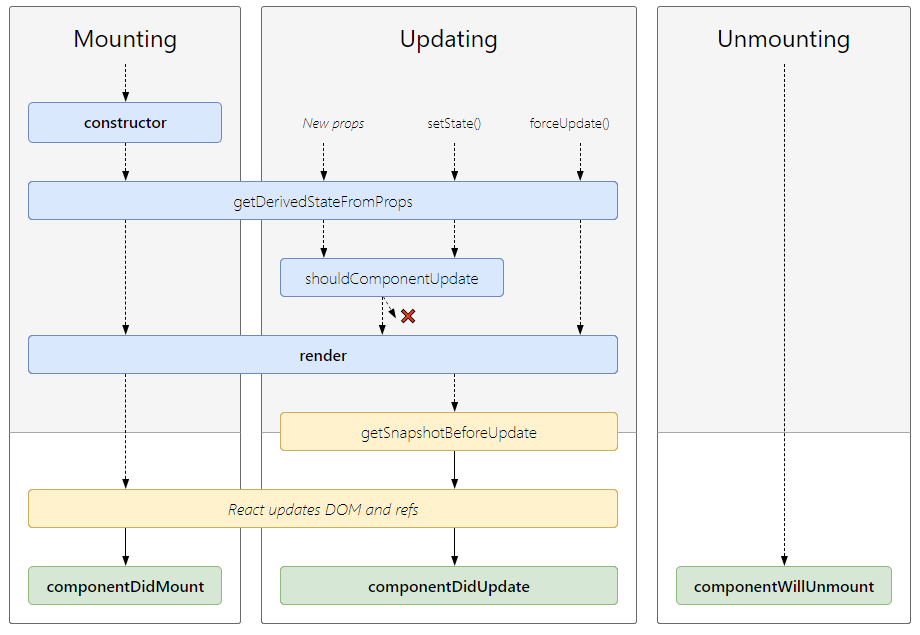

## React Questions
<br/>

1. What Is And When Use React.js?
> - React is a `front-end JavaScript library` for building `user interfaces` which developed by Facebook, now Instagram, Netflix, Whatsapp, Uber, Dropbox, IMDB and Reddit, etc. also use React.js 
> - React used to build a huge website which includes `complicated events and status change` instead of building a simple web.<br /><br/>
> - Related Reference : [What is React?](https://www.simplilearn.com/what-is-react-article)
<br/>

1.2 What Are The Features Of React.js?
> - Only the View of MVC.
> - JSX.
> - Virtual DOM.
> - Uni-directional data flow.
> - Components based.
<br/>

1.3 What Is The Meaning Of The Component-based Architecture Of React?
> - With the component-based system in place, all of the individual entities become completely reusable and independent of each other.
<br/><br/>

1.4 What Is Strength And Weakness Of React.js?
> - **Strength** :  <br/>
(1) Ensures faster rendering with `virtual DOM`, which compares the components’ previous states and updates only the items in the Real DOM that were changed, instead of updating all of the components again.   <br/>
(2) It follows the `component based` approach which helps in building reusable UI components, it save the time and repeat working.  <br/>
(3) `Uni-directional data flow` make it becomes `easier to debug errors and know where a problem occurs` in an application at the moment in question. And even small changes made to the child structures will not affect their parents, that makes code stable.  <br/>
(4) `SEO friendly`, React can run on the server, rendering and returning the virtual DOM to the browser as a regular webpage.  <br/>
(5) Can be used for the development of both `web and mobile apps`.   <br/>
(6) Useful developer toolset.  <br/>
(7) Strong community support.
<br/>

> - **Weakness** : <br/>
(1) React focus on view, lacking of route, ajax, async promise, etc. <br/>
(2) Coding gets complex as it uses inline templating and JSX.

<br/>

2. What Are The Differences Between Vue.js, Angular.js and React.js?

| TOPIC | React | Vue | Angular |
|---|---|---|---|
| Syntax | ES6 | ES5, ES6 | TypeScript |
| Architecture | Only the View of MVC | MVVM | Complete MVC |
| Rendering | Server-side rendering | Client-side rendering | Client-side rendering |
| DOM | Virtual DOM | Virtual DOM | Real DOM |
| Data Binding | One-way data binding | Two-way data binding | Two-way data binding |
| Author | Facebook | Former google employee | Google |
| When Use | • Your project can accept reusable components.  <br/> • Your project’s front-end is not too complex.  <br/> • The performance and scalability are critical.  <br/> • You have tight deadlines.  <br/> | • Your project scope is on the `small side`.  <br/> • You need high performance.  <br/> • You have no skilled front-end developers but have team members with JavaScript knowledge.  <br/> • You `do not have much time` to learn a new technology.  <br/> | • You are about to develop a `very large and complex project`. <br/> • You need easy and reliable scalability. <br/> • You have Angular developers on your team. <br/>   • You can afford some time for learning TypeScript before the project starts |

> - Related Reference : [Angular vs React vs Vue: Which Framework to Choose in 2020](https://www.codeinwp.com/blog/angular-vs-vue-vs-react/), [Angular vs React vs Vue](https://levelup.gitconnected.com/angular-vs-react-vs-vue-which-is-the-best-choice-for-2020-81f577697c7e), [Angular vs. React vs. Vue.js – choosing a JavaScript framework for your project](https://relevant.software/blog/angular-vs-react-vs-vue-js-choosing-a-javascript-framework-for-your-project/)

<br/>

3. What Is JSX?
> - JSX stands for `JavaScript XML`.
> - JSX is `not JavaScript nor HTML, is an XML/HTML like extension` to JavaScript.
> - JSX as a syntax sugar for calling `React.createElement()`.
> - Instead of putting JavaScript into HTML, JSX allows us to `put HTML into JavaScript`, then Babel will transform these expressions into actual JavaScript code. 
> - Examples : <br/>
 (1) Return one element https://jsfiddle.net/yschen25/29xrnmtw/ <br/>
 (2) Self-closing tags https://jsfiddle.net/yschen25/8g0w7thy/ <br/>
 (3) Comments https://jsfiddle.net/yschen25/c9uwgox1/ <br/>
 (4) Js in JSX https://jsfiddle.net/yschen25/knrg7ydm/ <br/>
 (5) Ternary operator https://jsfiddle.net/yschen25/L9o6ymcg/ <br/>
 (6) CamelCase https://jsfiddle.net/yschen25/x2n3oc8y/11/ <br/>
<br/><br/>

3.1 Why Can’t Browsers Read JSX?
> - Browsers can only read JavaScript objects but `JSX in not a regular JavaScript object`. Thus to enable a browser to read JSX, first, we need to transform JSX file into a JavaScript object using `JSX transformers` like Babel and then pass it to the browser.
<br/><br/>

4. What Is Virtual DOM?

<p align="center">


</p>

> - If a developer uses React.js (and JSX) to manipulate and update its DOM, React.js creates `Virtual DOM which is a copy of the real DOM`, when status changes the algorithm will compute the difference between virtual DOM and real DOM then only `update the change part without reloading entire DOM`.
<br/>

4.1 How About Not Using Virtual DOM?
> - If you’re not using React.js (and JSX), your website will use HTML to update its DOM. This works fine for simple, static websites, but for dynamic websites that involve heavy user interaction it can become a problem, since `the entire DOM needs to reload every time` the user clicks a feature calling for a page refresh.

<br/>

5. What Are Functional Components (Stateless Components) And Class Components (Stateful Components)? 

> - **Functional Components** : <br/>
(1) These components `have no state` of their own and only contain a render method, so they are also called `Stateless components`. They may derive data from other components as props (properties). <br/>
(2) Functional components can have state when use hook. (ref:17) <br/>
(3) Example : https://jsfiddle.net/yschen25/dmacrpjq/
<br/>

> - **Class Components** : <br/>
(1) These components `can hold and manage their state` and have a separate render method for returning JSX on the screen. They are also called `Stateful components`, as they can have a state. <br/>
(2) `Constructor is optional`, add the constructor when you `need to use state or bind function`  (ref:8). In this example, this.props works fine even without constructor, Example : https://jsfiddle.net/yschen25/2jcgbom0/ <br/>
(3)  Related Reference : [有無加上constructor的差異](https://github.com/kdchang/reactjs101/issues/28)
<br/><br/>


5.1 What Is The Difference Between Functional Components And Class Components?

|  Functional Components | Class Components |
|---|---|
| Calculates the internal state of the components | Stores info about component’s state change in memory |
| Do not have the authority to change state | Have authority to change state |
| Contains no knowledge of past, current and possible future state changes | Contains the knowledge of past, current and possible future changes in state |
| They receive the props from the Class components and treat them as callback functions | Functional components notify them about the requirement of the state change, then they send down the props to them |

<br/>

5.2 When Use Functional Components And Class Components?

> - **Functional Components** :  <br/>
(1) Don't need to use lifecycle  <br/>
(2) Don't need to use state  <br/>
(3) `Create reusable components`  <br/>
(4) Only render UI
<br/>

> - **Class Components** :  <br/>
(1) Need to use lifecycle  <br/>
(2) Need to use state  <br/>
(3) Have to `receive data form user`  <br/>
(4) Create interactive objects  <br/>
(5) Render after change state

<br/>

5.3 Why Recommend To Use Functional Components + Hook Instead Of Using Class Components?
> - Make code simple
> - Reduce using complicated lifecycle

<br/>

6. What Are Props?
> - Props is the shorthand for Properties. props data is `read-only`, which means that data coming from the parent should `not be changed by child components`.
> - They are always `passed down` from the parent to the child components in a uni-directional flow, a child component `can never send a prop back` to the parent component.
> - Props from the parent to the child components will `cause child components re-render`.
> - When your applications have a massive quantity of nested components it will may causes props hell (wrapper hell) (ref:6.3).
> - Examples : <br/>
    (1) Pass props via Functional Component (notice : use props.data) https://jsfiddle.net/yschen25/0e5udb1x/ <br/>
    (2) Pass props via Class Component (notice : use this.props.data) https://jsfiddle.net/yschen25/3vhqL8bn/
<br/><br/>

6.1 When Use Props?
> - To `pass data & event handlers` down to your child components.
> - If you just want to use props, not use state or bind function then you don't need to write constructor.
> - Related Reference : [有無加上constructor的差異](https://github.com/kdchang/reactjs101/issues/28)
<br/><br/>

6.2 What Are PropTypes And DefaultProps?
> - PropTypes : A typechecking tool to `make sure the data is valid`, propTypes is only checked in development mode, Example : https://jsfiddle.net/yschen25/oahjbq81/.
> - DefaultProps : You can `define default values` for props by assigning defaultProps, Example : https://jsfiddle.net/yschen25/763g8Lqv/.
<br/><br/>

6.3 How To Solve Props Hell (Wrapper Hell)?
> - Redux.
> - Functional components + React hooks. 

<br/>

7. What Is State ?
> - The state is a data structure that starts with a `default value` when a component mounts.
> - A component’s state `can change over time`. whenever it changes, the component re-renders. The change in state can happen as a response to user action or system-generated events, and these changes `determine the behavior of the component and how it will render`.  
> - Example : https://jsfiddle.net/yschen25/wc1qapz2/14/
<br/>

7.1 When Use State ?
> - To store the data your current page needs in your controller-view.
<br/><br/>

7.2 How To Change State?
> - State of a component can be updated using this.setState(), functional + hook useState().
> - setState is asynchronous.
> - Example : https://jsfiddle.net/yschen25/a2cmdb04/
<br/><br/>

7.3 What Is The Difference Between Props And State?

|  Conditions | State | Props |
|---|---|---|
| | Internal | External |
| | Mutable | Immutable |
| | Can be modified using setState() method | Can't not be modified |
| | Starts with a default value which is generally updated by event handlers | Passed as attributes from parent component to child component |
| | Can only be used with class Components (ref:17.2) | Can be used with both class as well as functional components |

<br/>

7.4 Why Can't Update State Directly Without setState()?
> - setState() trigger re-rendering of the components. When we want to update state again and again we must need to setState otherwise it doesn't work correctly.
<br/><br/>

8. Why Should We Bind The Function?

> - When you define a component using an ES6 class, a common pattern is for an event handler to be a method on the class. If we don't use bind method, the `this will refer to window scope`, and code within the class body's syntactic boundary is always executed in strict mode, then `will be undefined` when the function is actually called.
> - This is `a way of saving the current value of this`, which is in scope during the call to the constructor, so that it can be used later when the function is called.
> - Bind creates a new function that will force the this inside the function to be the parameter passed to bind().
> - When you `need to access props, state on the class`, then you would need to bind it.
> - Related Reference : [why do you need to bind a function in a constructor
](https://stackoverflow.com/questions/38334062/why-do-you-need-to-bind-a-function-in-a-constructor), [Why and when do we need to bind functions and eventHandlers in React?](https://stackoverflow.com/questions/41113798/why-and-when-do-we-need-to-bind-functions-and-eventhandlers-in-react), [What is the use of the JavaScript 'bind' method?](https://stackoverflow.com/questions/2236747/what-is-the-use-of-the-javascript-bind-method), [進入Component的事件處理篇](https://ithelp.ithome.com.tw/articles/10200941), [React Binding Patterns: 5 Approaches for Handling 'this'](https://www.freecodecamp.org/news/react-binding-patterns-5-approaches-for-handling-this-92c651b5af56/?source=post_page---------------------------)
<br/><br/>

8.1 How To Bind The Function?
> - Class component : Bind in constructor : https://jsfiddle.net/yschen25/n8umkzx6/5/

```
constructor(props) {
        super(props);
        this.state = {count: 0};
        this.addCount = this.addCount.bind(this);
    }

    addCount() {
        this.setState({
            count: this.state.count + 1
        });
    }
    
    render() {
    		return (
		    <div>
			<button onClick={this.addCount}>Click Me!</button>
			<h1>{this.state.count}</h1>
		    </div>
        )
    }
```
<br/>

> -  Class component : Bind in render : https://jsfiddle.net/yschen25/otd36q24/
```
addCount() {
        this.setState({
            count: this.state.count + 1
        });
    };

    render() {
        return (
            <div>
                <button onClick={this.addCount.bind(this)}>Click Me!</button>
                <h1>{this.state.count}</h1>
            </div>
         )
     }
```
<br/>

> -  Class component : use arrow function : https://jsfiddle.net/yschen25/z6ckng0w/
```
addCount = () => {
    this.setState({ 
        count: this.state.count + 1 
    });
    
    render() {
    	return(
             <div>
	        <button onClick={this.addCount}>Click Me!</button>
	        <h1>{this.state.count}</h1>
             </div>
          )
      }
```
<br/>

> - Functional component + hook

<br/>

8.2 Why We Don't Need Bind Arrow Function?
> - Arrow function `does not have the this, arguments, super, new.target` in its context. So when you reference `this` inside an arrow function it `treat this as any other variable and look for its declaration in its scope first` and it can not find it so it `search the upper scope which is the this referring to the react component class` which what is required so we do not need to bind the this to the class.
> - Related Reference : [Why we don't need to bind the arrow function in React?](https://stackoverflow.com/questions/52979915/why-we-dont-need-to-bind-the-arrow-function-in-react)
<br/><br/>

8.3 Why Do We Use Arrow Function In React?
> - Arrow functions don’t redefine the value of this within their function body. This makes it a lot easier to predict their behavior when passed as callbacks, and prevents bugs caused by use of this within callbacks.
<br/><br/>

8.4 How To Use Arrow Function In The Class Components? (ref:8.1)
> - Install @babel/plugin-proposal-class-properties then we can use arrow function and don't need to bind this.
> - Related Reference : [React | 那個在 Class Component 中的 Arrow function ](https://medium.com/enjoy-life-enjoy-coding/react-%E9%82%A3%E5%80%8B%E5%9C%A8-class-component-%E4%B8%AD%E7%9A%84-arrow-function-%E7%AE%AD%E9%A0%AD%E5%87%BD%E5%BC%8F-b5fa02db94a1)
<br/><br/>


9. Explain The Life Cycle Of React.js (Name Lifecycle Methods and their purpose.)? <br/>

<p align="center">

</p>

> - Each component in React has a lifecycle which you can monitor and manipulate during its three main phases. <br/>
 (1) **Mounting** : Means putting elements into the DOM. <br/>
 (2) **Updating** : A component is updated whenever there is a change in the component's state or props. <br/>
 (3) **Unmounting** : When a component is removed from the DOM. <br/>
 (4) (Error Handling) : Occurs javaScript errors. <br/>
<br/>

**Mounting** : <br/>
(1) **constructor()** : The constructor is the first method executed and is called before mounting. This method is typically used for two reasons, `binding functions and setting the initial state`. Each can `only be used in class components`. If you do make use of a constructor, make sure to call super() with the props as an argument, otherwise 'props' will be undefined in the component. <br/><br/>
Since we need to initialize state, this is the only place where we can directly define state without using setState(). You should also not use setState() in the constructor anyway to avoid unexpected behavior.
```
constructor(props){
        super(props);
        this.state = {
            name: "ReactJS"
        }
        this.updateName = this.updateName.bind(this);
    }
```
<br/>

(2) **static getDerivedStateFromProps()** : Called `right before rendering the elements` in the DOM, and is `executed every time the component updates`, including the initial render. It is usually used to `set the initial state depending on the props` passed to the component.
```
 static getDerivedStateFromProps(props, state){
        return {
            name: props.name
        }
    }
```
<br/>

(3) **render()** : The only required method in a component. It is responsible for rendering the JSX into the DOM. If using conditional rendering, some simple logic can be applied inside this method, such as a ternary operator or pure functions.  <br/><br/>
Don't make API request, put any action that needs to occur only once in the lifetime of the component here and set the state here (Your app will be thrown into an infinite loop of rendering as this.setState will change the state and then call the render function which in turn will again set the state and so on).
```
render() {
    return <div>My Component</div>;
  }
```
<br/>

(4) **componentDidMount()** : When your `component is loaded in the DOM`, this method is executed. Therefore, it makes this an ideal place to perform any `API calls or make changes to the DOM`. After executing once, it is not triggered again for the duration of the component’s life. <br/>
You can use setState() here to modify the state, which is commonly done when data is fetched from a network request. However, if you need to set the state immediately and you don’t need to access the DOM, it is always a better idea to do that in the constructor. <br/><br/>

**Updating** : <br/>
The modification phase can be triggered using three methods :  <br/>
> - Receiving new props  <br/>
> - Calling setState() and updating the state  <br/>
> - Using this.forceUpdate  <br/><br/>

(1) **static getDerivedStateFromProps()** : This is the first method that is called when a component gets updated. This is still the natural place to set the state object based on the initial props. <br/>

(2) **shouldComponentUpdate()** : This method is designed to `increase performance` in React applications. It accepts the previous state and previous props, which you can compare with the current state and props and using a conditional operator, return true or false depending on whether React `should update the component or not`. (ref:22)
```
shouldComponentUpdate(nextProps, nextState){
    if(this.state.name === nextState.name) { return false; }
  }
```

(3) **render()** : The render() method is of course called when a component gets updated, it has to re-render the HTML to the DOM, with the new changes. <br/>

(4) **getSnapshotBeforeUpdate()** : If you want to `do something before render` then can do it right here. This is a new method recently introduced in React. It can be used as an alternative for the now deprecated componentWillUpdate(). In the getSnapshotBeforeUpdate() method you have access to the props and state before the update, meaning that even after the update, you can check what the values were before the update. If the getSnapshotBeforeUpdate() method is present, you should also include the componentDidUpdate() method, otherwise you will get an error. <br/>

(5) **componentDidUpdate()** : You can `do the samething as what did in componentDidMount()`. This method is executed right after all the changes have been propagated to the DOM. Here, we have `access to the previous props, state and the value returned by getSnapshotBeforeUpdate()` also known as the snapshot. If we want to `modify the state` in this method, we must do so in a conditional statement. 
```
componentDidUpdate(prevProps, prevState, snapshot) {
      if(prevState.name === "ReactJS" && this.state.name === "VueJS") {
          this.setState({ name: "Angular" })
      }
  }
```
<br/>

**Unmounting** :  <br/>
(1) **componentWillUnmount()** : This method is called `right before the component is unmounted from the DOM`. Here, you can call any last-minute actions or perform any clean-up required. You’ll need to make sure to `clean up any subscriptions or events` in componentWillUnmount(), that you may have created earlier in componentDidMount.
```
 componentWillUnmount(){
      this.clearInterval(this.timer);
  }
 ```
 <br/>

**Error Handling** : <br/>
(1) **static getDerivedStateFromError()** : When an error occurs, this method receives the error object. You can update the state, depending on the error, to be used anywhere in the component, possibly to show a fallback UI. 
```
static getDerivedStateFromError(error) {
    return { error: error.message };
  }
```

(2) **componentDidCatch()** : Error boundaries are components that can catch errors anywhere in component (including any children component they render), and log errors and/or display a fallback UI. The componentDidCatch lifecycle hook is meant to catch errors during mounting, rendering and in other lifecycle methods.
```
componentDidCatch(error, info) {
    this.logError(error, info);
  }
```
<br/>

9.1 Why static getDerivedStateFromProps() Is Static?
> - Discourage any side-effects during the render phase to prevent unsafe access of instance properties.
<br/>

9.2. Explain Error Boundaries? (ref:9)
> - Error boundaries are React components that catch JavaScript errors anywhere in their child component tree, log those errors, and display a fallback UI instead of the component tree that crashed.
> - static getDerivedStateFromError(), componentDidCatch()
<br/>

> - Related Reference : [Understand React Lifecycle Methods](https://www.gistia.com/insights/understand-react-lifecycle-methods), [Understanding React Lifecycle Methods](https://medium.com/commutatus/understanding-react-lifecycle-methods-de0e33bf3319), [React 元件生命週期](https://www.fooish.com/reactjs/component-lifecycle.html), [React Life Cycle 生命週期更新版，父子元件執行順序](https://iandays.com/2018/07/27/reactlife/index.html), [React 16：Lifecycle Methods 新手包](https://5xruby.tw/posts/react-16-lifecycle-methods/)
<br/><br/>

10. Axios
> - To send HTTP requests from (client-side) JavaScript. <br/>
(1) Make XMLHttpRequests from the browser <br/>
(2) Make http requests from node.js <br/>
(3) Supports the Promise API <br/>
(4) Intercept request and response <br/>
(5) Transform request and response data <br/>
(6) Cancel requests <br/>
(7) Automatic transforms for JSON data <br/>
(8) Client side support for protecting against XSRF
<br/><br/>

11. What Is Flux?

<p align="center">

 
<br/>


</p>

> - The relationship between components gets complicated. It becomes hard to scale the application. To solve this issue FB architected a Single directional data flow.
> - Flux uses a unidirectional data flow pattern to solve state management complexity.
<br/>

> - **There are three distinct roles for dealing with data in the flux methodology** :
> - Action Creators & Action : Action Creators are collections of methods that are called within views to send ``Actions`` to the ``Dispatcher``. Actions are the actual payloads that are delivered via the dispatcher. The action can be something like add a post, delete a post, or any other user interaction. 
> - Dispatcher : The manager of this entire process, the central hub for the application. It dispatches the payload from ``Actions`` to ``Store``. 
> - Store : Containers for application state & logic that have callbacks registered to the ``Dispatcher``.
> - View : This component renders the UI. Whenever any user interaction occurs on it (like an event) then it fires off the action. Also when the Store informs the View that some change has occurred, it re-renders itself.
<br/>

> - **Flux pattern pre-processing**： <br/>
(1) Stores register callback to Dispatcher, notify Stores when data changes. <br/>
(2) Controller Views get inital data from Stores. <br/>
(3) Controller Views gives data to Views to render UI. <br/>
(4) Controller Views register listener to Store, notify Controller Views when data changes.
<br/>

> - **Flux interactive with users**： <br/>
(1) User interactive with web and triggers the event, Action Creator sends actions to Dispatcher.  <br/>
(2) Dispatcher sends action to store, action type determines the proper method to execute.  <br/>
(3) Trigger the listener which Controller Views register to Store when data updates then get the new data from the Store. <br/>
(4) View re-render according to the new data.
<br/>

> - Related Reference : [Flux 基礎概念與實戰入門](https://www.bookstack.cn/read/reactjs101-zh-tw/Ch07-react-flux-introduction.md), [Getting To Know Flux, the React.js Architecture](https://scotch.io/tutorials/getting-to-know-flux-the-react-js-architecture), [How to Use Flux to Manage State in ReactJS - Explained with an Example](https://www.freecodecamp.org/news/how-to-use-flux-in-react-example/)
<br/><br/>

11.1 What Are The Strengths And Weaknesses Of Flux?
> - **Strengths** :  <br/>
(1) The code becomes quite clear and easy to understand. <br/>
(2) Easily testable using Unit Test. <br/>
(3) Scalable apps can be built. <br/>
(4) Predictable data flow.
<br/>

> - **Weaknesses**  <br/>
(1) Too complicated to small application.
<br/><br/>

12. What Is Redux? (Ref:16.3)
<p align="center">

</p>
<br/><br/>

> - It is a `predictable state container` for JavaScript applications and is used for the `entire applications state management`, it can also `prevent props hell`.
<br/>

> - **List down three components of redux** :  <br/>
(1) **Action** – To describe the type of `event (type)` and `informations (payload)`. <br/>
(2) **Store** – The core of redux, `the state of the entire application` is stored in an object / state tree within a single store. <br/>
(3) **Reducer** – It is a place `receiving previousState and action to determine the new state`.
<br/>

> - **Redux interactive with users**： <br/>
(1) User clicks components. <br/>
(2) `Action Creator` sends `Action` to `Store`. <br/>
(3) `Store` calls `Reducer` with `previousState and action` to get the new state. <br/>
(4) `View` Re-render when gets the new state from `Store`.
<br/>

> - **Redux follows three principles** : <br/>
**(1) Single source of truth** : The state of the entire application is `stored in an object / state tree within a single store`. The single state tree makes it easier to keep track of changes over time and debug or inspect the application. <br/>
**(2) State is read-only** : `The only way to change the state is to trigger an action`. An action is a plain JS object describing the change. Just like state is the minimal representation of data, the action is the minimal representation of the change to that data. <br/>
**(3) Changes are made with pure functions** : `The reducer must be pure`. Given the same arguments, it should calculate the next state and return it. No side effects. No API calls. No mutations. Just a calculation.
<br/>

12.1 How To Use Redux?

**Combine with React-Redux** <br/>

**(1) Provider** : The Provider makes the Redux store available to any nested components that have been wrapped in the connect() function. Since any React component in a React Redux app can be connected, most applications will render a Provider at the top level, with the entire app’s component tree inside of it. Normally, `you can’t use a connected component unless it is nested inside of a <Provider>`. <br/>
```
<Provider store={store}>
    <Main />
</Provider>
```
		
(2) **Connect** : The connect() function `connects a React component to a Redux store`. <br/>
(2.1) **mapStateToProps(state, [ownProps])** : As the first argument passed in to connect, `mapStateToProps will be called any time the store is updated`. mapStateToProps is tranform state to the props which component needs. <br/>
(2.2) **mapDispatchToProps(dispatch, [ownProps])** : As the second argument passed in to connect, mapDispatchToProps is used for `dispatching actions to the store`. <br/>
(2.3) **mergeProps(stateProps, dispatchProps, ownProps)** : It is a function which is used to select a slice of the props from state and dispatch. <br/>
(2.4) **options** : If specified, further `customizes the behavior` of the connector. 
```
function connect(mapStateToProps, mapDispatchToProps, mergeProps, options)(Main);
```
<br/>

**Store Methods** <br/>

(1) **getState()** : Returns the `current state tree` of your application. It is equal to the last value returned by the store's reducer. <br/>
(2) **dispatch(action)** : `Dispatches an action`. This is the only way to trigger a state change. <br/>
(3) **subscribe(listener)** : Adds a change listener. It will be called any time `an action is dispatched`, and some part of the state tree may potentially have changed. <br/>
(4) **createStore(reducer, [preloadedState], [enhancer])** <br/>
(4.1) **reducer** : You can put such as `combineReducers` => As your app grows more complex, you'll want to split your reducing function into separate functions, each managing independent parts of the state. The combineReducers helper function turns an object whose values are `different reducing functions into a single reducing function` you can pass to createStore. <br/>
(4.2) **preloadedState** : `The initial state`. You may optionally specify it to hydrate the state from the server in universal apps, or to restore a previously serialized user session. <br/>
(4.3) **enhancer** : You can put such as `applyMiddleware` => Middleware is the suggested way to `extend Redux with custom functionality`. The applyMiddleware combines mutiple middleware into a single function.

```
const allReducers = combineReducers({textReducer, imageReducer, videoRed: videoReducer});

let store = createStore(allReducers, ,applyMiddleware(thunkMiddleware));
```

<br/>

> - Related Reference : [Redex 核心概念筆記](https://note.pcwu.net/2017/03/04/redux-intro/), [Redux 入門](https://www.twblogs.net/a/5bb2a4c02b71770e645e017b), [Redux 基礎概念](https://www.bookstack.cn/read/reactjs101-zh-tw/Ch07-react-redux-introduction.md), [Redux](https://redux.js.org/api/store), [React Redux](https://react-redux.js.org/api/provider)
<br/><br/>

12.2 What Are The Strengths And Weaknesses Of Redux?

> - **Strengths** : <br/>
(1) **Predictability of outcome** – Since there is always one source of truth, i.e. the store, there is no confusion about how to sync the current state with actions and other parts of the application. <br/>
(2) **Maintainability** – The code becomes easier to maintain with a predictable outcome and strict structure. <br/>
(3) **Server-side rendering** – You just need to pass the store created on the server, to the client side. This is very useful for initial render and provides a better user experience as it optimizes the application performance. <br/>
(4) **Developer tools** – From actions to state changes, developers can track everything going on in the application in real time. <br/>
Community and ecosystem – Redux has a huge community behind it which makes it even more captivating to use. A large community of talented individuals contribute to the betterment of the library and develop various applications with it. <br/>
(5) **Ease of testing** – Redux’s code is mostly functions which are small, pure and isolated. This makes the code testable and independent. <br/>
(6) **Organization** – Redux is precise about how code should be organized, this makes the code more consistent and easier when a team works with it.
<br/>

> - **Weaknesses** : <br/>
(1) No encapsulation. Any component can access the data which can cause security issues. <br/>
(2) As state is immutable in redux, the reducer updates the state by returning a new state every time which can cause excessive use of memory.
<br/><br/>

12.3 What Are Alternatives To Redux?
> - MobX, RxJs, apollo client + graphQL
<br/><br/>

12.4. What Is Redux Middleware?
<p align="center">

</p>

> - Redux middleware function `provides a medium to interact with dispatched action before they reach the reducer`, such as call async API, log. etc.
> - When we send a action to reducer, this process works fine with synchronous change,  but if call an Action Creator that is fetching data from an API or some asynchronous action, that will has some problems.

12.5. What Is React-Saga And React-Thunk?
> - React-Saga : Sagas are implemented using Generator functions. To express the Saga logic, we yield plain JavaScript Objects from the Generator. We call those Objects Effects (put, call, etc.).
> - React-Thunk : Thunk is a function which optionaly takes some parameters and returns another function, it takes dispatch and getState functions and both of these are supplied by Redux Thunk middleware.
> - Differences :  <br/>
(1) Thunks can never act in response to an action. Redux-Saga subscribes to the store and can trigger a saga to run or continue when a certain action is dispatched. <br/>
(2) Redux Saga a lot of built-in features, which Redux Thunk lacks. For example, you can throttle requests, debounce or cancel them and handle race conditions.
> - Related Reference : [Redux-Thunk vs. Redux-Saga](https://decembersoft.com/posts/redux-thunk-vs-redux-saga/)
<br/><br/>

12.6 What is Redux Different From Flux?

| Flux | Redux |
|---|---|
| The Store contains state and change logic| Store and change logic are separate |
| There are multiple stores | There is only one store |
| All the stores are disconnected and flat | Single store with hierarchical reducers |
| Has singleton dispatcher | No concept of dispatcher |
| React components subscribe to the store | Container components utilize connect |
| State is mutable | State is immutable |

<br/>

13. What Is A Styled Component?
> - Styled Components is a `CSS-in-JS library` that enables you to create React components with a given style very easily.
> - Related Reference : [Styled-component](https://ithelp.ithome.com.tw/articles/10215800)
<br/><br/>

13.1 What Is Strength And Weakness Of Styled Components?
> - **Strength**
> - **Dynamic Styling**: It allows you to use React.js `props` that we can pass to components in styled-components `to create dynamic styling` for our app.
> - **Painless Maintenance**: You don't have maintain mutiple CSS files.
> - **Semantic Element**: You can know the meaning of the element by its name.

> - **Weakness**
> - Styled Component rendered in the browser have randomly generated classname(built-in CSS module system. This is great for solving the problem of classnames conflict) leads hard to debug.
> - Solving the problem with installing babel-plugin-macros or add className in styled component's attribute then pass it as props.
> - Related Reference : [How to Build A Debuggable Styled Component](https://www.freecodecamp.org/news/how-to-build-a-debuggable-styled-component-10f7e4fbea2/), [利用 Styled System 建立一個更好的 UI 元件庫](https://cythilya.github.io/2019/11/30/build-a-better-ui-component-library-with-styled-system/), [Styled-component](https://ithelp.ithome.com.tw/articles/10215800)
<br/>

14. What Is Jest?
> - A delightful JavaScript `testing Framework` which acts as a test runner, assertion library, and mocking library.

<br/>

14.1 What Is An Enzyme?
> - Enzyme adds some great additional utility methods for `rendering, finding and interacting with elements`.
> - Enzyme only works with React.
> - Enzyme must be paired with another test runner.
> - `Not support testing React hooks so far`.
> - Related Reference : [Jest | 經過測試，讓你的組件安全有把關 shallow render 篇 - feat.React, Enzyme](https://medium.com/enjoy-life-enjoy-coding/jest-%E7%B6%93%E9%81%8E%E6%B8%AC%E8%A9%A6-%E8%AE%93%E4%BD%A0%E7%9A%84%E7%B5%84%E4%BB%B6%E5%AE%89%E5%85%A8%E6%9C%89%E6%8A%8A%E9%97%9C-shallow-render-%E7%AF%87-feat-react-enzyme-be5ebbdf54a1)
<br/><br/>

14.2 Jest And Enzyme.
> - Both Jest and Enzyme are specifically designed to test React applications, Jest can be used with any other Javascript app but Enzyme only works with React.
> - Jest can be used without Enzyme to render components and test with snapshots, Enzyme simply adds additional functionality.
> - Related Reference : [Testing React with Jest and Enzyme](https://medium.com/codeclan/testing-react-with-jest-and-enzyme-20505fec4675)
<br/><br/>

14.3 React-testing-library/React-hooks-testing-library
> - React Testing Library it's a `alternative to Enzyme`, it `support to test hook`.
> - Install @testing-library/react-hooks to test hooks.
<br/><br/>

15. Refs.
> - Refs is the `short hand for References` in React. The ref is used to `return a reference to the element`. 
> - `Use state and props to manage components instead using refs`. (ref:18)
> - Refs can be use in 1) Managing focus, text selection, or media playback. 2)Triggering imperative animations. 3)Integrating with third-party DOM libraries. 
> - Refs can't use in functional components, `only for class components`.
> - Example : https://jsfiddle.net/yschen25/ewdtvn5b/9/
> - Related Reference : [React Ref使用方法解析](https://medium.com/@shihKai/react-ref%E4%BD%BF%E7%94%A8%E6%96%B9%E6%B3%95%E8%A7%A3%E6%9E%90-9633e9989adc), [Ref 屬性 與 DOM 元素](https://medium.com/4cats-io/24hrs-react-101-b287ffad1070)
<br/><br/>

16. Explain What Is Hook?
> - Hooks are in-built functions that allow React developers to `use state and lifecycle methods inside functional components`. If you write a functional component and realize you need to add some state to it, previously you had to convert it to a class. Now you can use a Hook inside the existing functional component.
> - Hooks don’t work inside classes.
<br/>

16.1 What Are Side Effects?
> - Side effects are all the operations that `affect your component` and can’t be done during rendering. Things like fetching data, subscriptions or manually changing the DOM are all examples of side effects.
<br/><br/>

16.2 And How To Use Hook?

1. useState() : <br/>
(1) Allows React developers to update, handle and manipulate state inside functional components without converting it to a class component. <br/>
(2) Receives an initial state as an argument and then returns, by making use of array destructuring in JavaScript, the two variables in the array can be named what. The first variable is the `actual state`, while the second variable is a function that is `for updating the state` by providing a new state.  <br/>
(3) Example : Before hook (https://jsfiddle.net/yschen25/8tp16wcy/), After hook (https://codesandbox.io/s/reacthookusestate-u65hn)<br/>
```
const [count, addCount] = useState(0);
```
<br/>

2. useEffect() : <br/>
(1) Data fetching, setting up a subscription, and manually changing the DOM in React components are all examples of side effects, The Effect Hook lets you `perform side effects in functional components`, you can think of useEffect hook as `componentDidMount`, `componentDidUpdate`, and `componentWillUnmount` combined. <br/>
(2) There are two arguments that are passed to useEffect(), `useEffect(callback, array)`

① The first an anonymous callback function that houses your useEffect logic.
```
useEffect(() => {
    console.log('This is like componentDidMount')
    
    return () => {
      console.log('This is like componentWillUnmount') // clear something
    };
  });
```
<br/>
 
② The useEffect() hook takes a second parameter, an array, containing the list of things that will cause the useEffect hook to run. When changed, it will trigger the effect hook. 

- Running every time. <br/>
```
useEffect(() => {
	console.log('Runs every time');
});
```

<br/>

 - Running an effect once (componentDidMount) : The key to running an effect once is to pass in an empty array. <br/>
```
useEffect(() => {
	console.log('This only runs once');
}, []);
```
<br/>

 - Using effects when things change (componentDidUpdate) : 
```
useEffect(() => {
	console.log('This is like componentDidUpdate, I will be triger whenever count state changes')
 }, [count]);
```
<br/>

(3) Example : https://tinyurl.com/y6yb643h <br/><br/>

3. useContext() :  <br/>
(1) The React Context API is a simple, easy-to-understand alternative to "prop-drilling" up and down your component tree. Instead of passing local data around and through several layers of components, it takes a step back to create global state, which is extremely useful for data that needs to be shared across components. <br/>
(2) React’s Context API, it’s a way to `pass data deeply throughout your app without having to manually pass props down through multiple levels`. It can be a `good alternative to tools like Redux`. Example : https://codesandbox.io/s/reacthookusecontext-1v5p4 <br/>

4. useReducer() : lets you handle state updates using reducers without a Redux store.

5. Custom React Hooks : <br/>
(1) Custom hooks allow you to create functionality that can be reused across different components.

<br/>

16.3 Compare Redux And useContext() API and React Hooks. 
> - Redux makes it really difficult to pick up, and the ton of extra code needed to get it working in our application introduces a lot of unnecessary complexity.
> - useContext API and React Hooks, there is no need to install external libraries or add a bunch of files and folders in order to get our app working. This makes it a much simpler, more straightforward way to handle global state management in React applications.

> - Related Reference : [React | 為了與 Hooks 相遇 - Function Components 升級記](https://medium.com/enjoy-life-enjoy-coding/react-%E7%82%BA%E4%BA%86%E8%88%87-hooks-%E7%9B%B8%E9%81%87-function-components-%E5%8D%87%E7%B4%9A%E8%A8%98-86869d869a45), [React Hooks 學習筆記useState、useEffect
](https://medium.com/vita-for-one/react-hooks-%E5%AD%B8%E7%BF%92%E7%AD%86%E8%A8%98-usestate-useeffect-usecontext-b11c33e69bea), [useEffect](https://ithelp.ithome.com.tw/articles/10215225), [React Hooks for Beginners - A Brain-Friendly Guide on useState and useEffect](https://www.freecodecamp.org/news/beginners-guide-to-using-react-hooks/), [Custom hook](https://ithelp.ithome.com.tw/articles/10224881), [How the useContext Hook Works](https://daveceddia.com/usecontext-hook/), [useContext Hook](https://segmentfault.com/a/1190000020111320)
<br/><br/>

17. What Is The Difference Between React And React Native?
> - `React.js is a javaScript library`, supporting both front-end web and being run on a server, for building user interfaces and web applications. It follows the concept of reusable components.
> - `React Native is a mobile framework` that makes use of JavaScript engine available on the host, allowing you to build mobile applications for different platforms (iOS, Android, and Windows Mobile) in JavaScript that allows you to use ReactJS to build reusable components and communicate with native components.
> - Both are open-sourced by Facebook follow the JSX syntax extension to JavaScript. Which compiles to React.createElement calls under the hood.
<br/><br/>

18. Explain The Controlled Components And Uncontrolled Components.
> - **Controlled Components** : <br/> 
(1) `Control by status or props`. <br/> 
(2) In most cases, we recommend using controlled components to implement forms.  <br/> 
(3) Controls the values of input elements in a form using setState(). <br/> 
(4) The input value can't not be control by user (https://jsfiddle.net/yschen25/xr2gb6w4/3/), it needs to add onChange handler to listen to the input value (https://jsfiddle.net/yschen25/gzx43por/).

| Elements | Attributes | Method | Callback value |
|---|---|---|---|
| ``<input type="text" />`` | value="string" | onChange | event.target.value | 
| ``<input type="checkbox" />`` | checked={boolean}| onChange | event.target.checked | 
| ``<input type="radio" />`` | checked={boolean} | onChange | event.target.checked | 
| ``<textarea />`` | value="string" | onChange | event.target.value | 
| ``<select />`` | value="option value" | onChange | event.target.value | 
<br/>

> - **Uncontrolled Components** :   <br/> 
(1) `Doesn't control by status or props, use ref to control DOM` (https://jsfiddle.net/yschen25/o237p9Ld/).  <br/> 
(2) Allow set up the value by defaultValue.  <br/> 
(3) Easy to use with third party library. 
<br/><br/>

18.1 When Use Controlled Components Or Uncontrolled Components?
| Functions | Controlled Components | Uncontrolled Components |
|---|---|---|
| One time submit | O  | O  |
| Submit validation | O  | O  |
| Instant validation | O  | X |
| Fobidden buttons| O | X |
| Formatted Input Value  | O | X |
| Merge mutiple input value | O  | X |
| Dynamic input value | O  | X |

> - Related Reference : [React 之受控组件和非受控组件](https://juejin.im/post/5b3507df51882574af2821ce), [受控組件與非受控組件](https://zhuanlan.zhihu.com/p/89223413), [受控組件和不受控組件的區別](https://blog.csdn.net/u010856177/article/details/103516618)
<br/><br/>

19. Why Do I Need To Use Keys In React Lists ?
> - Keys help React `identify which items have changed, are added, or are removed` then only update that part without updating whole Lists.
> - React `doesn't automatically pass they key like a prop`. If you wanted to use the key for some computation, you would need to pass it as another prop, like the example below.
```
const content = posts.map((post) =>
  <Post
    key={post.id}
    id={post.id}
    title={post.title} />
);
```

19.1 Why Don't Recommend To Use Indexes As Keys?
> - Since it could `impact performance negatively and could lead to some unstable component behaviour` such like rerender the whole list during the change.<br/>

> - Related Reference : [Why do I need Keys in React Lists?
](https://medium.com/@adhithiravi/why-do-i-need-keys-in-react-lists-dbb522188bbb), [List key 的使用](https://note.pcwu.net/2017/03/23/react-array-key/)
<br/><br/>

19.2 What Are Some Exceptions Where It Is Safe To Use Index As Key?
> - If your `list is static` (no additions/re-ordering/removal to the list).
<br/><br/>

20. What Are Higher-Order Components (HOC)?
> - `Takes one or more components as arguments, and return a new upgraded component`. They are similar to higher-order functions(forEach(), map(), reduce(), filter()), which takes some functions as an argument and produce a new function.
> - HOCs are commonly used to `enhance the reusability of particular components` in multiple modules or components.
> - Related Reference : [Higher-Order Components In React](https://www.smashingmagazine.com/2020/06/higher-order-components-react/)
<br/><br/>

21. Describe Shallow Comparision In React?
> - Shallow compare works by checking if two values are equal in case of primitive types like string, numbers and in case of object it just checks the reference.
> - Related Reference : [How does shallow compare work in react](https://stackoverflow.com/questions/36084515/how-does-shallow-compare-work-in-react)
<br/><br/>

22. What Are Pure Components? (ref:21)
> - If we extend a class with Pure Component, there is `no need for shouldComponentUpdate() Lifecycle Method`. Pure Component Class does the shallow comparisons of current state and props with new props and states to decide whether the React component should re-render itself or Not.
> - There is a simple Welcome Pure Component and Hello Stateless Component. When you use these two in your Parent Component, you will see Hello will re-render whenever Parent Component will re-render but Welcome Component will not. This is because PureComponent changes the life-cycle method shouldComponentUpdate and adds some logic to automatically check whether a re-render is required for the component. This allows a PureComponent to call the method render only if it detects changes in state or props.
```
class Welcome extends React.PureComponent {  
  render() {
    return <h1>Welcome</h1>
  }
}

Hello = () => {
  return <h1>Hello</h1>;
}
```

> - It increases performance because it `reduces the number of render operation` in the application.
> - For class components react provides `React.PureComponent` base class.
```
class MyComponent extends PureComponent{
   render() {
      return '';
   }
}
```
> - For Functional component react provides `React.memo HOC (Higher Order Component) (ref:20)`.
```
const MyComponent = React.memo(function MyComponent(props) {
   return '';
});
```
> - Related Reference : [Pure Component in React.js](https://www.tutorialspoint.com/pure-component-in-react-js), [Stateless Component vs Pure Component](https://medium.com/groww-engineering/stateless-component-vs-pure-component-d2af88a1200b), [Pure Components in React](https://dev.to/sumitkharche/pure-components-in-react-57on),[React 性能優化那件大事，使用 memo、useCallback、useMemo](https://medium.com/%E6%89%8B%E5%AF%AB%E7%AD%86%E8%A8%98/react-optimize-performance-using-memo-usecallback-usememo-a76b6b272df3)

<br/>

23. How Many Ways You Can Conditionally Render In React?
> - If else statement , expression 
<br/><br/>

24. Explain How React Rendering works?  <br/>
(1) During the rendering process, React will start at the root of the component tree and loop downwards to find all components that have been flagged as needing updates. <br/>
(2) JSX syntax will convert to React.createElement() calls as the JS is compiled and prepared for deployment. <br/>
(3) After it has collected the render output from the entire component tree, React will diff the new tree of objects (frequently referred to as the "virtual DOM"), and collects a list of all the changes that need to be applied to make the real DOM look like the current desired output. <br/>
(4) React then applies all the calculated changes to the DOM.
> - Related Reference : [Complete Guide to React Rendering Behavior](https://blog.isquaredsoftware.com/2020/05/blogged-answers-a-mostly-complete-guide-to-react-rendering-behavior/#react-redux-and-rendering-behavior)
<br/><br/>

25. How To Prevent Components From Re-Rendering?
> - shouldComponentUpdate(), React.PureComponent (class component), React.memo (functional component)
<br/><br/>

26. What Would You Do If Your React Application Application Is Rendering Slowly?
> - The cause of slow rendering in React is mostly beacuse of the number of re-render poperations, which are sometimes unnecessary.
> - Use React.PureComponent or React.memo(), React.lazy, CDN, Use arrow function.
<br/>

27. What Is React CLI?
> - Create React App is an officially supported way to create single-page React.
<br/><br/>

28. Name Some Patterns And Usage Of React.
> - **Context-api pattern** : To pass data deeply throughout your app without having to manually pass props down through multiple levels
> - **Render props** : For creating components that take functions as children and is a way for us to create a component that provides some kind of data to a child component.
> - **Presentation component pattern** : Presentational Component Patterns can best be described as patterns that are primarily concerned with how things look. The primary function of a presentational component is to display data. They rarely handle state and are best written as stateless functional components. 
<br/><br/>

29. What Is A React Router?
> - Is a package which is used to create Routing.
> - React Router, and dynamic, client-side routing, allows us to `build a single-page web application with navigation without the page refreshing as the user navigates`.
<br/><br/>

29.1 How Is Routing in React Different From Conventional Routing?
| SN | React Routing | Conventional Routing |
|---|---|---|
| | Single HTML page | Each view is a new HTML file |
| | User navigates multiple view in the same file | User navigates multiple files for each view |
| | The page does not refresh since it's a single file | The page refreshes every time user navigates |
| | Improved performance | Slower performance|

<br/>

30. What Is React Fiber?
> - The core of React algorithm. 
> - The main goal of React Fiber is to ensure that there are `incremental rendering facilities for the virtual DOM`.
<br/><br/>

31. What Are Fragments?
> - A common pattern in React is for a `component to return multiple elements`. Fragments let you group a list of children `without adding extra nodes to the DOM`.
```
class Columns extends React.Component {
  render() {
    return (
      <React.Fragment>
        <td>Hello</td>
        <td>World</td>
      </React.Fragment>
    );
  }
}
```

```
class Columns extends React.Component {
  render() {
    return (
      <>
        <td>Hello</td>
        <td>World</td>
      </>
    );
  }
}
```
> - Related Reference : [React Fragment](https://www.fooish.com/reactjs/fragment.html)
<br/><br/>


## Customized React Questions

1. Where Do You Use React?
> - I wrote a tool that can creat twitter social button quickly with react hooks, jest react-hook-teating-libraty instead of enzyme, because enzyme not support hooks so far,
then I push the tool to NPM platform, first week I got 3,000 download. 
> - I also wrote a interactive resume which like a galgame that user can check the item to solve the puzzle on website, I wrote this with class components and redux.
> - In company, we doesn't use React, but we using javaScript ES6 and ES7 syntax instead.
<br/>

2. Why Would You Use React In Your Project?
> - It depens on the project, such like if we have a project gets 3 monthes to develop, then I would not use react because react changes fast. Compare to angular, React is easier to learn, compare to vue, React has strong community support and documents.
<br/>

3. Have You Encountered Any Difficulties When You Write React? 
> - At first I  dont used to use state to manipulate rendering DOM because jQuery doesn't has this concept

<br/><br/>
