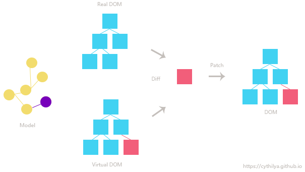

## React Questions
 

1. What Is React.js ?
> - React is a front-end JavaScript library for building user interfaces which developed by Facebook, now Instagram, Netflix, Whatsapp, Uber, Dropbox, IMDB and Reddit, etc. also use React.js 
> - Build a huge website which includes complicated events and status change instead of buliding a simple web.  
> - Related Reference : [What is React?](https://www.simplilearn.com/what-is-react-article)
 

1.2 What Is Features Of React.js ?
> - Only the View of MVC.
> - JSX.
> - Virtual DOM.
> - Uni-directional data flow.
> - Components based.
 

1.3 What Is Strength And Weakness Of React.js ?
> - **Strength** : 
> - Ensures faster rendering with virtual DOM, which compares the components’ previous states and updates only the items in the Real DOM that were changed, instead of updating all of the components again. 
> - It follows the component based approach which helps in building reusable UI components.
> - Uni-directional data flow make it becomes easier to debug errors and know where a problem occurs in an application at the moment in question. And even small changes made to the child structures will not affect their parents, that makes code stable.
> - SEO friendly, React can run on the server, rendering and returning the virtual DOM to the browser as a regular webpage.
> - Can be used for the development of both web and mobile apps
> - Server-side rendering accelerates loads of starting page because users do not need to wait for JavaScript loadings before viewing web sites.
> - Useful developer toolset.
> - Strong community support.
 

> - **Weakness** : 
> - React focus on view, lacking of route, ajax, async promise, etc.
> - Coding gets complex as it uses inline templating and JSX.

 

❗ 2. What Is The Differences Between Vue.js, Angular.js and React.js ?

| TOPIC | React | Vue | Angular |
|---|---|---|---|
| Architecture | Only the View of MVC |  | Complete MVC |
| Rendering | Server-side rendering |  | Client-side rendering |
| DOM | virtual DOM | virtual DOM | Uses real DOM |
| Data Binding | One-way data binding |  | Two-way data binding |
| Author | Facebook | Former google employee | Google |
| When Use | | |  |

> - Related Reference : [Angular vs React vs Vue](https://levelup.gitconnected.com/angular-vs-react-vs-vue-which-is-the-best-choice-for-2020-81f577697c7e)

 

3. What Is JSX ?
> - JSX stands for JavaScript XML.
> - JSX is not JavaScript nor HTML, is an XML/HTML like extension to JavaScript.
> - JSX as a syntax sugar for calling React.createElement().
> - Instead of putting JavaScript into HTML, JSX allows us to put HTML into JavaScript, then Babel will transform these expressions into actual JavaScript code. 
  

3.1 Why Can’t Browsers Read JSX?
> - Browsers can only read JavaScript objects but JSX in not a regular JavaScript object. Thus to enable a browser to read JSX, first, we need to transform JSX file into a JavaScript object using JSX transformers like Babel and then pass it to the browser.
  

4. What Is Virtual DOM ?

> - If a developer uses JSX to manipulate and update its DOM, React JS creates something called a Virtual DOM. The Virtual DOM is a copy of the site’s DOM, and React JS uses this copy to see what parts of the actual DOM need to change when an event happens.

> - If you’re not using React JS (and JSX), your website will use HTML to update its DOM. This works fine for simple, static websites, but for dynamic websites that involve heavy user interaction it can become a problem, since the entire DOM needs to reload every time the user clicks a feature calling for a page refresh.

 

5. What Is Function Components(Stateless Component) And Class Components (Stateful Components) ?

> - **Function Components** :
> - These components have no state of their own and only contain a render method, so they are also called stateless components. They may derive data from other components as props (properties).

> - **Class Components** :
> - These components can hold and manage their state and have a separate render method for returning JSX on the screen. They are also called stateful components, as they can have a state.
  

5.2 What Is The Difference Between Function Components And Class Components ?

|  Function Components | Class Components |
|---|---|
| Calculates the internal state of the components | Stores info about component’s state change in memory |
| Do not have the authority to change state | Have authority to change state |
| Contains no knowledge of past, current and possible future state changes | Contains the knowledge of past, current and possible future changes in state |
| They receive the props from the Stateful components and treat them as callback functions | Stateless components notify them about the requirement of the state change, then they send down the props to them |

 

5.3 When Use Function Components And Class Components ?

> - **Function Components** : 
> - Don't need to use lifecycle
> - Don't need to use state
> - Create reusable components
 

> - **Class Components** :
> - Need to use lifecycle
> - Need to use state
> - Have to receive data form user
> - Create interactive objects
> - Render after change state

 

6. What Is Props ?
> - Props is the shorthand for Properties. They are read-only components which must be kept pure i.e. immutable which stores the value of a tag’s attributes and works similar to the HTML attributes. 
> - They are always passed down from the parent to the child components throughout the application. A child component can never send a prop back to the parent component. This help in maintaining the unidirectional data flow and are generally used to render the dynamically generated data.
> - When your applications have a massive quantity of nested components it will may causes props hell (wrapper hell).
  

6.1 What Is PropTypes And DefaultProps ?
> - A typechecking tool to make sure the data is valid, propTypes is only checked in development mode.
> - You can define default values for props by assigning defaultProps.
  

6.2 How To Solve Props Hell (Wrapper Hell) ?
> - Redux.
> - Function components + hook. 

 

7. What Is State ?
> - The state is a built-in React object that is used to contain data or information about the component. A component’s state can change over time; whenever it changes, the component re-renders. The change in state can happen as a response to user action or system-generated events, and these changes determine the behavior of the component and how it will render.  
 

❗ 7.1 When Use State ?
  

7.2 How To Change State ?
> - State of a component can be updated using this.setState().
  

7.3 What Is The Difference Between Props And Status ?

|  Conditions | State | Props |
|---|---|---|
| Receive initial value from parent component | Yes | Yes |
| Parent component can change value | No | Yes |
| Set default values inside component | Yes | Yes |
| Changes inside component | Yes | No |
| Set initial value for child components | Yes | Yes |
| Changes inside child components | No | Yes |

 

❗ 8. When Should We Bind The Function?
> - Related Reference : [進入Component的事件處理篇](https://ithelp.ithome.com.tw/articles/10200941)
  

❗ 9. Explain The Life Cycle Of React.js (componentdidmount)
  

❗ 10. Axios
  

❗ 11. Flux
> - Flux is an architectural pattern which enforces the uni-directional data flow. It controls derived data and enables communication between multiple components using a central Store which has authority for all data. Any update in data throughout the application must occur here only. Flux provides stability to the application and reduces run-time errors.
  

❗ 12. Redux
> - It is a predictable state container for JavaScript applications and is used for the entire applications state management.
> - Related Reference : [Redex 核心概念筆記](https://note.pcwu.net/2017/03/04/redux-intro/)
  

❗ 12.1 What Are The Three Principles That Redux Follows?
> - Single source of truth: The state of the entire application is stored in an object/ state tree within a single store. The single state tree makes it easier to keep track of changes over time and debug or inspect the application.
 > - State is read-only: The only way to change the state is to trigger an action. An action is a plain JS object describing the change. Just like state is the minimal representation of data, the action is the minimal representation of the change to that data. 
 > - Changes are made with pure functions: In order to specify how the state tree is transformed by actions, you need pure functions. Pure functions are those whose return value depends solely on the values of their arguments.
  

❗ 12.2 List Down The Components Of Redux.

> - Action – It’s an object that describes what happened.
> - Reducer –  It is a place to determine how the state will change.
> - Store – State/ Object tree of the entire application is saved in the Store.
  

❗ 12.3 Show How The Data Flows Through Redux ?
  

❗ 12.4 What Are The advantages of Redux?

> - Predictability of outcome – Since there is always one source of truth, i.e. the store, there is no confusion about how to sync the current state with actions and other parts of the application.
> - Maintainability – The code becomes easier to maintain with a predictable outcome and strict structure.
> - Server-side rendering – You just need to pass the store created on the server, to the client side. This is very useful for initial render and provides a better user experience as it optimizes the application performance.
> - Developer tools – From actions to state changes, developers can track everything going on in the application in real time.
Community and ecosystem – Redux has a huge community behind it which makes it even more captivating to use. A large community of talented individuals contribute to the betterment of the library and develop various applications with it.
> - Ease of testing – Redux’s code is mostly functions which are small, pure and isolated. This makes the code testable and independent.
> - Organization – Redux is precise about how code should be organized, this makes the code more consistent and easier when a team works with it.

❗ 12.5 What is Redux Different From Flux?

  

❗ 13. Styled Component
  

14. What Is Jest?
> - A delightful JavaScript Testing Framework which acts as a test runner, assertion library, and mocking library.

  

14.1 What Is Enzyme?
> - Enzyme adds some great additional utility methods for rendering a component (or multiple components), finding elements, and interacting with elements.
> - Not support function components + hook so far.
> - Related Reference : [Jest | 經過測試，讓你的組件安全有把關 shallow render 篇 - feat.React, Enzyme](https://medium.com/enjoy-life-enjoy-coding/jest-%E7%B6%93%E9%81%8E%E6%B8%AC%E8%A9%A6-%E8%AE%93%E4%BD%A0%E7%9A%84%E7%B5%84%E4%BB%B6%E5%AE%89%E5%85%A8%E6%9C%89%E6%8A%8A%E9%97%9C-shallow-render-%E7%AF%87-feat-react-enzyme-be5ebbdf54a1)
  

14.2 Jest And Enzyme.
> - Both Jest and Enzyme are specifically designed to test React applications, Jest can be used with any other Javascript app but Enzyme only works with React.
> - Jest can be used without Enzyme to render components and test with snapshots, Enzyme simply adds additional functionality.
> - Enzyme can be used without Jest, however Enzyme must be paired with another test runner if Jest is not used.
> - Related Reference : [Testing React with Jest and Enzyme](https://medium.com/codeclan/testing-react-with-jest-and-enzyme-20505fec4675)
  

14.3 React-testing-library
> - React Testing Library is not an alternative to Jest, because they need each other and every one of them has a clear task, but it's a alternative to Enzyme.
> - Install @testing-library/react-hooks to test hooks.
  

❗ 15. Refs
> - Refs is the short hand for References in React. It is an attribute which helps to store a reference to a particular React element or component, which will be returned by the components render configuration function. It is used to return references to a particular element or component returned by render(). They come in handy when we need DOM measurements or to add methods to the components.
  

16. How To Use Arrow Function In The Class Components? (ref : 8)
> - Install @babel/plugin-proposal-class-properties then we can use arrow function and don't need to bind this.
> - Related Reference : [React | 那個在 Class Component 中的 Arrow function ](https://medium.com/enjoy-life-enjoy-coding/react-%E9%82%A3%E5%80%8B%E5%9C%A8-class-component-%E4%B8%AD%E7%9A%84-arrow-function-%E7%AE%AD%E9%A0%AD%E5%87%BD%E5%BC%8F-b5fa02db94a1)
  

❗ 17. Explain What Is Hook And How To Use It (State Hook, Effect Hook, Customized Hook) ?
> - Related Reference : [使用 State Hook](https://zh-hant.reactjs.org/docs/hooks-state.html), [Hook 概觀](https://zh-hant.reactjs.org/docs/hooks-overview.html), [React | 為了與 Hooks 相遇 - Function Components 升級記](https://medium.com/enjoy-life-enjoy-coding/react-%E7%82%BA%E4%BA%86%E8%88%87-hooks-%E7%9B%B8%E9%81%87-function-components-%E5%8D%87%E7%B4%9A%E8%A8%98-86869d869a45), [React 16.7 的 Hooks 為何讓人眼睛一亮](https://blog.yoctol.com/react-16-7-%E7%9A%84-hooks-%E7%82%BA%E4%BD%95%E8%AE%93%E4%BA%BA%E7%9C%BC%E7%9D%9B%E4%B8%80%E4%BA%AE-17796bd4e63d)
  

❗ 18. What Are Higher Order Components(HOC) ?
  

❗ 19. What are Pure Components ? 
  

❗ 20. What Is The Difference Between React And React Native ?
> - While ReactJS uses Virtual DOM to render browser code, React Native uses native APIs as a bridge to render components on mobile. For example, for Android components, it uses Java APIs and it invokes Objective-C API to render to iOS.
  

https://www.edureka.co/blog/interview-questions/react-interview-questions/
